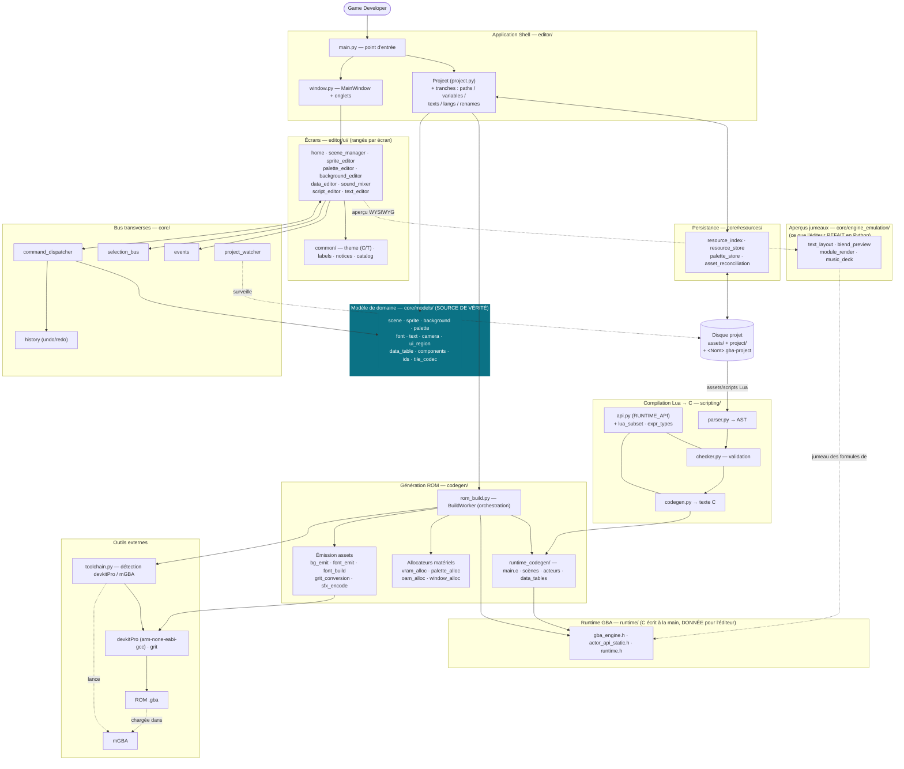

# Diagramme d'architecture

Vue d'ensemble des couches, dérivée du code réel (pas des noms de fichiers). Le détail
vit dans [ARCHITECTURE.md](ARCHITECTURE.md) ;
Rendu par GitHub / Mermaid. À régénérer à la main quand une couche bouge. Ce fichier n'est pas
auto-généré, pour rester fidèle aux relations et pas aux fichiers.

