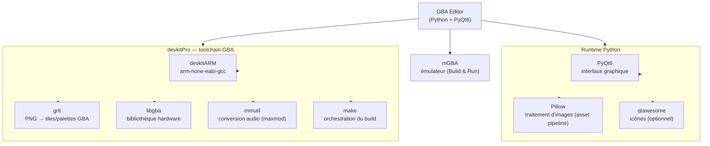

# Architecture

Détails techniques du projet — terminologie, structure des fichiers, pipeline de build. Le [README](README.md) reste le point d'entrée pour un utilisateur ; ce document est pour qui modifie le code.

---

## Arborescence

```
gba-editor/
├── editor/                          ← application Python (PyQt6)
│   ├── main.py                      ← point d'entrée
│   ├── window.py                    ← MainWindow + onglets
│   ├── core/
│   │   ├── project.py               ← modèle de données (project.json)
│   │   ├── project_watcher.py       ← détection live des assets
│   │   ├── scene_editor.py          ← canvas GBA - Placer des acteurs, dessiner ses collisions.
│   │   ├── toolchain.py             ← détection devkitPro/mGBA (PATH, config, emplacements connus)
│   │   └── ...
│   ├── codegen/
│   │   ├── pipeline.py              ← orchestration build
│   │   ├── asset_pipeline.py        ← grit (sprites + BG)
│   │   └── runtime_codegen/         ← génération main.c, scènes, acteurs
│   ├── scripting/                   ← compilation Lua → C
│   ├── plugins/                     ← plugins chargés dynamiquement (spec_from_file_location)
│   └── ui/
│       ├── sprite_editor.py         ← éditeur de sprites (tile-based)
│       ├── build_panel.py
│       ├── inspectors_module.py
│       └── ...
├── runtime/
│   └── Makefile                     ← copié dans build/ au moment du build
├── packaging/                       ← packaging PyInstaller + CI (voir section dédiée)
│   ├── gba_editor.spec
│   ├── icon.ico / icon.png
│   └── linux/                       ← AppImage (job CI en pause)
├── .github/workflows/release.yml    ← build + release GitHub automatique
└── projects/                        ← projets utilisateur
    └── Pong/                        ← projet démo
        ├── project.json
        ├── assets/
        │   ├── sprites/             ← PNG + JSON sidecar (SpriteAsset)
        │   ├── backgrounds/         ← PNG bruts (BackgroundImage)
        │   └── scripts/             ← scripts Lua source (acteurs + scènes)
        ├── project/
        │   ├── scenes/              ← définition des scènes (.json)
        │   ├── backgrounds/         ← BackgroundAsset (.json) — assemblages de layers
        │   └── prefab/              ← préfabs d'acteurs (.json)
        └── build/                   ← 100% généré, gitignored
```

---

## Terminologie

### Correspondances éditeur ↔ GBA / grit

Ces concepts ont un équivalent direct dans le hardware ou la toolchain.

| Éditeur | GBA / grit | Description |
|---------|------------|--------------|
| `SpriteAsset` | tiles OBJ VRAM | PNG converti par grit en tiles 8×8 chargées dans OBJ VRAM |
| `TileCell` | tile index VRAM | Une tile 8×8 référencée par son index dans VRAM |
| `AnimFrame` | plage de tile indices | Un état visuel = N tiles dans VRAM |
| `Actor` | `OBJATTR` (OAM) | Instance affichée à l'écran via une entrée OAM |
| `BackgroundImage` | PNG source | Image brute dans `assets/backgrounds/`, source pour grit |
| `BackgroundLayer` | charblock + screenblock BG | `{image, bg_slot, scroll_speed}` — un plan BG physique |
| `BackgroundAsset` | `REG_BGxCNT` × N | Assemblage de layers dans `project/backgrounds/*.json`, assigné à une scène |
| `Scene.background_asset` | ensemble de `REG_BGxCNT` activés | Référence (par nom) au `BackgroundAsset` de la scène |
| `Scene` | `scene_init_X` / `scene_tick_X` | Paire de fonctions C dispatchées via vtable dans `main.c` |
| `ScriptComponent` (Lua) | fonction C compilée | Le Lua est transpilé vers C, pas interprété à l'exécution |

### Abstractions pures de l'éditeur

Ces concepts n'ont pas d'équivalent direct dans grit ou le hardware GBA.

| Concept | Rôle | Résolution au build |
|---------|------|----------------------|
| `Prefab` | Template d'acteur réutilisable | Chaque instance génère son propre code C |
| `AnimState` | État d'animation nommé (`Idle`, `Walk`…) | Converti en index entier, pas de concept GBA natif |

### Components

| Nom | Rôle | API Lua |
|-----|------|---------|
| `SpriteComponent` | Lien vers un `SpriteAsset`, état initial, vitesse d'animation... | `self:play_anim("state")` `self:set_frame(n)` `self:set_visible(bool)` `self:set_flip_h(bool)` `self:set_pal(n)` |
| `CollisionBoxComponent` | AABB de collision. `solid=true` → résolution physique ; `solid=false` → trigger | callbacks : `onCollisionEnter(id)` `onCollisionExit(id)` `onTriggerEnter(id)` `onTriggerExit(id)` |
| `SoundFxComponent` | Déclenche un effet sonore lié à l'acteur | `sfx.play("name")` |
| `ScriptComponent` | Attache un script Lua à l'acteur | `on_start()` `on_update()` `on_late_update()` |
| `PathComponent` | Chemin de déplacement (waypoints) | — (en cours) |

### Règles clés

- `assets/` → la source de vérité des assets bruts ; le JSON sidecar est auto-géré par l'éditeur
- `assets/backgrounds/` → PNG bruts (`BackgroundImage`) ; `project/backgrounds/` → assemblages de layers (`BackgroundAsset`)
- `assets/scripts/` → scripts Lua édités par le dev ; copiés dans `build/src/` au build
- `build/grit_out/` et `build/src/` → effacés et regénérés à chaque build ; `build/obj/` est conservé pour la compilation incrémentale
- `project.json` → config racine uniquement (nom, scène de démarrage, auteur, globals) ; toutes les données vivent dans `project/**/*.json`
- Les assets sont référencés **par nom** (ex. `SpriteComponent.sprite_name`, `Scene.background_asset`) — jamais par chemin absolu
- Les scripts Lua sont **transpilés vers C** au build, pas interprétés à l'exécution
- Les `GlobalVar` sont des variables C partagées entre tous les scripts d'une scène (`globals.h` / `globals.c` générés)
- Chaque scène génère une paire C `scene_init_X` / `scene_tick_X` dispatchée via une vtable statique dans `main.c`

---

## Pipeline de build (ROM)

```
① Validation du projet (scenes, sprites, scripts)

② grit BG — par scène (si un BackgroundAsset est assigné)
   assets/backgrounds/{image}.png  (via BackgroundAsset.layers)
       → grit              → build/grit_out/{scene}_tileset.c/.h

③ grit Sprites — union de toutes les scènes + prefabs (dédupliqués)
   assets/sprites/{name}.png
       → grit              → build/grit_out/sprite_{name}.c/.h

④ Audio (optionnel)
   assets/sounds/*.wav/.mod
       → mmutil + bin2s     → build/grit_out/soundbank.*

⑤ Génération des headers C
   project/ + sprites
       → codegen            → build/src/actor_types.h
                            → build/src/actor_api.h

⑥ Transpilation Lua → C — toutes les scènes en une passe
   assets/scripts/scenes/*.lua   → build/src/{scene}_scene.c
   assets/scripts/actors/*.lua   → build/src/actor_{name}.c
   (globals partagés)            → build/src/globals.c / globals.h

⑦ Génération de main.c
   all_scene_data + prefabs
       → codegen            → build/src/main.c

⑧ Compilation + link
   build/src/*.c + build/grit_out/*.c
       → arm-none-eabi-gcc  → build/obj/*.o
       → make (Makefile)    → build/rom.elf → build/rom.gba

⑨ Lancement
   build/rom.gba → mgba
```

Orchestré par `editor/codegen/pipeline.py` (`BuildWorker`), déclenché depuis `ui/build_panel.py`.

---

## Packaging & distribution (PyInstaller + GitHub Releases)

À ne pas confondre avec le pipeline ROM ci-dessus : ceci construit l'**éditeur lui-même** en exécutable distribuable, pas une ROM GBA.

- **`packaging/gba_editor.spec`** — spec PyInstaller, mode **onefile** (un seul `.exe`, pas d'installeur). Build : `pyinstaller packaging/gba_editor.spec --noconfirm` → `dist/GBA Editor.exe`.
- **`editor/codegen/pipeline.py:RUNTIME_DIR`** — en mode figé (`sys.frozen`), résolu via `sys._MEIPASS / "runtime"` plutôt que `Path(__file__).parent.parent.parent` (qui ne pointe plus vers la racine du repo une fois packagé). `runtime/` est embarqué comme donnée du bundle via le `.spec`.
- **`editor/plugins/`** est copié tel quel (pas seulement compilé dans le PYZ) : chargé dynamiquement via `importlib.util.spec_from_file_location`, ça nécessite des fichiers `.py` réels sur disque au runtime.
- **`.github/workflows/release.yml`** — se déclenche sur `release: published` (ou `workflow_dispatch` pour tester sans publier). Build Windows only actuellement (le job Linux/AppImage est présent mais `if: false`, en pause en attendant un test sur une vraie distro). Le job `publish` attache l'exe à la Release automatiquement.
- **mGBA / devkitPro ne sont jamais embarqués** — dépendances système externes, détectées à l'exécution par `editor/core/toolchain.py` (`resolve_mgba`, `resolve_grit`, `resolve_make`, `resolve_arm_gcc`). Un mécanisme d'auto-download de mGBA a été tenté (Inno Setup puis AppImage) et **abandonné délibérément** — flux 100% manuel par choix (voir historique de conversation packaging).

### Pièges connus (Python figé vs. dev)

- Le poste de dev local tourne en Python 3.14 (annotations évaluées paresseusement par défaut, PEP 649). Le CI GitHub Actions utilise Python 3.12 (évaluation immédiate). Deux bugs de ce type ont déjà cassé le build CI sans jamais se voir en local :
  - `core/scene_editor.py` : `-> CollisionOverlay` (annotation de retour non protégée, classe définie plus bas dans le même fichier) → citée en `-> "CollisionOverlay"` (le pattern déjà utilisé ailleurs dans le même fichier pour la même classe, juste pas appliqué de façon cohérente).
  - `editor/ui/inspectors_module.py` : `Background` utilisé en annotation (`bg: Background`) mais jamais importé du tout (il existe bien dans `core/project.py`, marqué "stub rétrocompat") → ajouté à l'import `from core.project import (...)`.
  - Pas de `from __future__ import annotations` global appliqué au projet (la plupart des fichiers l'ont déjà individuellement ; `core/project.py`, `core/scene_editor.py`, `editor/ui/inspectors_module.py` et quelques autres ne l'ont pas).
- **Script de détection** (à relancer après tout changement de signature/annotation, avant de attendre un aller-retour CI) : vérifie les annotations de méthodes/fonctions ET les champs de classe (dataclasses) en accès brut (`func.__annotations__`, pas `typing.get_type_hints()` qui donne de faux positifs sur les forward refs correctement cités entre guillemets ou sous `TYPE_CHECKING`) :
  ```python
  import sys, importlib, inspect, pathlib
  sys.path.insert(0, 'editor')
  errors = []
  def check_module(modname):
      try:
          mod = importlib.import_module(modname)
      except Exception as e:
          errors.append((modname, "IMPORT", f"{type(e).__name__}: {e}")); return
      for name, obj in list(vars(mod).items()):
          if inspect.isclass(obj) and obj.__module__ == modname:
              try: _ = obj.__annotations__
              except Exception as e: errors.append((modname, f"{obj.__name__} (fields)", str(e)))
              for attr_name, attr in list(vars(obj).items()):
                  func = attr.__func__ if isinstance(attr, (staticmethod, classmethod)) else (attr.fget if isinstance(attr, property) else (attr if inspect.isfunction(attr) else None))
                  if func is None: continue
                  try: _ = func.__annotations__
                  except Exception as e: errors.append((modname, f"{obj.__name__}.{attr_name}", str(e)))
          elif inspect.isfunction(obj) and obj.__module__ == modname:
              try: _ = obj.__annotations__
              except Exception as e: errors.append((modname, name, str(e)))
  root = pathlib.Path('editor')
  for pyfile in sorted(root.rglob('*.py')):
      if '__pycache__' in pyfile.parts or 'plugins' in pyfile.parts: continue
      modname = '.'.join(pyfile.relative_to(root).with_suffix('').parts)
      if modname != 'main': check_module(modname)
  print(f"{len(errors)} issues"); [print(f"  {m} :: {l} -> {e}") for m, l, e in errors]
  ```
  Dernier passage (2026-07-04) : 0 problème restant après les deux fixes ci-dessus.

---

## Dépendances externes



`PyQt6` et `Pillow` sont des paquets Python (voir `requirements.txt`). `devkitPro` et `mGBA` sont des outils système installés séparément — ils n'apparaissent pas dans un gestionnaire de paquets Python.
