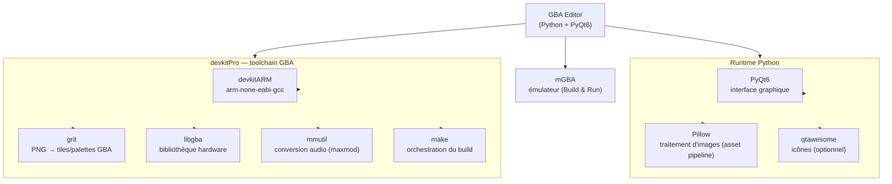

# Architecture

Détails techniques du projet — terminologie, structure des fichiers, pipeline de build. Le [README](README.md) reste le point d'entrée pour un utilisateur ; ce document est pour qui modifie le code.

---

## Arborescence

```
gba-editor/
├── editor/                          ← application Python (PyQt6)
│   ├── main.py                      ← point d'entrée
│   ├── window.py                    ← MainWindow + onglets
│   ├── core/
│   │   ├── project.py               ← modèle de données (project.json + project/**)
│   │   ├── project_watcher.py       ← détection live des assets
│   │   ├── scene_editor.py          ← canvas GBA - Placer des acteurs, dessiner ses collisions, peindre des tuiles.
│   │   ├── sprite_compose.py        ← composition d'une frame de sprite depuis son PNG source (PIL)
│   │   ├── toolchain.py             ← détection devkitPro/mGBA (PATH, config, emplacements connus)
│   │   └── ...
│   ├── codegen/
│   │   ├── pipeline.py              ← orchestration build
│   │   ├── asset_pipeline.py        ← grit (sprites + BG + Sounds)
│   │   └── runtime_codegen/         ← génération main.c, scènes, acteurs
│   ├── scripting/                   ← compilation Lua → C (voir section dédiée)
│   │   ├── parser.py / checker.py / codegen.py  ← Lua texte → AST → C
│   │   ├── api.py                   ← RUNTIME_API : catalogue unique de l'API Lua ↔ C
│   │   └── script_templates.py      ← contenu initial d'un nouveau script (scène/actor/vide)
│   ├── plugins/                     ← plugins chargés dynamiquement (spec_from_file_location)
│   └── ui/                          ← rangé par écran, pas par type de widget
│       ├── common/                  ← transverse à tous les écrans
│       │   ├── theme.py             ← C (couleurs) / T (typographie) — jamais de valeurs en dur
│       │   ├── icons.py, widgets.py, collapsible.py, reorderable_bar.py, build_panel.py
│       ├── home/
│       │   └── project_picker.py    ← écran d'accueil (HomeScreen)
│       ├── scene_manager/
│       │   ├── assets_finder_panel.py
│       │   └── inspectors/            ← un fichier par classe d'inspecteur
│       │       ├── actor_inspector.py, scene_inspector.py, camera_inspector.py
│       │       ├── uses_inspectors.py     ← Prefab/Script/Variable Uses (groupés, structure proche)
│       │       ├── dynamic_inspector.py   ← routeur, instancie tous les autres
│       │       └── component_editors/     ← un fichier par type de Component
│       ├── sprite_editor/             ← un fichier par sous-zone de l'écran
│       │   ├── sprite_finder_panel.py     ← panneau gauche (sprites + anims)
│       │   ├── frame_canvas.py            ← timeline + canvas de composition tuile par tuile
│       │   ├── spritesheet_viewer.py      ← tile picker sur le PNG source
│       │   ├── direction_widget.py        ← sélecteur 3×3 de directions
│       │   ├── sprite_center_panel.py     ← assemble playback+canvas+tiles+timeline
│       │   ├── sprite_right_panel.py      ← propriétés/collision/anim settings/palette
│       │   └── sprite_editor_screen.py    ← écran complet (assemble les 3 colonnes)
│       ├── sound_mixer/
│       │   └── sound_panel.py
│       └── script_editor/             ← un fichier par sous-zone de l'écran
│           ├── colors.py                  ← proxys couleur partagés par tout l'écran
│           ├── lua_editor.py               ← coloration syntaxique + widget d'édition
│           ├── sidebar_widgets.py          ← briques section/sous-section/bouton
│           ├── var_table_panel.py          ← table GLOBALS/CONSTANTS de la sidebar
│           ├── sidebar_panel.py            ← sections EVENTS/API/RÉFÉRENCES
│           ├── script_finder_panel.py      ← arbre de fichiers scripts
│           └── script_editor.py            ← écran complet (assemble sidebar+éditeur+finder)
├── runtime/
│   └── Makefile                     ← copié dans build/ au moment du build
├── packaging/                       ← packaging PyInstaller + CI (voir section dédiée)
│   ├── gba_editor.spec
│   ├── icon.ico / icon.png
│   └── linux/                       ← AppImage (job CI en pause)
├── .github/workflows/release.yml    ← build + release GitHub automatique
└── Project Demo/                    ← modèles de projet téléchargeables (voir README)
    └── Pong/                        ← projet démo
        ├── project.json             ← config racine uniquement (nom, scène de démarrage, auteur, version)
        ├── assets/                  ← dépend d'une ressource externe (image, son...)
        │   ├── sprites/             ← PNG + JSON sidecar (SpriteAsset)
        │   ├── backgrounds/         ← PNG + JSON sidecar (BackgroundAsset)
        │   └── scripts/             ← scripts Lua source (acteurs + scènes)
        ├── project/                 ← données éditeur pures, aucune dépendance externe
        │   ├── scenes/              ← définition des scènes (.json)
        │   ├── palettes/            ← PaletteBank (.json) — catalogue de palettes nommées, 1 fichier/palette
        │   ├── prefab/              ← préfabs d'acteurs (.json)
        │   └── variables.json       ← globals + constants du projet
        └── build/                   ← 100% généré, gitignored — compile assets/ ET project/
```

---

## Terminologie

### Correspondances éditeur ↔ GBA / grit

Ces concepts ont un équivalent direct dans le hardware ou la toolchain.

| Éditeur | GBA / grit | Description |
|---------|------------|--------------|
| `SpriteAsset` | tiles OBJ VRAM | PNG converti par grit en tiles 8×8 chargées dans OBJ VRAM |
| `TileCell` | tile index VRAM | Une tile 8×8 référencée par son index dans VRAM |
| `AnimFrame` | plage de tile indices | Un état visuel = N tiles dans VRAM |
| `Actor` | `OBJATTR` (OAM) | Instance affichée à l'écran via une entrée OAM |
| `BackgroundLayer` | charblock (CBB=`bg_slot`) + screenblock | `{image, bg_slot, scroll_speed, pal_bank, tile_palette_overrides}` — un plan BG physique **de la scène** |
| `BackgroundAsset` | tileset + sous-palettes | Sidecar (`project/backgrounds/{image}.json`), keyé par nom comme `SpriteAsset` — PNG source jamais modifié 
| `Scene.background_layers` | jusqu'à 4 `REG_BGxCNT` | Liste de `BackgroundLayer` inline dans le JSON de la scène (chacun référence un `BackgroundAsset` par nom d'asset) |
| `PaletteBank` | 16 couleurs BGR555 | Palette nommée du catalogue (`project/palettes/*.json`), partagée OBJ/BG |
| `Scene.active_obj_palettes` / `Scene.active_bg_palettes` | 16 banques `PAL_OBJ`/`PAL_BG` | Sélection ordonnée (index = banque hardware) des palettes actives de la scène ; `pal_bank` indexe dans cette liste |
| `Scene` | `scene_init_X` / `scene_tick_X` | Paire de fonctions C dispatchées via vtable dans `main.c` |
| `ScriptComponent` (Lua) | fonction C compilée | Le Lua est transpilé vers C, pas interprété à l'exécution |

### Abstractions pures de l'éditeur

Ces concepts n'ont pas d'équivalent direct dans grit ou le hardware GBA.

| Concept | Rôle | Résolution au build |
|---------|------|----------------------|
| `Prefab` | Template d'acteur réutilisable | Chaque instance génère son propre code C |
| `AnimState` | État d'animation nommé (`Idle`, `Walk`…) | Converti en index entier, pas de concept GBA natif |

### Components

| Nom | Rôle | API Lua |
|-----|------|---------|
| `SpriteComponent` | Lien vers un `SpriteAsset`, état initial, vitesse d'animation... | `self:play_anim("state")` `self:set_frame(n)` `self:set_visible(bool)` `self:set_flip_h(bool)` `self:set_pal(n)` |
| `CollisionBoxComponent` | AABB de collision. `solid=true` → résolution physique ; `solid=false` → trigger | callbacks : `onCollisionEnter(id)` `onCollisionExit(id)` `onTriggerEnter(id)` `onTriggerExit(id)` |
| `SoundFxComponent` | Déclenche un effet sonore lié à l'acteur | `sfx.play("name")` |
| `ScriptComponent` | Attache un script Lua à l'acteur — **un seul actif par actor** (le compilateur n'en lit de toute façon qu'un seul) | `on_start()` `on_update()` `on_late_update()` |
| `PathComponent` | Chemin de déplacement (waypoints) | — (en cours) |

### Règles clés

- **`assets/` vs `project/`** — la distinction qui structure tout le projet : `assets/` contient ce qui dépend d'une ressource externe à l'éditeur (une image PNG, un son) ; `project/` contient les données propres à l'éditeur, sans dépendance externe (scènes, prefabs, variables...). Les deux sont traités par l'éditeur et compilés dans `build/` — la différence est l'origine de la donnée, pas son traitement.
- `assets/` → la source de vérité des assets bruts ; le JSON sidecar est auto-géré par l'éditeur
- `assets/backgrounds/` → PNG bruts (`BackgroundAsset`) ; → sidecar d'importation par image (`BackgroundAsset` : tileset + sous-palettes, PNG jamais modifié). 
- `assets/scripts/` → scripts Lua édités par le dev ; copiés dans `build/src/` au build
- `build/grit_out/` et `build/src/` → effacés et regénérés à chaque build ; `build/obj/` est conservé pour la compilation incrémentale
- `project.json` → config racine uniquement (nom, scène de démarrage, auteur, version) ; toutes les autres données vivent dans `project/**/*.json`, y compris `project/variables.json` (globals + constants, unicité de nom vérifiée par type — un global et une constante peuvent partager un nom)
- Les assets sont référencés **par nom** (ex. `SpriteComponent.sprite_name`, `BackgroundLayer.backgroundasset_name`, palette active par nom de `PaletteBank`) — jamais par chemin absolu
- Les scripts Lua sont **transpilés vers C** au build, pas interprétés à l'exécution
- Les `GlobalVar` sont des variables C partagées entre tous les scripts du jeu (`globals.h` / `globals.c` générés une fois par build, pas par scène)
- Chaque scène génère une paire C `scene_init_X` / `scene_tick_X` dispatchée via une vtable statique dans `main.c`

---

## API Lua ↔ C

Le script Lua n'est jamais traduit directement en texte C : il passe par un AST Python intermédiaire, lui-même validé et traduit via un catalogue déclaratif unique.

```
texte Lua → parser.py → AST Python → checker.py (validation) → codegen.py → texte C
                                            ↑                        ↑
                                            └── scripting/api.py ──┘
                                          (RUNTIME_API : catalogue unique)
```

- **`parser.py`** — modélise la grammaire Lua en dataclasses Python (`StmtIf`, `ExprInvoke` pour `self:method()`, etc.). Spécifique à Lua : remplacer le langage de script demanderait de réécrire ce fichier (et une partie du pattern-matching de `checker.py`/`codegen.py` sur ces formes syntaxiques), mais pas le reste de la chaîne.
- **`api.py`** (`RUNTIME_API`) — source de vérité unique pour toute fonction Lua exposée au runtime : nom Lua, fonction C cible, types de paramètres, domaine de résolution des chaînes (`DOMAIN_ANIM`, `DOMAIN_SFX`, `DOMAIN_SCENE`...). Utilisé à la fois par `checker.py` (valider un appel connu) et `codegen.py` (générer l'appel C générique via `_emit_api_call`).
- **`checker.py`** — parcourt l'AST et valide les appels contre `RUNTIME_API` (fonction connue, bon nombre d'arguments — y compris les fonctions variadiques comme `display.print`, nom de ressource existant). Ne bloque le build que sur les erreurs (`CheckError.level == "error"`) ; les avertissements (ex. valeur littérale hors plage pour un `global.set` typé) sont journalisés sans empêcher la compilation. Appliqué uniformément aux scripts actor, scène et prefab via `lua_compiler.py::_compile_script` — un prefab avec une erreur bloque désormais le build comme un actor, plutôt que d'être silencieusement sauté. Les behaviors (`require("behaviors/x")`, inlinés par `codegen.py::_emit_inlined_behaviors`) passent par le même checker avec `check_event_names=False` (leurs fonctions top-level sont des noms de méthode arbitraires, pas des handlers d'événement) ; fichier manquant ou erreur de parse y remontent comme avertissement plutôt que de casser silencieusement ou de lever une exception Python brute.
- **`codegen.py`** — pour la majorité des appels, `_emit_api_call` génère l'appel C directement depuis l'entrée `RUNTIME_API` correspondante. Une poignée de fonctions ne se traduisent pas par un simple appel de fonction (`global.get`/`set` → accès direct à la variable C, `self:destroy` → deux instructions enchaînées, `sfx.play` → arguments synthétisés depuis la ressource Sfx du projet...) : elles sont réunies dans deux tables de dispatch en fin de fichier, `_INVOKE_CUSTOM` et `_CALL_CUSTOM`, plutôt que dispersées en `if`/`elif` dans le code de traduction. Chacune de ces fonctions a quand même une entrée dans `RUNTIME_API` pour la validation/documentation.
- **Important pour toute nouvelle fonction Lua** : si elle se traduit par un simple appel C avec conversion d'arguments, une seule entrée dans `RUNTIME_API` suffit. Ce n'est que si elle a besoin de logique de traduction (nom C dynamique, arguments non présents côté Lua, émission multi-instructions) qu'elle doit aussi rejoindre `_INVOKE_CUSTOM`/`_CALL_CUSTOM`.

---

## Système de palette & compression d'assets

Ajouté par la branche `ColorPaletteSystem`. Deux idées structurent tout : **un catalogue
de palettes nommées** activées par scène. — les PNG sources ne sont jamais réécrits ; les couleurs et la tuilerie vivent dans des sidecars JSON, recalculés au build.

### Catalogue et sélection par scène


- **`PaletteBank`** (`core/project.py`) — une palette nommée de 16 couleurs BGR555,
  catalogue illimité et **unifié** (`project/palettes/*.json`, un fichier par palette),
  partagé entre les pools OBJ et BG. L'index 0 est toujours forcé transparent.
- **Sélection active par scène** — `Scene.active_obj_palettes` / `active_bg_palettes` :
  jusqu'à 16 noms de `PaletteBank` par pool, l'ordre = index de banque hardware. C'est
  cette sélection (pas le catalogue) qui occupe réellement les banques
  `PAL_OBJ_RAM` / `PAL_BG_RAM` au build. Les deux pools GBA sont physiquement séparés.
- **`pal_bank`** sur `Actor` / `Prefab` / `BackgroundLayer` — soit un slot `0-15` dans la
  sélection de la scène, soit le sentinel **`OWN_PAL_BANK` (-1)** = « palette issu de l'asset » :


### Allocation des banques — source de vérité unique

`codegen/palette_alloc.py::scene_bank_layout(project, scene, pool)` résout, pour une scène
et un pool, quelles couleurs occupent chacune des 16 banques hardware :

1. palettes référencées → à leur slot fixe (index dans `active_*_palettes`) ;
4. fonds compressés → un **bloc de banques contiguës** (une par sous-palette).

Déterministe : `pipeline.py` (quantification grit) et `main_gen.py` (émission des
`PAL_*_RAM`) lisent le même layout sans se coordonner. Le débordement (>16 banques) n'est
jamais silencieux : `bank_index` retombe sur la banque 0 et le validateur avertit.

### Compression non-destructive

- **Sprites** — chaque `SpriteAsset` conserve sa **palette propre** (`own_palette`, BGR555)
  dérivée d'un png indexé directement (ou déduite depuis un png non-indexé). Au build, le sprite est quantifié vers sa palette effective (propre ou
  banque référencée) et indexé, sans réécrire le PNG.
- **Fonds** — `core/bg_compress.py` produit un `BackgroundAsset` (sidecar par image) :
  tuilerie 8×8 + déduplication + jusqu'à 16 **sous-palettes** (`SE_PALBANK` par tuile en
  4bpp). L'émission C se fait **directement** (`codegen/bg_emit.py::emit_bg_c`), sans passer
  par grit. Trois modes, **auto-détectés à l'import** (`detect_import_mode`) :

  | Mode | `BackgroundAsset` | Rendu |
  |------|-------------------|-------|
  | Tuilé 4bpp | `bpp=4`, ≤16 sous-palettes | Mode 0, `SE_PALBANK` par tuile, inpainting possible |
  | Tuilé 8bpp | `bpp=8`, 1 palette de 256 | Mode 0, occupe toute la `PAL_BG_RAM` (1 seul layer) |
  | Bitmap | `mode="bitmap"` | Mode 4 plein écran (photos) — **éditable mais pas encore émis au build** |

### Inpainting — repeindre la palette par tuile (non-destructif)

Réassigner la banque de palette d'une tuile 8×8 sans toucher aux pixels. La baseline
(`BackgroundAsset.tilemap`) reste intacte ; `effective_tilemap()` applique les overrides.
Deux niveaux :

- **Éditeur** — `BackgroundAsset.tile_palette_overrides` : partagé par toutes les scènes
  qui utilisent ce fond (canvas du Background Editor).
- **Scène** — `BackgroundLayer.tile_palette_overrides` : propre à une scène, se superpose
  par-dessus l'inpainting éditeur (canvas du Scene Manager). La scène est source de vérité ;
  le build produit alors une map propre à la scène plutôt que la map partagée.

La gomme restaure la palette d'origine (supprime l'override).

### Garde-fous (validateur)

- **Conflit inter-scènes** — même sprite/prefab résolu vers des palettes différentes selon
  la scène → **avertissement** (une seule variante de tuiles est générée, 1ʳᵉ scène gagne).
- **Débordement de banques** (>16 par pool) → avertissement, fallback banque 0.
- **Budget VRAM tuiles** (`pipeline._check_bg_tile_budget`) — un layer dont les tuiles
  générées déborderaient sur l'espace réservé à sa propre map → **erreur bloquante** (ici
  c'est de la mémoire écrasée au runtime, pas juste une mauvaise couleur).

---

## Pipeline de build (ROM)

```
① Validation du projet (scenes, sprites, scripts)

② Fonds — par layer de scène (dédup par image+bg_slot, ou par scène si inpainting)
   fond COMPRESSÉ (cas courant : tileset + sous-palettes déjà dans le BackgroundAsset)
       → bg_emit           → build/grit_out/{layer}.c/.h   (émission directe, PAS grit)
   fond legacy non compressé
       → grit              → build/grit_out/{layer}.c/.h
   (bitmap Mode 4 : ignoré au build — cf. Système de palette)

③ Sprites — union de toutes les scènes + prefabs (dédupliqués par nom)
   assets/sprites/{name}.png  quantifié vers sa palette effective (propre ou banque
   référencée, résolue par palette_alloc)
       → grit              → build/grit_out/sprite_{name}.c/.h

④ Audio (optionnel)
   assets/sounds/*.wav/.mod
       → mmutil + bin2s     → build/grit_out/soundbank.*

⑤ Génération des headers C
   project/ + sprites
       → codegen            → build/src/actor_types.h
                            → build/src/actor_api.h

⑥ Transpilation Lua → C — toutes les scènes en une passe
   assets/scripts/scenes/*.lua   → build/src/{scene}_scene.c
   assets/scripts/actors/*.lua   → build/src/actor_{name}.c
   (globals partagés)            → build/src/globals.c / globals.h

⑦ Génération de main.c
   all_scene_data + prefabs
       → codegen            → build/src/main.c

⑧ Compilation + link
   build/src/*.c + build/grit_out/*.c
       → arm-none-eabi-gcc  → build/obj/*.o
       → make (Makefile)    → build/rom.elf → build/rom.gba

⑨ Lancement
   build/rom.gba → mgba
```

Orchestré par `editor/codegen/pipeline.py` (`BuildWorker`), déclenché depuis `ui/build_panel.py`.

---

## Packaging & distribution (PyInstaller + GitHub Releases)

À ne pas confondre avec le pipeline ROM ci-dessus : ceci construit l'**éditeur lui-même** en exécutable distribuable, pas une ROM GBA.

- **`packaging/gba_editor.spec`** — spec PyInstaller, mode **onefile** (un seul `.exe`, pas d'installeur). Build : `pyinstaller packaging/gba_editor.spec --noconfirm` → `dist/GBA Editor.exe`.
- **`editor/codegen/pipeline.py:RUNTIME_DIR`** — en mode figé (`sys.frozen`), résolu via `sys._MEIPASS / "runtime"` plutôt que `Path(__file__).parent.parent.parent` (qui ne pointe plus vers la racine du repo une fois packagé). `runtime/` est embarqué comme donnée du bundle via le `.spec`.
- **`editor/plugins/`** est copié tel quel (pas seulement compilé dans le PYZ) : chargé dynamiquement via `importlib.util.spec_from_file_location`, ça nécessite des fichiers `.py` réels sur disque au runtime.
- **`.github/workflows/release.yml`** — se déclenche sur `release: published` (ou `workflow_dispatch` pour tester sans publier). Build Windows only actuellement (le job Linux/AppImage est présent mais `if: false`, en pause en attendant un test sur une vraie distro). Le job `publish` attache l'exe à la Release automatiquement.
- **mGBA / devkitPro ne sont jamais embarqués** — dépendances système externes, détectées à l'exécution par `editor/core/toolchain.py` (`resolve_mgba`, `resolve_grit`, `resolve_make`, `resolve_arm_gcc`). Un mécanisme d'auto-download de mGBA a été tenté (Inno Setup puis AppImage) et **abandonné délibérément** — flux 100% manuel par choix (voir historique de conversation packaging).

### Pièges connus (Python figé vs. dev)

- Le poste de dev local tourne en Python 3.14 (annotations évaluées paresseusement par défaut, PEP 649). Le CI GitHub Actions utilise Python 3.12 (évaluation immédiate). Deux bugs de ce type ont déjà cassé le build CI sans jamais se voir en local :
  - `core/scene_editor.py` : `-> CollisionOverlay` (annotation de retour non protégée, classe définie plus bas dans le même fichier) → citée en `-> "CollisionOverlay"` (le pattern déjà utilisé ailleurs dans le même fichier pour la même classe, juste pas appliqué de façon cohérente).
  - `editor/ui/inspectors_module.py` : `Background` utilisé en annotation (`bg: Background`) mais jamais importé du tout (il existe bien dans `core/project.py`, marqué "stub rétrocompat") → ajouté à l'import `from core.project import (...)`.
  - Pas de `from __future__ import annotations` global appliqué au projet (la plupart des fichiers l'ont déjà individuellement ; `core/project.py`, `core/scene_editor.py`, `editor/ui/inspectors_module.py` et quelques autres ne l'ont pas).
- **Script de détection** (à relancer après tout changement de signature/annotation, avant de attendre un aller-retour CI) : vérifie les annotations de méthodes/fonctions ET les champs de classe (dataclasses) en accès brut (`func.__annotations__`, pas `typing.get_type_hints()` qui donne de faux positifs sur les forward refs correctement cités entre guillemets ou sous `TYPE_CHECKING`) :
  ```python
  import sys, importlib, inspect, pathlib
  sys.path.insert(0, 'editor')
  errors = []
  def check_module(modname):
      try:
          mod = importlib.import_module(modname)
      except Exception as e:
          errors.append((modname, "IMPORT", f"{type(e).__name__}: {e}")); return
      for name, obj in list(vars(mod).items()):
          if inspect.isclass(obj) and obj.__module__ == modname:
              try: _ = obj.__annotations__
              except Exception as e: errors.append((modname, f"{obj.__name__} (fields)", str(e)))
              for attr_name, attr in list(vars(obj).items()):
                  func = attr.__func__ if isinstance(attr, (staticmethod, classmethod)) else (attr.fget if isinstance(attr, property) else (attr if inspect.isfunction(attr) else None))
                  if func is None: continue
                  try: _ = func.__annotations__
                  except Exception as e: errors.append((modname, f"{obj.__name__}.{attr_name}", str(e)))
          elif inspect.isfunction(obj) and obj.__module__ == modname:
              try: _ = obj.__annotations__
              except Exception as e: errors.append((modname, name, str(e)))
  root = pathlib.Path('editor')
  for pyfile in sorted(root.rglob('*.py')):
      if '__pycache__' in pyfile.parts or 'plugins' in pyfile.parts: continue
      modname = '.'.join(pyfile.relative_to(root).with_suffix('').parts)
      if modname != 'main': check_module(modname)
  print(f"{len(errors)} issues"); [print(f"  {m} :: {l} -> {e}") for m, l, e in errors]
  ```
  Dernier passage (2026-07-04) : 0 problème restant après les deux fixes ci-dessus.

---

## Dépendances externes



`PyQt6` et `Pillow` sont des paquets Python (voir `requirements.txt`). `devkitPro` et `mGBA` sont des outils système installés séparément — ils n'apparaissent pas dans un gestionnaire de paquets Python.
