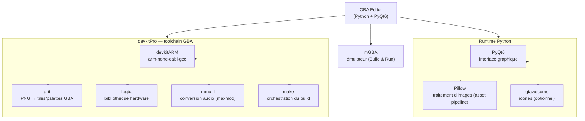

# Architecture

Détails techniques du projet — terminologie, structure des fichiers, pipeline de build. Le [README](README.md) reste le point d'entrée pour un utilisateur ; ce document est pour qui modifie le code.

---

## Arborescence

```
gba-editor/
├── editor/                          ← application Python (PyQt6)
│   ├── main.py                      ← point d'entrée
│   ├── window.py                    ← MainWindow + onglets
│   ├── core/
│   │   ├── project.py               ← classe Project : chemins canoniques, CRUD, orchestration save/load
│   │   ├── models/                  ← modèle de domaine (dataclasses + sérialisation), un fichier par sous-domaine
│   │   │   ├── ids.py                   ← id opaque partagé (données) vs nom lisible (code écrit à la main)
│   │   │   ├── resource.py, settings.py, palette.py, sub_palette.py
│   │   │   ├── components.py            ← Components ECS (CollisionBox/Sprite/SoundFx/Script) + registre
│   │   │   ├── sprite.py, background.py, audio.py
│   │   │   ├── font.py                  ← Font/Glyph : géométrie de planche, coût VRAM, fusion de cases
│   │   │   ├── text.py                  ← Text + clé dérivée + arbre de rangement (dérivé de la liste plate)
│   │   │   └── scene.py                 ← Actor, Prefab, Scene, collision map
│   │   ├── resource_manager.py      ← ResourceManager générique (I/O JSON par collection)
│   │   ├── project_migrations.py    ← migrations/réconciliations de formats JSON legacy (appelées par Project.load)
│   │   ├── asset_sync.py            ← orchestration d'encodage déclenchée par l'apparition d'un PNG/audio sur disque
│   │   ├── collision_slopes.py      ← génération des tiles de pente (Bresenham) pour CollisionTool
│   │   ├── project_watcher.py       ← détection live des assets
│   │   ├── scene_editor.py          ← canvas GBA - Placer des acteurs, dessiner ses collisions, peindre des tuiles.
│   │   ├── sprite_compose.py        ← composition d'une frame de sprite depuis son PNG source (PIL)
│   │   ├── font_import.py           ← import de police (PNG déduit / BMFont .fnt), mesure des chasses
│   │   ├── text_layout.py           ← où atterrit chaque glyphe (miroir de `text_layout` du runtime)
│   │   ├── text_markup.py           ← langage de balisage des textes (BBCode) : analyse → affiché + effets
│   │   ├── toolchain.py             ← détection devkitPro/mGBA (PATH, config, emplacements connus)
│   │   └── ...
│   ├── codegen/
│   │   ├── pipeline.py              ← orchestration build
│   │   ├── asset_pipeline.py        ← grit (sprites + BG + Sounds)
│   │   └── runtime_codegen/         ← génération main.c, scènes, acteurs
│   ├── scripting/                   ← compilation Lua → C (voir section dédiée)
│   │   ├── parser.py / checker.py / codegen.py  ← Lua texte → AST → C
│   │   ├── api.py                   ← RUNTIME_API : catalogue unique de l'API Lua ↔ C
│   │   └── script_templates.py      ← contenu initial d'un nouveau script (scène/actor/vide)
│   ├── plugins/                     ← plugins chargés dynamiquement (spec_from_file_location)
│   └── ui/                          ← rangé par écran, pas par type de widget
│       ├── common/                  ← transverse à tous les écrans
│       │   ├── theme.py             ← C (couleurs) / T (typographie) — jamais de valeurs en dur
│       │   ├── icons.py, widgets.py, collapsible.py, reorderable_bar.py, build_panel.py
│       ├── home/
│       │   └── project_picker.py    ← écran d'accueil (HomeScreen)
│       ├── scene_manager/
│       │   ├── assets_finder_panel.py
│       │   └── inspectors/            ← un fichier par classe d'inspecteur
│       │       ├── actor_inspector.py, scene_inspector.py, camera_inspector.py
│       │       ├── uses_inspectors.py     ← Prefab/Script/Variable Uses (groupés, structure proche)
│       │       ├── dynamic_inspector.py   ← routeur, instancie tous les autres
│       │       └── component_editors/     ← un fichier par type de Component
│       ├── sprite_editor/             ← un fichier par sous-zone de l'écran
│       │   ├── sprite_finder_panel.py     ← panneau gauche (sprites + anims)
│       │   ├── frame_canvas.py            ← timeline + canvas de composition tuile par tuile
│       │   ├── spritesheet_viewer.py      ← tile picker sur le PNG source
│       │   ├── direction_widget.py        ← sélecteur 3×3 de directions
│       │   ├── sprite_center_panel.py     ← assemble playback+canvas+tiles+timeline
│       │   ├── sprite_right_panel.py      ← propriétés/collision/anim settings/palette
│       │   └── sprite_editor_screen.py    ← écran complet (assemble les 3 colonnes)
│       ├── palette_editor/            ← un fichier par sous-zone de l'écran
│       │   ├── palette_file_io.py           ← lecture/écriture .gpl / .pal / liste hex
│       │   ├── swatch_button.py             ← case de palette peinte (contour animé)
│       │   ├── color_wheel.py               ← roue teinte + triangle saturation/luminosité
│       │   ├── palette_finder_panel.py      ← panneau gauche (catalogue du projet)
│       │   ├── palette_grid_panel.py        ← centre : grille de swatches, sélection, zoom, écritures
│       │   ├── color_inspector_panel.py     ← panneau droit : roue/hex/RGB/TSL de la couleur active
│       │   ├── palette_usage_card.py        ← carte USAGE (bas du panneau droit) : qui utilise la palette
│       │   └── palette_editor_screen.py     ← écran complet (assemble les 3 colonnes)
│       ├── sound_mixer/
│       │   └── sound_panel.py
│       ├── script_editor/             ← un fichier par sous-zone de l'écran
│       │   ├── colors.py                  ← proxys couleur partagés par tout l'écran
│       │   ├── lua_editor.py               ← coloration syntaxique + widget d'édition
│       │   ├── sidebar_widgets.py          ← briques section/sous-section/bouton
│       │   ├── var_table_panel.py          ← table GLOBALS/CONSTANTS de la sidebar
│       │   ├── sidebar_panel.py            ← sections EVENTS/API/RÉFÉRENCES
│       │   ├── script_finder_panel.py      ← arbre de fichiers scripts
│       │   └── script_editor.py            ← écran complet (assemble sidebar+éditeur+finder)
│       └── text_editor/               ← un fichier par sous-zone de l'écran
│           ├── colors.py                  ← familles police / texte, partagées par l'écran
│           ├── glyph_paint.py              ← trouage des couleurs-clés + damier
│           ├── text_commands.py            ← commandes annulables (clé, rangement, planche)
│           ├── font_finder_panel.py        ← colonne gauche (liste des polices)
│           ├── text_tree_panel.py          ← centre, contexte Texte : arbre + atelier
│           ├── font_screen_preview.py      ← aperçu écran GBA (monté par l'atelier)
│           ├── glyph_sheet.py              ← planche de glyphes (canvas)
│           ├── glyph_sheet_panel.py        ← centre, contexte Police : planche + outils
│           ├── markup_highlighter.py       ← coloration des balises (lit les spans du parseur)
│           ├── markup_toolbar.py           ← boutons de balisage (dérivés de TAGS, agissent sur la sélection)
│           ├── inspector_shell.py          ← coquille commune aux deux inspecteurs
│           ├── text_inspector.py / font_inspector.py  ← colonne droite, un par contexte
│           └── text_editor_screen.py       ← écran complet (assemble les 3 colonnes)
├── runtime/
│   └── Makefile                     ← copié dans build/ au moment du build
├── packaging/                       ← packaging Nuitka + CI (voir section dédiée)
│   ├── nuitka_build.py              ← commande de build unique (CI et local)
│   ├── check_deps.py                ← garde-fou requirements.txt vs imports réels
│   ├── icon.ico / icon.png
│   ├── windows/installer.nsi        ← installateur NSIS (par utilisateur)
│   └── linux/                       ← AppImage (job CI en pause)
├── .github/workflows/release.yml    ← build + release GitHub automatique
└── Project Demo/                    ← modèles de projet téléchargeables (voir README)
    └── Pong/                        ← projet démo
        ├── project.json             ← config racine uniquement (nom, scène de démarrage, auteur, version)
        ├── assets/                  ← dépend d'une ressource externe (image, son...)
        │   ├── sprites/             ← PNG + JSON sidecar (SpriteAsset)
        │   ├── backgrounds/         ← PNG + JSON sidecar (BackgroundAsset)
        │   └── scripts/             ← scripts Lua source (acteurs + scènes)
        ├── project/                 ← données éditeur pures, aucune dépendance externe
        │   ├── scenes/              ← définition des scènes (.json)
        │   ├── palettes/            ← PaletteBank (.json) — catalogue de palettes nommées, 1 fichier/palette
        │   ├── prefab/              ← préfabs d'acteurs (.json)
        │   └── variables.json       ← globals + constants du projet
        └── build/                   ← 100% généré, gitignored — compile assets/ ET project/
```

---

## Terminologie

### Correspondances éditeur ↔ GBA / grit

Ces concepts ont un équivalent direct dans le hardware ou la toolchain.

| Éditeur | GBA / grit | Description |
|---------|------------|--------------|
| `SpriteAsset` | tiles OBJ VRAM | PNG converti par grit en tiles 8×8 chargées dans OBJ VRAM |
| `TileCell` | tile index VRAM | Une tile 8×8 référencée par son index dans VRAM |
| `AnimFrame` | plage de tile indices | Un état visuel = N tiles dans VRAM |
| `Actor` | `OBJATTR` (OAM) | Instance affichée à l'écran via une entrée OAM |
| `BackgroundLayer` | charblock (CBB=`bg_slot`) + screenblock | `{image, bg_slot, scroll_speed, pal_bank, tile_palette_overrides}` — un plan BG physique **de la scène** |
| `BackgroundAsset` | tileset + sous-palettes | Sidecar (`project/backgrounds/{image}.json`), keyé par nom comme `SpriteAsset` — PNG source jamais modifié 
| `Scene.background_layers` | jusqu'à 4 `REG_BGxCNT` | Liste de `BackgroundLayer` inline dans le JSON de la scène (chacun référence un `BackgroundAsset` par nom d'asset) |
| `PaletteBank` | 16 couleurs BGR555 | Palette nommée du catalogue (`project/palettes/*.json`), partagée OBJ/BG |
| `Scene.active_obj_palettes` / `Scene.active_bg_palettes` | 16 banques `PAL_OBJ`/`PAL_BG` | Sélection ordonnée (index = banque hardware) des palettes actives de la scène ; `pal_bank` indexe dans cette liste |
| `Scene` | `scene_init_X` / `scene_tick_X` | Paire de fonctions C dispatchées via vtable dans `main.c` |
| `ScriptComponent` (Lua) | fonction C compilée | Le Lua est transpilé vers C, pas interprété à l'exécution |

### Abstractions pures de l'éditeur

Ces concepts n'ont pas d'équivalent direct dans grit ou le hardware GBA.

| Concept | Rôle | Résolution au build |
|---------|------|----------------------|
| `Prefab` | Template d'acteur réutilisable | Chaque instance génère son propre code C |
| `AnimState` | État d'animation nommé (`Idle`, `Walk`…) | Converti en index entier, pas de concept GBA natif |

### Components

| Nom | Rôle | API Lua |
|-----|------|---------|
| `SpriteComponent` | Lien vers un `SpriteAsset`, état initial, vitesse d'animation... | `self:play_anim("state")` `self:set_frame(n)` `self:set_visible(bool)` `self:set_flip_h(bool)` `self:set_pal(n)` |
| `CollisionBoxComponent` | AABB de collision. `solid=true` → résolution physique ; `solid=false` → trigger | callbacks : `onCollisionEnter(id)` `onCollisionExit(id)` `onTriggerEnter(id)` `onTriggerExit(id)` |
| `SoundFxComponent` | Déclenche un effet sonore lié à l'acteur | `sfx.play("name")` |
| `ScriptComponent` | Attache un script Lua à l'acteur — **un seul actif par actor** (le compilateur n'en lit de toute façon qu'un seul) | `on_start()` `on_update()` `on_late_update()` |
| `PathComponent` | Chemin de déplacement (waypoints) | — (en cours) |

### Règles clés

- **`assets/` vs `project/`** — la distinction qui structure tout le projet : `assets/` contient ce qui dépend d'une ressource externe à l'éditeur (une image PNG, un son) ; `project/` contient les données propres à l'éditeur, sans dépendance externe (scènes, prefabs, variables...). Les deux sont traités par l'éditeur et compilés dans `build/` — la différence est l'origine de la donnée, pas son traitement.
- `assets/` → la source de vérité des assets bruts ; le JSON sidecar est auto-géré par l'éditeur
- `assets/backgrounds/` → PNG bruts (`BackgroundAsset`) ; → sidecar d'importation par image (`BackgroundAsset` : tileset + sous-palettes, PNG jamais modifié). 
- `assets/scripts/` → scripts Lua édités par le dev ; copiés dans `build/src/` au build
- `build/grit_out/` et `build/src/` → effacés et regénérés à chaque build ; `build/obj/` est conservé pour la compilation incrémentale
- `project.json` → config racine uniquement (nom, scène de démarrage, auteur, version) ; `start_scene` (point de départ du **jeu**, éditable dans le ProjectInspector) et `last_scene` (dernière scène ouverte dans l'**éditeur**, restaurée à l'ouverture) sont deux champs distincts — ouvrir une scène ne redéfinit jamais le point de départ ; toutes les autres données vivent dans `project/**/*.json`, y compris `project/variables.json` (globals + constants, unicité de nom vérifiée par type — un global et une constante peuvent partager un nom)
- Les assets sont référencés **par nom** (ex. `SpriteComponent.sprite_name`, `BackgroundLayer.backgroundasset_name`, palette active par nom de `PaletteBank`) — jamais par chemin absolu
- Un argument de script qui cite un élément du projet est déclaré par le `domain` de son `Param` dans `scripting/api.py` (`DOMAIN_SCENE`, `DOMAIN_SFX`, `DOMAIN_GLOBAL`…). Cette table unique sert au checker (valider), au codegen (résoudre en index physique) et à `scripting/refactor.py` (suivre les renommages) : déclarer le domaine d'un nouvel argument suffit à alimenter les trois. Un renommage éditeur (`Project.rename_*`) réécrit les références Lua correspondantes en repérage **structurel** — jamais textuel, donc ni les commentaires ni les strings sans rapport ne bougent
- Les scripts Lua sont **transpilés vers C** au build, pas interprétés à l'exécution
- Les `GlobalVar` sont des variables C partagées entre tous les scripts du jeu (`globals.h` / `globals.c` générés une fois par build, pas par scène)
- Chaque scène génère une paire C `scene_init_X` / `scene_tick_X` dispatchée via une vtable statique dans `main.c`

---

## API Lua ↔ C

Le script Lua n'est jamais traduit directement en texte C : il passe par un AST Python intermédiaire, lui-même validé et traduit via un catalogue déclaratif unique.

```
texte Lua → parser.py → AST Python → checker.py (validation) → codegen.py → texte C
                                            ↑                        ↑
                                            └── scripting/api.py ──┘
                                          (RUNTIME_API : catalogue unique)
```

- **`parser.py`** — modélise la grammaire Lua en dataclasses Python (`StmtIf`, `ExprInvoke` pour `self:method()`, etc.). Spécifique à Lua : remplacer le langage de script demanderait de réécrire ce fichier (et une partie du pattern-matching de `checker.py`/`codegen.py` sur ces formes syntaxiques), mais pas le reste de la chaîne.
- **`api.py`** (`RUNTIME_API`) — source de vérité unique pour toute fonction Lua exposée au runtime : nom Lua, fonction C cible, types de paramètres, domaine de résolution des chaînes (`DOMAIN_ANIM`, `DOMAIN_SFX`, `DOMAIN_SCENE`...). Utilisé à la fois par `checker.py` (valider un appel connu) et `codegen.py` (générer l'appel C générique via `_emit_api_call`).
- **`checker.py`** — parcourt l'AST et valide les appels contre `RUNTIME_API` (fonction connue, bon nombre d'arguments — y compris les fonctions variadiques comme `display.print`, nom de ressource existant). Ne bloque le build que sur les erreurs (`CheckError.level == "error"`) ; les avertissements (ex. valeur littérale hors plage pour un `global.set` typé) sont journalisés sans empêcher la compilation. Appliqué uniformément aux scripts actor, scène et prefab via `lua_compiler.py::_compile_script` — un prefab avec une erreur bloque désormais le build comme un actor, plutôt que d'être silencieusement sauté. Les behaviors (`require("behaviors/x")`, inlinés par `codegen.py::_emit_inlined_behaviors`) passent par le même checker avec `check_event_names=False` (leurs fonctions top-level sont des noms de méthode arbitraires, pas des handlers d'événement) ; fichier manquant ou erreur de parse y remontent comme avertissement plutôt que de casser silencieusement ou de lever une exception Python brute.
- **`codegen.py`** — pour la majorité des appels, `_emit_api_call` génère l'appel C directement depuis l'entrée `RUNTIME_API` correspondante. Une poignée de fonctions ne se traduisent pas par un simple appel de fonction (`global.get`/`set` → accès direct à la variable C, `self:destroy` → deux instructions enchaînées, `sfx.play` → arguments synthétisés depuis la ressource Sfx du projet...) : elles sont réunies dans deux tables de dispatch en fin de fichier, `_INVOKE_CUSTOM` et `_CALL_CUSTOM`, plutôt que dispersées en `if`/`elif` dans le code de traduction. Chacune de ces fonctions a quand même une entrée dans `RUNTIME_API` pour la validation/documentation.
- **Important pour toute nouvelle fonction Lua** : si elle se traduit par un simple appel C avec conversion d'arguments, une entrée dans `RUNTIME_API` suffit *côté traduction*. Ce n'est que si elle a besoin de logique de traduction (nom C dynamique, arguments non présents côté Lua, émission multi-instructions) qu'elle doit aussi rejoindre `_INVOKE_CUSTOM`/`_CALL_CUSTOM`.
- **Mais une fonction du moteur doit être déclarée DEUX fois** — voir « Deux listes de prototypes » ci-dessous. C'est le piège le plus coûteux de cette chaîne, parce qu'il ne se manifeste qu'au `make`.

### Deux listes de prototypes, et le garde-fou qui les tient d'accord

`gba_engine.h` porte l'implémentation du moteur ; `actor_api_static.h` **redéclare** la même
chose en `extern`, parce que les scripts d'actor et de scène sont compilés en unités de
traduction séparées qui n'incluent pas le moteur.

Une fonction ajoutée d'un seul côté franchit donc tout le chemin sans rien signaler —
checker vert, C émis correct — pour échouer au `make` sur un `implicit declaration of
function`, message qui pointe la ligne générée et jamais la cause. C'est exactement ce
qui a maintenu `text_clear_in` inatteignable depuis Lua : écrite dans le moteur, jamais
redéclarée.

`validator._check_api_prototypes` compare donc les deux listes à chaque build, en **erreur
bloquante** : le lien est de toute façon perdu, autant le dire avant de lancer la chaîne C.
La règle est *dérivée* — est exigé dans `actor_api_static.h` ce qui est déjà présent dans
`gba_engine.h`. Les fonctions résolues ailleurs (méthodes d'actor, `scene_switch`,
`sfx_play`, helpers de globals — générées dans `actor_api.h` ou déclarées dans
`runtime.h`) sortent du test d'elles-mêmes, sans liste d'exceptions à maintenir.

### Ce que l'éditeur INSÈRE dérive du catalogue

`scripting/api_snippets.py` fabrique le Lua que la sidebar du Script Editor propose au clic,
depuis `RUNTIME_API`. Écrits en dur, ces snippets pourrissaient sans que rien ne le signale :
la sidebar a proposé pendant des mois `scene_goto("X")` et `instantiate("X", x, y)`, deux
noms qui n'ont jamais existé dans le catalogue — et le checker les laisse passer (un appel
inconnu peut être un helper de l'utilisateur), donc l'erreur n'arrivait qu'à la compilation C.

`call(name, **by_domain)` remplit les arguments **par domaine** et non par position : c'est
ce qui fait qu'un réordonnancement de paramètres dans `api.py` n'invalide aucun appelant.

Même logique pour `api_reference.json`, qui ne décrit que la *présentation* (groupes, ordre,
descriptions rédigées) : `api_reference.get_categories()` le filtre par le catalogue puis le
complète avec lui. Une fonction retirée disparaît de l'écran, une fonction ajoutée y
apparaît sans qu'on touche au JSON — les deux dérives que ce fichier avait accumulées
(`display.print`, `display.clear`, `text.draw_box` encore proposées ; `text.draw_in`
absente).

---

## Layers BG vivants (shadows de registres)

Changer *un* champ d'un registre BG (la priorité, sans toucher au screenblock) suppose de
connaître les autres bits. `DISPCNT` et `BGxCNT` sont pourtant relisables (R/W) — mais
`BGxHOFS/VOFS`, eux, sont **write-only**, donc le décalage de scroll DOIT vivre en RAM de
toute façon. Plutôt que deux modèles, un seul : `gba_engine.h` garde une copie de tout —
`g_dispcnt_sh`, `g_bgcnt_sh[4]` — et **toute** écriture passe par `dispcnt_set()` /
`bg_cnt_set()`, y compris celles émises à l'init de scène par `main_gen.py`. C'est ce qui
rend modifiables en cours de jeu des choses jusque-là figées au build : visibilité,
priorité (z-order), screenblock affiché.

- `display_reset()` remet layers, windows et blending à neuf en tête de `scene_init_*`, avant que la
  scène ne les repeuple — sinon une scène hériterait des layers de la précédente.
- `g_bg_ofs_x/y[4]` = décalage **propre au layer**, distinct du scroll caméra.
  `scene_tick_*` écrit `BGOFS = (cam × vitesse de parallax) + décalage propre`, donc les
  deux se composent au lieu de se battre. Un layer sans image (UI/texte) n'est pas touché
  par le tick : pour lui, l'écriture directe de `layer_set_scroll()` fait foi.
- `bg_se_addr()` résout une coordonnée en tuiles vers l'adresse de la screen entry, en
  gérant les 4 tailles de map régulières et leur découpage en blocs 32×32 (+0x400 à
  droite, +0x800 en bas d'une map 64-large, +0xC00 au coin). Les coordonnées bouclent
  comme le matériel.
- `tilemap_set()` ne touche que les 10 bits d'index : le flip et la banque de palette de
  la case survivent. Repeindre (`tilemap_set_palette`) est l'inpainting appliqué au
  runtime — même mécanique `SE_PALBANK`, mêmes 16 banques.

Ces fonctions sont déclarées dans `gba_engine.h` et définies dans `main.c` (via
`GBA_ENGINE_IMPL`) ; `actor_api_static.h` les redéclare `extern` pour que les scripts
d'actor et de scène, compilés en TU séparées, puissent les appeler — avec le garde-fou
décrit en « Deux listes de prototypes ».

### Windows — le pochoir

Une window GBA **ne dessine rien**. C'est un pochoir : par région de l'écran, elle dit
quels layers et sprites ont le droit de s'afficher, et si le blending s'y applique.
D'où sa valeur pour l'UI — elle exprime le *où* sans jamais imposer un *à quoi ça
ressemble* (cf. `ROADMAP.md` v0.3.2, « neutralité de style »).

Quatre régions, par priorité décroissante : `WINR_0` (rectangle 0), `WINR_1`
(rectangle 1), `WINR_OBJ` (fenêtre-objet), `WINR_OUT` (tout le reste). Un pixel obéit à
la première qui le contient. `WININ` porte les 6 bits (BG0-3, OBJ, blending) des deux
rectangles, `WINOUT` ceux de l'extérieur et de la fenêtre-objet — d'où `win_region_sh()`,
qui mappe une région vers (shadow, décalage).

- `window_reset()` (appelé par `display_reset()`) pose **tout autorisé partout, aucune
  window active**. Sans ce défaut, activer une window éteindrait tout l'écran hors du
  rectangle : `WINOUT` régit le reste du monde dès qu'une seule window existe. C'est le
  piège matériel classique, neutralisé une fois pour toutes.
- `window_set()` clampe à 240×160 et interdit les rectangles inversés : le matériel a un
  comportement erratique sur `X1>X2` ou `X2>240`, ces cas ne sortent pas de la fonction.
- **Fenêtre-objet** : `Actor.obj_mode` (0 normal, 1 semi-transparent, 2 fenêtre) est
  injecté dans `attr0` bits 10-11 aux **trois** sites d'émission OAM de `main_gen.py`
  (acteur de scène, prefab poolé, sprite affine). En mode 2 le sprite n'est plus dessiné :
  ses pixels opaques découpent `WINR_OBJ`, ce qui donne une région de forme libre et
  animée sans interruption HBlank.

Les constantes sont préfixées `WINR_*` : libtonc définit déjà `WIN_OBJ`, `WIN_BG0`… comme
masques de bits, sémantique incompatible.

### Blending — deux jeux de cibles

`BLDCNT` porte **deux** listes de cibles, pas une : le *dessus* (bits 0-5, ce qui est
mélangé) et le *dessous* (bits 8-13, ce avec quoi — situé derrière selon les priorités).
D'où le paramètre `side` de `blend_set_layer/obj/backdrop`, 0 = dessus, 1 = dessous. En
mode alpha, aucun mélange ne se produit là où un pixel du dessus n'a pas de pixel du
dessous derrière lui : c'est la cause première des effets qui « ne marchent pas », et le
dessous manquant est très souvent le backdrop.

Trois portes en cascade, à garder en tête quand on débugge un effet absent :

1. **Le mode** (`blend_set_mode`) — 0 aucun, 1 alpha, 2 vers le blanc, 3 vers le noir.
   Les modes 2 et 3 n'utilisent que le dessus, et se dosent par `BLDY` (`blend_set_fade`),
   pas par `BLDALPHA`.
2. **Les cibles** — dessus ET dessous pour l'alpha, dessus seul pour les fondus.
3. **Les régions** — `window_set_blend()` décide *où* tout ceci s'applique. C'est la
   combinaison qui donne l'effet le plus courant d'une UI : estomper le monde dans
   `WINR_OUT`, couper l'estompe dans `WINR_0`, donc un panneau net sur un monde assombri,
   sans dépenser un octet de VRAM.

Un sprite en `obj_mode` 1 (semi-transparent) court-circuite la liste du dessus : il se
mélange quel que soit le réglage OBJ — utile pour un seul fantôme translucide.

`BLDCNT`/`BLDALPHA` sont shadowés (`g_bldcnt_sh`, `g_bldalpha_sh`) ; `BLDY` est write-only
et n'a aucun lecteur, donc pas de shadow. `eva`/`evb`/`evy` sont des seizièmes clampés à
0-16 par `ev_clamp()` — au-delà le matériel sature, on préfère un comportement identique
partout.

---

## Textes du joueur — table de chaînes

`project/texts.json`, modèle dans `core/models/text.py`. Un seul fichier plutôt qu'un par
entrée (contrairement aux palettes) : des centaines d'entrées courtes, qu'un traducteur
veut voir d'un coup. La v0.8 ajoutera `texts.<langue>.json` à côté.

**Trois identifiants, un seul résolvable** — c'est la décision structurante :

| Champ | Rôle | Résolvable ? |
| --- | --- | --- |
| `id` | opaque (12 chiffres), tiré une fois, jamais affiché | dans les **fichiers de données** — insensible au renommage |
| `key` | poignée lisible, ce qu'écrit un script Lua | oui, **au build** uniquement → index de table C, comme `SFX_*` |
| `path` | rangement libre, 1 à 3 niveaux, peut se répéter | **jamais** |

Deux identifiants résolvables donneraient de l'ambiguïté (deux entrées au même
rangement), un signal brouillé (un libellé *invite* à être retouché, une clé non) et un
graphe de dépendances à deux passes. Le confort de lecture est rendu par l'UI —
autocomplétion et aperçu du contenu en ligne — pas par un second chemin de résolution.

**La clé situe, elle ne résume pas.** Elle est dérivée de la *place* du texte
(`village_garde`), jamais du contenu : le contenu est réécrit vingt fois pendant
l'écriture, la place dans le jeu bouge rarement. Une clé tirée du contenu
(`garde_je_suis`) devient un mensonge dès que le garde devient un mendiant.

**Le chemin propose la clé, il ne la possède pas.** Tant que `auto_key` est vrai, ranger
le texte ailleurs recale sa clé et réécrit les scripts qui la citent — sans danger, une
clé automatique est jetable. Dès que l'utilisateur la nomme à la main, `auto_key` tombe et
la clé se détache définitivement. Sans ce détachement, ranger reviendrait à **refactorer** :
renommer un nœud produirait un diff de N fichiers `.lua` versionnés pour un geste
cosmétique. Et une clé strictement dérivée forcerait un dernier niveau unique — le libellé
ne serait plus libre, juste une clé déguisée ; d'où le rang `_NN` en cas de collision.

Le chemin est stocké comme **liste**, jamais comme chaîne à séparateur : un libellé libre
a le droit de contenir `/`. L'arbre de l'écran Textes est une **vue** — `texts.json` reste
plat, les nœuds sont dérivés à chaque reconstruction (rien à garbage-collecter, diffs git
lisibles, dep-graph inchangé). Contrepartie assumée : **pas de nœud vide**, créer un
rangement veut dire y créer un texte.

`_repair_texts()` rattrape un fichier édité à la main (id ou clé manquant/dupliqué,
chemin mal formé) : l'id prime, c'est l'identité ; une clé en double est celle qu'on
renumérote. `Text.from_dict` migre au passage l'ancien champ plat `label` en `path`
à un seul niveau.

Un `Text` est destiné au **joueur**, donc traduisible — c'est ce qui le distingue d'un
`string` technique (nom de fichier, code interne), qui reste un littéral dans le script.

### Le balisage est résolu au BUILD — aucun parseur en ROM

Une entrée peut porter des balises à la BBCode (`core/text_markup.py`) : ponctuelles
(`[speed=n]`, `[pause=n]`, `[icon=nom]`), de portée (`[wave]`, `[shake]`, `[color=n]`), plus
le marqueur de valeur `$nom`. Tout est résolu par `emit_texts_c`, qui sort **trois pistes** :
les codepoints affichables, une piste d'événements de tempo et d'effets, et la table des
sources à interpoler.

Trois gains, et c'est ce qui justifie de tout faire au build : `text.length` reste la
longueur *affichée*, le moteur n'embarque pas de parseur, et un littéral écrit dans un
script suit exactement le même chemin puisque le codegen le voit aussi.

**Un `$nom` a trois sorts, et c'est ce qui garde l'encodeur simple :**

| Ce que `$nom` désigne | Ce qui est émis |
| --- | --- |
| une **constante** | ses chiffres sont **cuits** dans les codepoints — elle ne change jamais, la lire au runtime coûterait une indirection pour rien |
| un **global** | une place réservée (le non-caractère U+FFFF, donc jamais un vrai glyphe) + un **pointeur** vers la variable C. Un pointeur et pas un index : `globals.h` déclare des variables nommées, pas les cases d'une table |
| **ni l'un ni l'autre** | écrit littéralement, exactement comme l'aperçu de l'éditeur le montre, et signalé dans le log de build |

La substitution passe par une **réécriture de la source suivie d'une ré-analyse**, jamais
par un rapiéçage du résultat : une constante vaut « 7 » comme « 100 », donc décale tout ce
qui suit — recalculer les positions à la main les ferait diverger au premier oubli.

**Au runtime**, un texte porteur de valeurs est recopié en RAM avec les chiffres substitués
(même procédé que l'affichage d'un nombre, donc un seul chemin de rendu). Les positions des
événements se décalent d'autant : une **carte index source → index matérialisé** les recale
toutes en une fois, plutôt qu'un rattrapage au fil de l'eau qui devrait rejouer à la main
les portées à cheval sur une valeur.

**La tête de lecture appartient à la ZONE, pas à l'appel** — c'est la raison pour laquelle
le tempo est ignoré par un `text.draw` à coordonnées libres : une tête doit s'accrocher à
quelque chose de nommé. Un texte sans marqueur de tempo s'affiche entier, immédiatement : ne
pas en mettre est une décision d'auteur, pas un oubli à compenser par une vitesse par
défaut. Et `text.draw_in` est **idempotent** tant que la lecture court, sinon un appel depuis
`on_update` la relancerait soixante fois par seconde et le texte n'avancerait jamais.

`[color=n]` ne fonctionne que sur les chemins COMPOSÉS : le chemin tilemap pose une tuile
déjà encrée et partagée par toutes ses occurrences, la recolorer recolorerait le texte
entier. Signalé aux deux endroits qui peuvent le savoir, le build et l'inspecteur. La plage
1..15 est une contrainte matérielle (4bpp, l'index 0 est la transparence), pas un choix.

---

## Polices — un asset, deux points d'entrée

`core/models/font.py` + `core/font_import.py`, sidecar à côté de la planche dans
`assets/fonts/`. Deux formats acceptés, volontairement pas plus : **PNG nu** ou
**BMFont `.fnt`**. Les deux remplissent le même sidecar — un format d'entrée n'est
qu'une façade, comme `detect_import_mode` pour les fonds.

**Le modèle est à rectangles, pas à grille.** Chaque `Glyph` porte son propre rectangle
dans la planche : c'est ce qui permet d'accueillir BMFont, dont les glyphes sont posés
librement dans la page. Une planche régulière n'est que le cas où tous les rectangles
sont identiques ; `cell_w`/`cell_h` ne restent qu'une aide à la déduction et à
l'affichage.

- **Le charset n'est pas un champ** — c'est `"".join(g.char for g in glyphs)`. Une seule
  source de vérité, et l'écran Police éditera `Glyph.char` case par case plutôt qu'une
  chaîne de 95 caractères.
- **PNG nu = cas dégradé.** `detect_grid()` énumère les découpages réguliers et note les
  candidats : tomber sur un nombre de cases d'un charset connu pèse le plus lourd, puis
  les cellules carrées, puis les multiples de 8. `propose_charset()` fournit une première
  attribution, corrigeable. Les cases vides **en fin** de planche sont du bourrage et sont
  retirées — une case vide *au milieu* est légitime, c'est l'espace.
- **`.fnt` = rien à deviner** : codepoints, rectangles, `xadvance` et `lineHeight` sont
  déclarés. `xadvance` prime sur toute mesure d'encre — c'est une décision typographique
  de l'auteur, pas un constat. Formats texte et XML gérés ; le binaire lève une erreur
  explicite plutôt que de produire une police vide.
- **`advance` était mesuré dès l'import bien avant de servir**, ce qui a permis au rendu
  proportionnel d'arriver ensuite sans réimporter une seule police. Trois sources par
  ordre d'autorité : le `xadvance` d'un `.fnt`, sinon le marqueur d'espacement s'il a été
  désigné à la pipette, sinon **mono** (chasse = cellule). Pas de repli sur une mesure
  d'encre : sans flanc déclaré, une chasse proportionnelle colle les lettres, là où du mono
  reste toujours lisible.
- **`tile_count()`** donne le coût VRAM en tuiles 8×8 : ces tuiles vivent dans le
  charblock du layer d'UI, en concurrence directe avec le décor.
- **`missing_chars()`** croise une police avec un texte. Couplé à la table de textes, ça
  signale les caractères manquants *avant* de les découvrir sur la console — et ce sera
  critique en v0.8 quand une traduction arrivera avec des `ß`.

### Du sidecar à la ROM

`codegen/font_emit.py` encode une police en tuiles 4bpp et émet les tables C ; `main_gen`
les pose dans `main.c` et charge la police au début de chaque scène.

- **Un glyphe → `tiles_x × tiles_y` tuiles** (une seule pour du 8×8, le cas courant),
  déposées à la suite dans le charblock du texte. Leur base n'est plus une constante :
  `text_set_tile_base()` la reçoit de l'allocateur de charblock (`codegen/vram_alloc.py`),
  qui glisse le texte dans les trous que laisse le décor — `FONT_TILE_BASE_DEFAULT = 1`
  n'est que le repli. La tuile 0 reste vide, c'est celle que pose `text_clear()`. Palette
  des glyphes en banque **15** (`FONT_PAL_BANK`), en BG comme en OBJ.
- **Deux chemins de rendu, choisis par la donnée.** `font_emit.is_proportional()` /
  `render_composited()` décident, et `FontInfo.composited` désigne le CHEMIN, pas la
  typographie. *Tilemap* : les tuiles de glyphes vont en VRAM, écrire du texte revient à
  poser des index — coût nul par appel, mais plafonné à un charblock. *Composition* : les
  glyphes restent en ROM et servent de source, le moteur compose pixel par pixel dans une
  surface de 240 tuiles. Le second est pris dès qu'il est moins cher (police
  proportionnelle, ou plus de ~240 tuiles de glyphes — c'est ce qui rend une police CJK
  possible). Chasses, interligne et avance de secours sont émis **déjà résolus**
  (`font_line_px`, `font_fallback_adv_px`) : sans ça, basculer de chemin changerait
  l'interligne en silence.
- **Un texte est émis en codepoints `u16`, pas en glyphes.** La correspondance
  caractère → tuile se fait au runtime, par dichotomie sur la table triée de la police
  courante. C'est ce qui rend un texte **indépendant de la police** — indispensable en
  v0.8, où une traduction peut exiger un autre jeu de glyphes. Le coût est une recherche
  par caractère à l'affichage, pas par frame.
- **Le texte vit sur LE layer d'UI** (`Scene.text_bg`), d'où l'absence de paramètre
  `layer` dans l'API : les glyphes sont chargés dans le charblock de ce layer, et un
  charblock appartient à un layer. Un paramètre `layer` serait mensonger.
- **Une seule police résidente** à la fois : `text_set_font()` recopie glyphes et palette
  en VRAM. C'est un appel délibéré, pas un coût par frame.
- **Celle que `scene_init` charge est `Scene.font_name`**, et `font_emit.scene_default_font()`
  est le point UNIQUE qui la résout — l'émission, la réservation VRAM, les sous-ensembles de
  glyphes, le validateur de débordement et l'aperçu du canvas passent tous par lui. Réserver
  pour une police et en charger une autre écrit le texte DANS le décor, sans erreur avant
  l'exécution : c'est la seule raison d'être de cette fonction. `""` (et un nom introuvable)
  retombent sur la première police encodable — il faut bien charger quelque chose ; le second
  cas est un avertissement du validateur, pas le premier.
- L'ordre des tables fait foi : `project_fonts()` (dans `main_gen`) est la source unique
  dont `lua_compiler` dérive les `#define FONT_*`, et l'ordre de `project.texts` donne les
  `TEXT_*`. Les deux côtés doivent voir la même liste, sinon un script pointerait sur la
  mauvaise entrée.

Une clé de texte ou un nom de police inconnus sont une **erreur** de checker, pas un
avertissement : le `#define` n'existerait pas et la compilation C échouerait de toute
façon, avec un message bien moins clair.

`sync_font_file()` distingue deux échecs : **dur** (format illisible, planche
introuvable) → aucun asset créé, mieux vaut rien qu'une police vide qui se sauvegarde ;
**mou** (planche lisible, aucun glyphe trouvé) → asset créé avec avertissement,
l'utilisateur corrigera la taille de cellule. `reconcile_fonts()` traite les `.fnt`
d'abord : quand descripteur et planche sont tous deux présents, le descripteur fait foi
et sa page ne doit pas créer une seconde police en doublon.

---

## Éléments d'interface — `UIText` / `UIPanel` / `UIImage` dans un `UILayout`

`core/models/ui_region.py`, stockage dans `project/ui_layouts/<nom>.json`. Un élément de
texte répond à **où** le texte se pose ; il remplace les arguments de géométrie que
`text_draw_box` prenait dans le script, donc invisibles depuis l'éditeur et incalculables
avant le build.

**Trois types, pas quatre.** `UIText` (là où du texte se pose), `UIPanel` (le conteneur,
seul à dessiner un fond) et `UIImage` (un sprite à état). Le type « zone de texte » a
existé à côté de `UIText` et a été RETIRÉ : les deux portaient la même géométrie, le même
ancrage, la même allocation OBJ et la même entrée de `g_ui_regions`, et ne différaient que
par l'écrivain — le script pour l'une, `scene_init` pour l'autre. Ce n'était pas deux types
mais un type et un champ vide : **un `UIText` sans `text_key` EST une zone qu'un script
remplit**. `KIND_REGION` ne survit que comme alias de désérialisation ; l'espace de
constantes reste `REGION_*`.

**Une zone ne dessine rien.** Même contrat que la window matérielle : elle dit où, jamais
à quoi ça ressemble. C'est pour ça que le mot est « région » et non « frame » — dans
GB Studio, `frame.png` *est* l'image de bordure 9-slice, le mot promettrait donc un dessin
que le moteur ne fait pas (et collisionnerait avec les frames d'animation).

**Ce qui reste au script** : la zone porte la géométrie, pas l'enchaînement. Rien ici ne
dit quel texte s'affiche quand, ni sur quel événement — c'est ce qui empêche l'objet de
devenir un éditeur de dialogue par accident.

### L'ancrage n'est pas un champ libre : il contraint la mémoire

| Ancrage | Comportement | Cible |
| --- | --- | --- |
| `screen` | fixe sur 240×160 (HUD, boîte basse) | BG |
| `world` | défile avec la caméra (panneau posé dans le décor) | BG |
| `actor` | suit un acteur à l'offset près (bulle) | **OBJ, sans alternative** |

Un actor bouge au pixel, la grille BG avance par 8 : une bulle en texte BG sauterait par
crans de 8 px. Ce n'est pas une préférence de qualité, c'est une impossibilité — d'où
`forced_target()`, et `forced_target_reason()` qui rend la contrainte **affichable** (une
contrainte muette se lit comme un bug de l'éditeur). Même mécanique pour une scène en mode
bitmap : plus de tilemap du tout, donc OBJ. `target` ne porte une valeur que lorsque
l'auteur a fait un choix réel.

Basculer une zone d'une cible à l'autre transfère la charge entre **deux budgets
disjoints** — VRAM BG (64 Ko, arbitrée par `codegen/vram_alloc.py`) et VRAM OBJ (32 Ko).
C'est l'échappatoire quand un charblock est plein.

### Tout en pixels, une seule unité

Le BG exige un alignement à la tuile, mais c'est `snap_to_tile()` qui le pose, pas le
format de stockage — sinon le sens d'un champ dépendrait de la cible. La taille est
arrondie vers le **haut** : rogner reviendrait à couper du texte pour faire joli.
`tile_rect()` arrondit vers l'extérieur, parce qu'un glyphe posé à x=13 mord sur la
tuile 1 et qu'elle fait partie de l'empreinte — exactement comme `text_layout` arrondit la
sienne avant de préparer la surface.

**Pas de `FieldValue` ici, volontairement.** Les champs numériques de composant acceptent
une référence de variable ; une zone ne le peut pas. Tout l'intérêt de déclarer la
géométrie est que l'empreinte VRAM soit connue **avant** le build ; une position qui ne se
connaîtrait qu'au runtime rendrait ce chiffre faux, c'est-à-dire pire qu'absent. Une
position calculée reste possible par `text.draw(x, y, …)`, qui ne disparaît pas.

`w` est **aussi** la largeur de coupe. Un champ séparé garantirait qu'un jour les deux
divergent.

### Une mise en page est un asset, pas une donnée de scène

`UILayout` est rangée dans `project/ui_layouts/` et référencée par nom via
`Scene.ui_layout` : une boîte dessinée une fois sert les quarante scènes du jeu et se
corrige en un endroit. Contrepartie à assumer dans l'UI — éditer une zone depuis le canvas
d'une scène modifie un objet **partagé**, et `ui_layout_users()` alimente le badge
« partagée — N scènes » : le taire casserait N scènes en croyant en ajuster une.

**Une seule mise en page par scène, contenant N zones.** Passer de 1 à N plus tard est
additif ; l'inverse ne l'est pas.

### Du canvas à la ROM

`project.all_regions()` donne l'ordre **stable** qui devient l'index dans la table C
`g_ui_regions` (`font_emit.emit_ui_regions_c`), et `api.region_constant()` les `REGION_*`.
Un nom de zone inconnu est une **erreur** de checker (`DOMAIN_REGION`), pas un
avertissement.

Le runtime a deux chemins, choisis par `UIRegionInfo.target` :

- **BG** — `text_render_cp_al()` avec la position, la largeur de coupe et l'alignement de
  la zone. Rien de spécifique : c'est le chemin libre avec une géométrie qui vient d'une
  table au lieu des arguments.
- **OBJ** — la zone est couverte d'une **bande de sprites** de 8 px de haut, et le texte
  s'y compose par le même code, seul le bloc de destination change. Blocs de 8 px et non
  un sprite par ligne parce que l'interligne vient de la police, qu'un script peut changer :
  une allocation qui en dépendrait ne serait pas calculable au build. `strip_columns()`
  découpe en 32/16/8 px — **un OBJ 64×8 n'existe pas** dans le matériel, d'où le plafond à
  32. Le moteur (`text_strip_col`) doit reproduire ce découpage à l'identique, sinon les
  tuiles allouées ne sont pas celles que le sprite lit.

Le placement OBJ (`layout_obj_budget`) est **relatif** à la mise en page : une même mise en
page sert plusieurs scènes, qui n'ont pas le même nombre d'acteurs donc pas la même base —
même raisonnement que `FontInfo.slot`. `text_obj_set_base()` reçoit la base absolue à
l'init de scène ; à −1, les zones OBJ ne s'affichent pas plutôt que d'aller écrire dans les
sprites des acteurs.

`animated_glyphs` est **déclaré, jamais déduit** : quel texte atterrit dans une zone est une
décision de script prise au runtime, et une portée d'effet change de longueur avec le
texte. Le build ne peut que réserver ce que l'auteur annonce ; au-delà, le runtime **écrête**
et les glyphes en trop rendent en statique dans la bande. Un effet qui dégrade est une perte
cosmétique, un dépassement d'OAM corrompt les sprites des acteurs.

### API et surface d'édition

| Lua | Effet |
| --- | --- |
| `text.draw_in(zone, id)` | le texte de la table dans la zone |
| `text.draw_in_upto(zone, id, n)` | idem, n premiers caractères (machine à écrire) |
| `text.draw_num_in(zone, valeur)` | un nombre, aligné et polices héritées — **intérimaire** |
| `text.clear_in(zone)` | vide la zone, BG **ou** OBJ |

**Grammaire : conteneur (ou position) d'abord, contenu ensuite**, tenue par toute la
famille `text.*` — c'est le contenu qui grandira avec les valeurs interpolées, la géométrie
non. L'ordre est le même en Lua et en C, parce que `codegen._emit_api_call` mappe les
arguments par **position** : une permutation entre les deux couches serait invisible à la
relecture de chacune, et tous les paramètres étant des `int`, le compilateur ne pourrait
rien en dire. `validator._check_api_prototypes` compare donc aussi les deux ordres, et ne
signale que les *permutations* — un renommage délibéré (`layer.show(n, on)` en Lua contre
`layer_show(bg, on)` en C) reste juste sur le fond.

`text_render_region_cp()` prend une suite de codepoints et non un id de table, pour la même
raison que `text_render_cp` côté libre : la table n'est qu'une source parmi d'autres. Un
second chemin de rendu pour les nombres finirait par dériver du premier.

`text_clear_in()` applique **la police de la zone avant d'effacer**. L'effacement en dépend :
une police composée range ses pixels dans les tuiles de surface, une police mono pose des
index dans le tilemap. Effacer avec la police d'à côté vide le mauvais des deux et laisse
l'encre en place.

Côté éditeur : outil « Widget d'interface » (T) au canvas de scène — un bouton, trois
types au dropdown (zone / conteneur / texte, comme collision et inpainting), même geste
rectangle pour les trois, et création de la mise en page à la volée si la scène n'en a
pas (`UIWidgetTool` + `UIRegionController.create_element`). `UIRegionItem` déplaçable
avec snap 8 px en BG et 1 px en OBJ, dans la couleur de la famille Interface
(`icons.COLOR_UI`, le type se lit à la forme d'icône posée à côté du nom) ; les
descendants d'un conteneur suivent visuellement pendant le drag (leur modèle est relatif
au parent, rien à réécrire) ; `MoveUIRegionCmd` annulable et fusionnable ; UN inspecteur
adaptatif (`UIInspector`, grammaire `W`) routé par le `selection_bus`, sections par type.

**L'arbre de la mise en page vit dans l'arbre de SCÈNE** (`_SceneTree`,
`assets_finder_panel.py`), pas dans un panneau séparé : sous chaque scène, une sous-branche
« Interface » (marquée « — N scènes » car `UILayout` est un asset partagé, à la façon d'une
scène instanciée Godot) déploie la hiérarchie des éléments. Objectif : l'arbre montre d'un
coup d'œil ce qu'un **script Lua peut référencer** — un actor (`get_actor`) et une zone
(`text.draw_in` / `REGION_*`) s'affichent en clair, un conteneur ou un texte authoré (pas de
domaine, cf. `api.py`) en grisé. Création / réordonnancement / renommage / suppression des
éléments s'y font (menu contextuel + drag), et `AssetsFinderPanel.ui_layout_changed`
déclenche sauvegarde + redessin du canvas. Le renommage passe par `Project.rename_ui_element`
(unicité `REGION_*` projet-globale, `retarget_parent` des enfants, refactor des scripts pour
les seules zones).

**Z-order = ordre de `elements`** (frère tardif au-dessus), lu par trois consommateurs :
l'arbre (`children`), le canvas (`setZValue(120 + index in_tree_order)` — parent sous ses
enfants) et le codegen (ordre de dessin des fonds). Un réordonnancement — menu contextuel
Monter/Descendre, ou drop entre deux frères — réécrit `elements` en DFS canonique via
`UILayout.move_sibling` / `place_child`, sous une commande snapshot `UILayoutOrderCmd`
(ordre + refs `parent`), pour que les trois s'accordent. Le drop porte à la fois le parent
visé ET la position, d'où un seul chemin (l'ancien `ReparentUIRegionCmd`, parent seul, a été
retiré).
`preview_text` affiche une entrée réelle dans le canvas — le mesureur
existait déjà (`FontScreenPreview` rejoue `text_layout` avec les vrais glyphes), il ne lui
manquait qu'un rectangle contre lequel se mesurer, ce qui rend le débordement visible **à la
conception**.

### Réservation VRAM du texte — pourquoi tout retombe sur `None`

Une mise en page **déclare** les polices que la scène pose (`layout_font_names`) et un script
peut en charger d'autres (`text.set_font`, repéré par DOMAINE) : `scene_font_names` croise les
deux, ce qui rend la réservation calculable **par scène** au lieu du maximum du projet.

La règle de sûreté qui explique tous les `None` du code est **asymétrique** : réserver trop
coûte des tuiles au décor, réserver trop peu fait écrire le texte DANS le décor sans une
erreur avant l'exécution. `scene_font_names` rend donc `None` dès qu'une police est choisie au
runtime, qu'un script est introuvable ou en C natif, ou que luaparser manque. **`None` veut
dire « je ne sais pas », jamais « rien »** — et `scene_text_tiles(fonts, names=None)` retombe
alors sur le projet entier. Un ensemble vide DÉDUIT (« aucune police déclarée ») et un
ensemble inconnu sont deux choses différentes ; les confondre ferait réserver zéro.

Même raisonnement pour `scene_codepoints`, qui restreint le sous-ensemble de glyphes chargé.

### UI en sprite — `Actor.screen_space`

L'autre moitié de l'interface : un `UIImage` est un dessin posé dans une mise en page, un
acteur d'écran est un **acteur de jeu** (script, composants, logique) qui ne défile pas.

- **Un seul effet, au bon endroit** : l'émission OAM ne retranche pas la caméra. `x`/`y`
  cessent d'être des coordonnées de monde pour devenir des pixels d'écran — le même repère
  que les éléments d'UI ancrés à l'ÉCRAN. Trois sites suivent (acteur simple, acteur
  affine, et `_affine_oam_lines(..., screen_space=)`) ; le **pool de prefabs reste en
  monde**, un prefab n'ayant pas de scène propriétaire unique où authorer ce choix.
- **Résolu au build.** Pas de champ dans `g_actors`, pas de setter Lua : un acteur est de
  l'UI ou du monde pour toute sa vie. Conséquence à préserver — le C émis pour un acteur
  de monde est **mot pour mot** celui d'avant l'existence du drapeau.
- **Canvas : enfant de l'item caméra**, comme les windows (`CameraItem.set_windows`). La
  position locale de l'item EST sa position dans l'écran GBA : il suit la vue sans
  recalcul, et `itemChange` lit une position déjà relative au parent, donc le drag rend
  directement la valeur à écrire dans le modèle. `GBAScene.sync_sprite_space()` est le
  point unique et idempotent (création, changement de caméra, bascule de la case).
- **Z-order face à l'UI de fond : le matériel répond.** `Actor.priority` (OAM attr2, bits
  10-11) se compare à la priorité du calque d'UI, qui vaut son `bg_slot` (`Scene.text_bg`)
  — la convention « priorité = index de layer » du projet. À priorité égale l'OBJ passe
  devant. Aucune règle implicite ajoutée par-dessus.
- **Ce qui continue de lire le monde**, et que `validator._check_screen_space` signale :
  une CollisionBox (carte de collision en pixels de monde), une caméra qui suit cet acteur
  (elle resterait immobile), un élément d'UI ancré sur lui (`text_region_origin()`
  retrancherait le scroll une seconde fois). Trois cas, trois corrections évidentes.

### Fond d'un conteneur — deux chemins que la CIBLE choisit

`UIPanel.fill_kind` est polymorphe, et `_FILL_TARGETS` dit ce que le build ÉMET, pas ce qui
serait concevable : couleur / nine-slice / background posent des tuiles et écrivent une
carte, donc **BG seulement** (`scene_color_fills`, `scene_image_fills`) ; sprite pave des
OBJ, donc **OBJ seulement**. La table promettait autrefois couleur et nine-slice sur OBJ,
que rien n'émettait — un mode permis mais jamais émis est pire qu'un mode absent.

- **Un fond OBJ se PAVE** (`sprite_grid`) : `⌈w/fw⌉ × ⌈h/fh⌉` cases, parce qu'un OBJ ne
  s'étire pas sans mode affine et qu'un panneau dont la taille serait dictée par son fond ne
  serait plus un conteneur. La dernière colonne/rangée déborde plutôt que d'être rognée — le
  matériel ne sait pas couper un sprite. Coût : des slots OAM, **aucune tuile de plus**
  (toutes les cases pointent la même frame).
- **Aucune table de plus** : le panneau entre dans `g_ui_images` avec les `UIImage`, et
  `UIPanel` expose la surface commune (`sprite_name`, `state_name`, `playing`, `priority`,
  `state_index`) en propriétés dérivées de ses champs `fill_*`. Les deux types demandent la
  même chose au moteur à la répétition près ; `UIImageInfo` ne gagne que `cols`/`rows` et
  `speed`. Corollaire : `IMAGE_<nom du panneau>` existe, un script anime le fond comme une
  image.
- **`fill_speed` est une surcharge** (0 = la vitesse de l'état du sprite, qui reste la source
  de vérité). Le sprite garde ses frames, ses vitesses et son bouclage — même refus de
  duplication que pour les frames d'un `UIImage`.
- **L'ordre d'allocation OAM est l'ordre de profondeur** (`layout_obj_budget`) : bandes de
  texte, puis images, puis fonds de conteneur. Un slot bas passe devant, et la priorité OBJ
  ne départage pas deux OBJ de même priorité — c'est donc l'ordre qui met le fond au fond.
- **Le débordement OAM bloque le build.** Les deux dépassements OBJ n'étaient que
  journalisés, `generate_main` rendant `True` quoi qu'il arrive : la ROM se construisait avec
  des slots hors des 128 du matériel, donc rien à l'écran et aucune erreur.

---

## Allocation de la VRAM BG — `codegen/vram_alloc.py`

Les 64 Ko de VRAM BG portent DEUX choses qui se recouvrent : les tuiles (rangées en quatre
charblocks de 16 Ko) et les cartes (rangées en trente-deux screenblocks de 2 Ko). La
convention historique — « le charblock d'un layer est son index, sa carte va à la fin de ce
même charblock » — était simple mais gâchait beaucoup. L'allocateur la remplace, **par
scène**.

- **Tout se raisonne en blocs de 2 Ko** (= 1 screenblock = 64 tuiles 4bpp) : c'est la seule
  unité qui voit à la fois les tuiles et les cartes.
- **L'asymétrie qui dicte tout** : un fond est *rigide* (le champ CharBlock de son registre
  fait 2 bits, et les tuiles sont numérotées à partir de 0 — il est collé à la base d'un
  charblock) ; le texte est *souple* (c'est nous qui écrivons ses entrées de carte, en y
  ajoutant une base). **C'est donc le texte qu'on glisse dans les trous, jamais le fond.**
- **Les cartes sortent du chemin de croissance.** Posée à la fin de son propre charblock, la
  carte d'un layer murait sa propre croissance — la croissance étant contiguë, elle ne peut
  pas sauter par-dessus. Autoriser le débordement sans déplacer les cartes n'aurait rien
  donné.
- **Portée 10 bits** : un layer voit 1024 tuiles depuis la base de son charblock, soit deux
  charblocks — il déborde sur le suivant si rien ne l'occupe. Cas particulier : au-delà du
  charblock 3 commence la VRAM des sprites, donc un layer en CBB3 reste plafonné à 512.
- **Garde-fou** : le placement calculé n'est retenu que s'il donne à CHAQUE layer au moins ce
  que donnait le placement historique — sinon repli complet. Une allocation plus fine ne doit
  jamais casser un projet qui passait. Et le budget est vérifié au build, en erreur bloquante
  et non en avertissement : ici c'est de la mémoire écrasée, pas une mauvaise couleur.

Effet mesuré sur le démo : le décor d'une scène passe de 448 à 1024 tuiles. Les modes bitmap
restent hors périmètre — leur framebuffer occupe la VRAM BG et se traite avec le rendu
bitmap. Le pendant OBJ (128 slots OAM, 1024 tuiles) est arbitré séparément, dans `main_gen`.

---

## Système de palette & compression d'assets

Ajouté par la branche `ColorPaletteSystem`. Deux idées structurent tout : **un catalogue
de palettes nommées** activées par scène. — les PNG sources ne sont jamais réécrits ; les couleurs et la tuilerie vivent dans des sidecars JSON, recalculés au build.

### Catalogue et sélection par scène


- **`PaletteBank`** (`core/models/palette.py`) — une palette nommée de 16 couleurs BGR555,
  catalogue illimité et **unifié** (`project/palettes/*.json`, un fichier par palette),
  partagé entre les pools OBJ et BG. L'index 0 est toujours forcé transparent.
- **Sélection active par scène** — `Scene.active_obj_palettes` / `active_bg_palettes` :
  jusqu'à 16 noms de `PaletteBank` par pool, l'ordre = index de banque hardware. C'est
  cette sélection (pas le catalogue) qui occupe réellement les banques
  `PAL_OBJ_RAM` / `PAL_BG_RAM` au build. Les deux pools GBA sont physiquement séparés.
- **`pal_bank`** sur `Actor` / `Prefab` / `BackgroundLayer` — soit un slot `0-15` dans la
  sélection de la scène, soit le sentinel **`OWN_PAL_BANK` (-1)** = « palette issu de l'asset » :


### Allocation des banques — source de vérité unique

`codegen/palette_alloc.py::scene_bank_layout(project, scene, pool)` résout, pour une scène
et un pool, quelles couleurs occupent chacune des 16 banques hardware :

1. palettes référencées → à leur slot fixe (index dans `active_*_palettes`) ;
4. fonds compressés → un **bloc de banques contiguës** (une par sous-palette).

Déterministe : `pipeline.py` (quantification grit) et `main_gen.py` (émission des
`PAL_*_RAM`) lisent le même layout sans se coordonner. Le débordement (>16 banques) n'est
jamais silencieux : `bank_index` retombe sur la banque 0 et le validateur avertit.

### Compression non-destructive

- **Sprites** — chaque `SpriteAsset` conserve sa **palette propre** (`own_palette`, BGR555)
  dérivée d'un png indexé directement (ou déduite depuis un png non-indexé). Au build, le sprite est quantifié vers sa palette effective (propre ou
  banque référencée) et indexé, sans réécrire le PNG.
- **Fonds** — `core/bg_compress.py` produit un `BackgroundAsset` (sidecar par image) :
  tuilerie 8×8 + déduplication + jusqu'à 16 **sous-palettes** (`SE_PALBANK` par tuile en
  4bpp). L'émission C se fait **directement** (`codegen/bg_emit.py::emit_bg_c`), sans passer
  par grit. Trois modes, **auto-détectés à l'import** (`detect_import_mode`) :

  | Mode | `BackgroundAsset` | Rendu |
  |------|-------------------|-------|
  | Tuilé 4bpp | `bpp=4`, ≤16 sous-palettes | Mode 0, `SE_PALBANK` par tuile, inpainting possible |
  | Tuilé 8bpp | `bpp=8`, 1 palette de 256 | Mode 0, occupe toute la `PAL_BG_RAM` (1 seul layer) |
  | Bitmap | `mode="bitmap"` | Mode 4 plein écran (photos) — **éditable mais pas encore émis au build** |

### Inpainting — repeindre la palette par tuile (non-destructif)

Réassigner la banque de palette d'une tuile 8×8 sans toucher aux pixels. La baseline
(`BackgroundAsset.tilemap`) reste intacte ; `effective_tilemap()` applique les overrides.
Deux niveaux :

- **Éditeur** — `BackgroundAsset.tile_palette_overrides` : partagé par toutes les scènes
  qui utilisent ce fond (canvas du Background Editor).
- **Scène** — `BackgroundLayer.tile_palette_overrides` : propre à une scène, se superpose
  par-dessus l'inpainting éditeur (canvas du Scene Manager). La scène est source de vérité ;
  le build produit alors une map propre à la scène plutôt que la map partagée.

La gomme restaure la palette d'origine (supprime l'override).

### Garde-fous (validateur)

- **Conflit inter-scènes** — même sprite/prefab résolu vers des palettes différentes selon
  la scène → **avertissement** (une seule variante de tuiles est générée, 1ʳᵉ scène gagne).
- **Débordement de banques** (>16 par pool) → avertissement, fallback banque 0.
- **Budget VRAM tuiles** (`pipeline._check_bg_tile_budget`) — un layer dont les tuiles
  générées déborderaient sur l'espace réservé à sa propre map → **erreur bloquante** (ici
  c'est de la mémoire écrasée au runtime, pas juste une mauvaise couleur).

---

## Pipeline de build (ROM)

```
① Validation du projet (scenes, sprites, scripts)

② Fonds — par layer de scène (dédup par image+bg_slot, ou par scène si inpainting)
   fond COMPRESSÉ (cas courant : tileset + sous-palettes déjà dans le BackgroundAsset)
       → bg_emit           → build/grit_out/{layer}.c/.h   (émission directe, PAS grit)
   fond legacy non compressé
       → grit              → build/grit_out/{layer}.c/.h
   (bitmap Mode 4 : ignoré au build — cf. Système de palette)

③ Sprites — union de toutes les scènes + prefabs (dédupliqués par nom)
   assets/sprites/{name}.png  quantifié vers sa palette effective (propre ou banque
   référencée, résolue par palette_alloc)
       → grit              → build/grit_out/sprite_{name}.c/.h

④ Audio (optionnel)
   assets/sounds/*.wav/.mod
       → mmutil + bin2s     → build/grit_out/soundbank.*

⑤ Génération des headers C
   project/ + sprites
       → codegen            → build/src/actor_types.h
                            → build/src/actor_api.h

⑥ Transpilation Lua → C — toutes les scènes en une passe
   assets/scripts/scenes/*.lua   → build/src/{scene}_scene.c
   assets/scripts/actors/*.lua   → build/src/actor_{name}.c
   (globals partagés)            → build/src/globals.c / globals.h

⑦ Génération de main.c
   all_scene_data + prefabs
       → codegen            → build/src/main.c

⑧ Compilation + link
   build/src/*.c + build/grit_out/*.c
       → arm-none-eabi-gcc  → build/obj/*.o
       → make (Makefile)    → build/rom.elf → build/rom.gba

⑨ Lancement
   build/rom.gba → mgba
```

Orchestré par `editor/codegen/pipeline.py` (`BuildWorker`), déclenché depuis `ui/build_panel.py`.

---

## Packaging & distribution (Nuitka + NSIS + GitHub Releases)

À ne pas confondre avec le pipeline ROM ci-dessus : ceci construit l'**éditeur lui-même** en exécutable distribuable, pas une ROM GBA.

- **`packaging/nuitka_build.py`** — définition unique de la commande de build, utilisée à l'identique par la CI et en local (`python packaging/nuitka_build.py --version 0.3.2 --output-dir build-out`). Nuitka en mode **standalone** (dossier), pas onefile : l'installateur pose de toute façon un dossier, et le onefile ne ferait que ré-extraire à chaque lancement. Sortie : `build-out/GBAEditor/`.
- **`packaging/check_deps.py`** — relève les imports réels du code par AST et vérifie que `requirements.txt` les couvre tous. Lancé en CI **avant** le build : c'est le filet qui manquait quand `luaparser` est parti en release sans être déclaré.
- **`packaging/windows/installer.nsi`** — installateur NSIS **par utilisateur** (`%LOCALAPPDATA%\Programs\GBAEditor`, aucune élévation UAC, désinstallation sous HKCU). La désinstallation laisse volontairement en place les projets (`~/GBAProjects`) et la config toolchain (`%APPDATA%\GBAEditor`).
- **`editor/core/app_paths.py`** — source unique de vérité pour « où tourne-t-on ». `IS_FROZEN` s'appuie sur `__compiled__` (le marqueur Nuitka ; **`sys._MEIPASS` n'existe pas** hors PyInstaller), et `APP_DIR` vaut le dossier de l'exe en distribution, la racine du repo depuis les sources. `RUNTIME_DIR` en dérive. Tout module ayant besoin d'un chemin de données passe par ici — c'est la duplication de ce calcul qui avait laissé `runtime_codegen/{main_gen,headers}.py` chercher `runtime/` hors du bundle, faisant échouer les copies de `.h` en silence.
- **Disposition des données** — les données embarquées reproduisent l'arborescence des sources (`runtime/`, `plugins/`, `scripting/api_reference.json`), parce que les modules les résolvent via `Path(__file__).parent` et que Nuitka donne aux modules compilés un `__file__` cohérent dans la distribution. Les images référencées par les QSS ne sont **pas** embarquées : `ui/common/icons.py:qss_image()` les rend depuis qtawesome dans `%TEMP%/gba_editor_icons/` au démarrage (`ensure_qss_assets()`, appelé après la `QApplication` et avant `setStyleSheet`) — un cache en zone temporaire, donc toujours inscriptible même pour une installation en lecture seule.
- **`editor/plugins/`** est copié tel quel, **non compilé** : chargé dynamiquement via `importlib.util.spec_from_file_location`, ça nécessite des `.py` réels sur disque au runtime. Corollaire assumé : le code des plugins reste lisible dans la distribution, contrairement au reste.
- **`.github/workflows/release.yml`** — se déclenche sur `release: published` (ou `workflow_dispatch` pour tester sans publier). Publie deux artefacts Windows : l'installateur `.exe` et un ZIP portable. Le job Linux/AppImage est présent mais `if: false`, en pause en attendant un test sur une vraie distro. Le cache Nuitka est indispensable : un build à froid est nettement plus long que l'ancien assemblage PyInstaller.
- **mGBA / devkitPro ne sont jamais embarqués** — dépendances système externes, détectées à l'exécution par `editor/core/toolchain.py` (`resolve_mgba`, `resolve_grit`, `resolve_make`, `resolve_arm_gcc`). Un mécanisme d'auto-download de mGBA a été tenté (Inno Setup puis AppImage) et **abandonné délibérément** — flux 100% manuel par choix (voir historique de conversation packaging).

### Pièges connus (Python figé vs. dev)

- Le poste de dev local tourne en Python 3.14 (annotations évaluées paresseusement par défaut, PEP 649). Le CI GitHub Actions utilise Python 3.12 (évaluation immédiate). Deux bugs de ce type ont déjà cassé le build CI sans jamais se voir en local :
  - `core/scene_editor.py` : `-> CollisionOverlay` (annotation de retour non protégée, classe définie plus bas dans le même fichier) → citée en `-> "CollisionOverlay"` (le pattern déjà utilisé ailleurs dans le même fichier pour la même classe, juste pas appliqué de façon cohérente).
  - `editor/ui/inspectors_module.py` : `Background` utilisé en annotation (`bg: Background`) mais jamais importé du tout (il existe bien dans `core/project.py`, marqué "stub rétrocompat") → ajouté à l'import `from core.project import (...)`.
  - Pas de `from __future__ import annotations` global appliqué au projet (la plupart des fichiers l'ont déjà individuellement ; `core/project.py`, `core/scene_editor.py`, `editor/ui/inspectors_module.py` et quelques autres ne l'ont pas).
- **Script de détection** (à relancer après tout changement de signature/annotation, avant de attendre un aller-retour CI) : vérifie les annotations de méthodes/fonctions ET les champs de classe (dataclasses) en accès brut (`func.__annotations__`, pas `typing.get_type_hints()` qui donne de faux positifs sur les forward refs correctement cités entre guillemets ou sous `TYPE_CHECKING`) :
  ```python
  import sys, importlib, inspect, pathlib
  sys.path.insert(0, 'editor')
  errors = []
  def check_module(modname):
      try:
          mod = importlib.import_module(modname)
      except Exception as e:
          errors.append((modname, "IMPORT", f"{type(e).__name__}: {e}")); return
      for name, obj in list(vars(mod).items()):
          if inspect.isclass(obj) and obj.__module__ == modname:
              try: _ = obj.__annotations__
              except Exception as e: errors.append((modname, f"{obj.__name__} (fields)", str(e)))
              for attr_name, attr in list(vars(obj).items()):
                  func = attr.__func__ if isinstance(attr, (staticmethod, classmethod)) else (attr.fget if isinstance(attr, property) else (attr if inspect.isfunction(attr) else None))
                  if func is None: continue
                  try: _ = func.__annotations__
                  except Exception as e: errors.append((modname, f"{obj.__name__}.{attr_name}", str(e)))
          elif inspect.isfunction(obj) and obj.__module__ == modname:
              try: _ = obj.__annotations__
              except Exception as e: errors.append((modname, name, str(e)))
  root = pathlib.Path('editor')
  for pyfile in sorted(root.rglob('*.py')):
      if '__pycache__' in pyfile.parts or 'plugins' in pyfile.parts: continue
      modname = '.'.join(pyfile.relative_to(root).with_suffix('').parts)
      if modname != 'main': check_module(modname)
  print(f"{len(errors)} issues"); [print(f"  {m} :: {l} -> {e}") for m, l, e in errors]
  ```
  Dernier passage (2026-07-04) : 0 problème restant après les deux fixes ci-dessus.

---

## Dépendances externes


```mermaid
flowchart TD
    APP["GBA Editor<br/>(Python + PyQt6)"]

    subgraph PY["Runtime Python"]
        PYQT["PyQt6<br/>interface graphique"]
        PIL["Pillow<br/>traitement d'images (asset pipeline)"]
        QTA["qtawesome<br/>icônes (optionnel)"]
    end

    subgraph DKP["devkitPro — toolchain GBA"]
        ARM["devkitARM<br/>arm-none-eabi-gcc"]
        GRIT["grit<br/>PNG → tiles/palettes GBA"]
        LIBGBA["libgba<br/>bibliothèque hardware"]
        MMUTIL["mmutil<br/>conversion audio (maxmod)"]
        MAKE["make<br/>orchestration du build"]
    end

    MGBA["mGBA<br/>émulateur (Build &amp; Run)"]

    APP --> PY
    APP --> DKP
    APP --> MGBA
    PY --> PYQT
    PY --> PIL
    PY --> QTA
    DKP --> ARM
    DKP --> GRIT
    DKP --> LIBGBA
    DKP --> MMUTIL
    DKP --> MAKE
```

`PyQt6` et `Pillow` sont des paquets Python (voir `requirements.txt`). `devkitPro` et `mGBA` sont des outils système installés séparément — ils n'apparaissent pas dans un gestionnaire de paquets Python.
