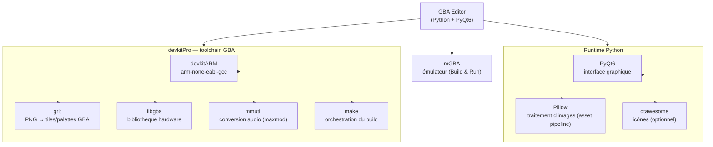

# Architecture

Détails techniques du projet — terminologie, structure des fichiers, pipeline de build. Le [README](README.md) reste le point d'entrée pour un utilisateur ; ce document est pour qui modifie le code.

---

## Arborescence

```
gba-editor/
├── editor/                          ← application Python (PyQt6)
│   ├── main.py                      ← point d'entrée
│   ├── window.py                    ← MainWindow + onglets
│   ├── core/
│   │   ├── project.py               ← classe Project : registres, scène active, recherches, save/load
│   │   ├── project_paths.py         ← tranche de Project : où chaque chose vit sur le disque
│   │   ├── project_variables.py     ← tranche de Project : globals et constantes
│   │   ├── project_texts.py         ← tranche de Project : table de textes + règles de la clé
│   │   ├── project_langs.py         ← tranche de Project : traductions, un fichier par langue
│   │   ├── project_renames.py       ← tranche de Project : renommer et réparer ce qui cite
│   │   ├── models/                  ← modèle de domaine (dataclasses + sérialisation), un fichier par sous-domaine
│   │   │   ├── ids.py                   ← id opaque partagé (données) vs nom lisible (code écrit à la main)
│   │   │   ├── resource.py, settings.py, palette.py, sub_palette.py
│   │   │   ├── components.py            ← Components ECS (CollisionBox/Sprite/SoundFx/Script) + registre
│   │   │   ├── sprite.py, background.py, audio.py
│   │   │   ├── font.py                  ← Font/Glyph : géométrie de planche, coût VRAM, fusion de cases
│   │   │   ├── text.py                  ← Text + clé dérivée + arbre de rangement (dérivé de la liste plate)
│   │   │   ├── scene.py                 ← Actor, Prefab, Scene, collision map
│   │   │   └── tile_codec.py            ← format binaire tuile/entrée de carte — module FEUILLE, n'importe rien
│   │   ├── resource_store.py      ← ResourceStore générique (I/O JSON par collection)
│   │   ├── project_migrations.py    ← migrations/réconciliations de formats JSON legacy (appelées par Project.load)
│   │   ├── asset_encoding.py            ← orchestration d'encodage déclenchée par l'apparition d'un PNG/audio sur disque
│   │   ├── collision_slopes.py      ← génération des tiles de pente (Bresenham) pour CollisionTool
│   │   ├── project_watcher.py       ← détection live des assets
│   │   ├── sprite_compose.py        ← composition d'une frame de sprite depuis son PNG source (PIL)
│   │   ├── font_import.py           ← import de police (PNG déduit / BMFont .fnt), mesure des chasses
│   │   ├── engine_emulation/           ← ce que l'éditeur REFAIT en Python parce que la console
│   │   │   │                          le fait en C — DEUX implémentations à tenir d'accord
│   │   │   ├── text_layout.py       ← où atterrit chaque glyphe (jumeau : text_layout() du moteur)
│   │   │   ├── blend_preview.py     ← les formules BLDCNT/BLDALPHA/BLDY appliquées aux images
│   │   │   ├── module_render.py     ← rejoue un module façon mixeur maxmod (taux réduit, sans interpolation)
│   │   │   ├── music_deck.py        ← la couche module et ses 2 transitions (jumeau : music_transition_tick())
│   │   │   ├── module_model.py      ← le modèle commun aux 4 formats + reconnaissance par signature
│   │   │   └── mod/s3m/xm/it_file.py ← les 4 lecteurs de format que maxmod accepte
│   │   ├── text_markup.py           ← langage de balisage des textes (BBCode) : analyse → affiché + effets
│   │   ├── toolchain.py             ← détection devkitPro/mGBA (PATH, config, emplacements connus)
│   │   │                             + `config_dir()`, où les 4 réglages de MACHINE posent leur JSON
│   │   ├── interface_preferences.py ← ce que l'interface montre d'elle-même (astuces) — par machine
│   │   └── ...
│   ├── codegen/
│   │   ├── pipeline.py              ← orchestration build
│   │   ├── grit_conversion.py        ← grit (sprites + BG + Sounds)
│   │   └── runtime_codegen/         ← génération main.c, scènes, acteurs
│   │       └── data_tables.py       ← tables de données du projet, en `const` dans la ROM
│   ├── scripting/                   ← compilation Lua → C (voir section dédiée)
│   │   ├── parser.py / checker.py / codegen.py  ← Lua texte → AST → C
│   │   ├── api.py                   ← RUNTIME_API : catalogue unique de l'API Lua ↔ C
│   │   ├── lua_subset.py            ← le Lua accepté, et le refus qui dit quoi écrire (→ SCRIPTING.md)
│   │   └── script_templates.py      ← contenu initial d'un nouveau script (scène/actor/vide)
│   ├── plugins/                     ← plugins chargés dynamiquement (spec_from_file_location)
│   └── ui/                          ← rangé par écran, pas par type de widget
│       ├── screens.py               ← le contrat d'un écran (ProjectScreen), le
│       │                              descripteur EditorScreen, et register_screen()
│       │                              pour les plugins (cf. « Ajouter un écran »)
│       ├── common/                  ← transverse à tous les écrans
│       │   ├── theme.py             ← C (couleurs) / T (typographie) — jamais de valeurs en dur
│       │   ├── icons.py, widgets.py, reorderable_bar.py, build_panel.py
│       │   ├── notice.py            ← les 3 niveaux de contenu informatif
│       │   └── notices/notices.json ← leurs TEXTES, hors du code (cf. « Textes de l'ÉDITEUR »)
│       ├── home/
│       │   └── project_picker.py    ← écran d'accueil (HomeScreen)
│       ├── scene_manager/
│       │   ├── assets_finder_panel.py
│       │   └── inspectors/            ← un fichier par classe d'inspecteur
│       │       ├── actor_inspector.py, scene_inspector.py, camera_inspector.py
│       │       ├── uses_inspectors.py     ← Prefab/Script/Variable Uses (groupés, structure proche)
│       │       ├── languages_card.py      ← carte « Languages » du ProjectInspector (v0.9)
│       │       ├── dynamic_inspector.py   ← routeur, instancie tous les autres
│       │       └── component_editors/     ← un fichier par type de Component
│       ├── sprite_editor/             ← un fichier par sous-zone de l'écran
│       │   ├── sprite_finder_panel.py     ← panneau gauche (sprites + anims)
│       │   ├── frame_canvas.py            ← timeline + canvas de composition tuile par tuile
│       │   ├── spritesheet_viewer.py      ← tile picker sur le PNG source
│       │   ├── direction_widget.py        ← sélecteur 3×3 de directions
│       │   ├── sprite_center_panel.py     ← assemble playback+canvas+tiles+timeline
│       │   ├── sprite_right_panel.py      ← propriétés/collision/anim settings/palette
│       │   └── sprite_editor_screen.py    ← écran complet (assemble les 3 colonnes)
│       ├── palette_editor/            ← un fichier par sous-zone de l'écran
│       │   ├── palette_file_io.py           ← lecture/écriture .gpl / .pal / liste hex
│       │   ├── swatch_button.py             ← case de palette peinte (contour animé)
│       │   ├── color_wheel.py               ← roue teinte + triangle saturation/luminosité
│       │   ├── palette_finder_panel.py      ← panneau gauche (catalogue du projet)
│       │   ├── palette_grid_panel.py        ← centre : grille de swatches, sélection, zoom, écritures
│       │   ├── color_inspector_panel.py     ← panneau droit : roue/hex/RGB/TSL de la couleur active
│       │   ├── palette_usage_card.py        ← carte USAGE (bas du panneau droit) : qui utilise la palette
│       │   └── palette_editor_screen.py     ← écran complet (assemble les 3 colonnes)
│       ├── data_editor/              ← un fichier par sous-zone de l'écran
│       │   ├── data_commands.py            ← écritures annulables (cellule, ligne, colonne)
│       │   ├── data_finder_panel.py        ← panneau gauche (les tables du projet)
│       │   ├── data_grid_panel.py          ← centre : la grille, en-tête éditable en place
│       │   ├── data_inspector_panel.py     ← panneau droit : la colonne, et ce que la cellule désigne
│       │   └── data_editor_screen.py       ← écran complet (assemble les 3 colonnes)
│       ├── sound_mixer/
│       │   ├── box_playback.py             ← lecture ROM d'une MusicBox (sortie audio + cache des modules)
│       │   ├── music_graph.py              ← centre : le graphe de la MusicBox (nœuds déplaçables)
│       │   ├── sound_commands.py           ← écritures annulables (déplacer, supprimer, renommer un état)
│       │   ├── state_machines.py           ← hôte du graphe, inspecteur d'état, tables actions × états
│       │   ├── sound_budget_bar.py         ← bandeau canaux, LOCAL à l'écran (jumeau de GbaStatusBar)
│       │   └── sound_panel.py              ← écran complet (finder + 3 onglets de boîtes + inspecteurs)
│       ├── script_editor/             ← un fichier par sous-zone de l'écran
│       │   ├── colors.py                  ← proxys couleur partagés par tout l'écran
│       │   ├── lua_editor.py               ← coloration syntaxique + widget d'édition
│       │   ├── sidebar_widgets.py          ← briques section/sous-section/bouton
│       │   ├── var_table_panel.py          ← table GLOBALS/CONSTANTS de la sidebar
│       │   ├── sidebar_panel.py            ← sections EVENTS/API/RÉFÉRENCES
│       │   ├── script_finder_panel.py      ← arbre de fichiers scripts
│       │   └── script_editor.py            ← écran complet (assemble sidebar+éditeur+finder)
│       └── text_editor/               ← un fichier par sous-zone de l'écran
│           ├── colors.py                  ← familles police / texte, partagées par l'écran
│           ├── glyph_paint.py              ← trouage des couleurs-clés + damier
│           ├── text_commands.py            ← commandes annulables (clé, rangement, planche)
│           ├── font_finder_panel.py        ← colonne gauche (liste des polices)
│           ├── text_panel.py               ← centre, contexte Texte : arbitre table et atelier
│           ├── text_table.py               ← la table des textes (haut du centre)
│           ├── text_workbench.py           ← l'atelier d'écriture (bas du centre)
│           ├── font_screen_preview.py      ← aperçu écran GBA (monté par l'atelier)
│           ├── glyph_sheet.py              ← planche de glyphes (canvas)
│           ├── glyph_sheet_panel.py        ← centre, contexte Police : planche + outils
│           ├── markup_highlighter.py       ← coloration des balises (lit les spans du parseur)
│           ├── markup_toolbar.py           ← boutons de balisage (dérivés de TAGS, agissent sur la sélection)
│           ├── inspector_shell.py          ← coquille commune aux deux inspecteurs
│           ├── text_inspector.py / font_inspector.py  ← colonne droite, un par contexte
│           └── text_editor_screen.py       ← écran complet (assemble les 3 colonnes)
├── runtime/                         ← le moteur GBA écrit À LA MAIN, en C. Aucun .py :
│   │                                  pour l'éditeur c'est de la DONNÉE, jamais importée,
│   │                                  seulement recopiée dans build/ (cf. app_paths.RUNTIME_DIR)
│   ├── Makefile                     ← copié dans build/, pilote arm-none-eabi-gcc
│   └── include/
│       ├── gba_engine.h             ← le gros du moteur (~2 750 l.) : VRAM, layers, windows,
│       │                              blending, palettes, fonds animés, texte, SRAM.
│       │                              Inclus UNE SEULE FOIS, depuis le main.c généré
│       ├── actor_api_static.h       ← la même API REDÉCLARÉE en extern, pour les unités de
│       │                              compilation des acteurs et des scènes, qui n'incluent
│       │                              pas le moteur (cf. « Deux listes de prototypes »)
│       ├── actor_types_static.h     ← structs et constantes GBA, partie non générée
│       └── runtime.h                ← API partagée entre le main.c généré et les scripts
├── packaging/                       ← packaging Nuitka + CI (voir section dédiée)
│   ├── nuitka_build.py              ← commande de build unique (CI et local)
│   ├── check_deps.py                ← garde-fou requirements.txt vs imports réels
│   ├── icon.ico / icon.png
│   ├── windows/installer.nsi        ← installateur NSIS (par utilisateur)
│   └── linux/                       ← AppImage (job CI en pause)
├── tools/
│   └── check_architecture.py        ← les règles de ce document, rendues exécutables
│                                      (voir « Les règles ci-dessus se vérifient toutes seules »)
├── tests/                           ← `pytest tests` — les trois modules où une
│   │                                  erreur est SILENCIEUSE (pas d'exception,
│   │                                  pas de message : une ROM fausse)
│   ├── test_vram_alloc.py           ← géométrie VRAM BG + le garde-fou de l'allocateur
│   ├── test_palette_alloc.py        ← les 16 banques, blocs contigus, débordement
│   ├── text_layout_cases.py         ← polices et textes d'essai, partagés
│   ├── test_text_layout.py          ← mise en page, côté aperçu Python
│   ├── test_text_layout_native.py   ← ÉQUIVALENCE Python ↔ C : compile le vrai
│   │                                  gba_engine.h et compare les placements.
│   │                                  Saute sans compilateur C hôte (cf. `CC`)
│   └── native/                      ← la sonde C et six en-têtes libgba bidon,
│                                      de quoi compiler le moteur sur PC
├── .github/workflows/tests.yml      ← contrôle d'architecture + tests, à chaque poussée
├── .github/workflows/release.yml    ← build + release GitHub automatique
└── Project Demo/                    ← modèles de projet téléchargeables (voir README)
    └── Pong/                        ← projet démo
        ├── Pong.gba-project         ← manifeste : config racine (scène de démarrage, auteur, version) ET point d'entrée double-clic ; le nom du projet EST le nom du fichier (v0.10, remplace project.json)
        ├── assets/                  ← dépend d'une ressource externe (image, son...)
        │   ├── sprites/             ← PNG + JSON sidecar (SpriteAsset)
        │   ├── backgrounds/         ← PNG + JSON sidecar (BackgroundAsset)
        │   └── scripts/             ← scripts Lua source (acteurs, scènes, caméras)
        ├── project/                 ← données éditeur pures, aucune dépendance externe
        │   ├── scenes/              ← définition des scènes (.json)
        │   ├── palettes/            ← PaletteBank (.json) — catalogue de palettes nommées, 1 fichier/palette
        │   ├── prefab/              ← préfabs d'acteurs (.json)
        │   ├── data/                ← tables de données (.json) — colonnes typées, lignes
        │   └── variables.json       ← globals + constants du projet
        └── build/                   ← 100% généré, gitignored — compile assets/ ET project/
```

---

## Terminologie

### Correspondances éditeur ↔ GBA / grit

Ces concepts ont un équivalent direct dans le hardware ou la toolchain.

| Éditeur | GBA / grit | Description |
|---------|------------|--------------|
| `SpriteAsset` | tiles OBJ VRAM | PNG converti par grit en tiles 8×8 chargées dans OBJ VRAM |
| `TileCell` | tile index VRAM | Une tile 8×8 référencée par son index dans VRAM |
| `AnimFrame` | plage de tile indices | Un état visuel = N tiles dans VRAM |
| `Actor` | `struct Actor` + `OBJATTR` (OAM) | Une entrée de `g_actors[]`, affichée via une entrée OAM. Les composants de l'éditeur sont les blocs de la struct : `SpriteComponent` → `Actor.sprite`, `CollisionBoxComponent` → `Actor.collision` (cf. « Une seule entité runtime ») |
| `BackgroundLayer` | charblock (CBB=`bg_slot`) + screenblock | `{image, bg_slot, scroll_speed, pal_bank, tile_palette_overrides}` — un plan BG physique **de la scène** |
| `BackgroundAsset` | tileset + sous-palettes | Sidecar (`project/backgrounds/{image}.json`), keyé par nom comme `SpriteAsset` — PNG source jamais modifié 
| `Scene.background_layers` | jusqu'à 4 `REG_BGxCNT` | Liste de `BackgroundLayer` inline dans le JSON de la scène (chacun référence un `BackgroundAsset` par nom d'asset) |
| `PaletteBank` | 16 couleurs BGR555 | Palette nommée du catalogue (`project/palettes/*.json`), partagée OBJ/BG |
| `Scene.active_obj_palettes` / `Scene.active_bg_palettes` | 16 banques `PAL_OBJ`/`PAL_BG` | Sélection ordonnée (index = banque hardware) des palettes actives de la scène ; `pal_bank` indexe dans cette liste |
| `Scene` | `scene_init_X` / `scene_tick_X` | Paire de fonctions C dispatchées via vtable dans `main.c` |
| `ScriptComponent` (Lua) | fonction C compilée | Le Lua est transpilé vers C, pas interprété à l'exécution |

### Abstractions pures de l'éditeur

Ces concepts n'ont pas d'équivalent direct dans grit ou le hardware GBA.

| Concept | Rôle | Résolution au build |
|---------|------|----------------------|
| `Prefab` | Template d'acteur réutilisable | Chaque instance génère son propre code C |
| `AnimState` | État d'animation nommé (`Idle`, `Walk`…) | Converti en index entier, pas de concept GBA natif |

### Components

| Nom | Rôle | API Lua |
|-----|------|---------|
| `SpriteComponent` | Lien vers un `SpriteAsset`, état initial, vitesse d'animation... | `self:play_anim("state")` `self.anim` (lecture, comparable par nom) `self.anim_speed = n` (surcharge, 0 = vitesse de l'état) `self.anim_length` / `self.anim_loop` / `self.anim_finished` (lecture) `self.frame_w` / `self.frame_h` (lecture) `self.frame = n` `self.visible = bool` `self.flip_h = bool` `self.pal = n` `self.priority = n` |
| `CollisionBoxComponent` | AABB de collision. `solid` ne décide que d'une chose : la box est-elle arrêtée par la carte de collision de la scène | handlers du script de l'actor (pas du composant) : `on_collision_enter(other, my_box, other_box)` `on_collision_exit(...)` `on_collide(...)` `on_tile_collide(nx, ny)` |
| `SoundFxComponent` | Déclenche un effet sonore lié à l'acteur | `sfx.play("name")` |
| `ScriptComponent` | Attache un script Lua à l'acteur — **un seul actif par actor** (le compilateur n'en lit de toute façon qu'un seul) | `on_start()` `on_update()` `on_late_update()` |
| `PathComponent` | Chemin de déplacement (waypoints) | — (en cours) |

### Une seule entité runtime

L'éditeur distingue trois choses : un **actor** (logique de jeu), un **sprite** (son rendu),
un **background** (le décor). L'API C n'a **qu'une struct**, `Actor`. Ce n'est pas un oubli,
et les deux absences n'ont pas la même cause.

**Le sprite est dans l'`Actor`, et c'est assumé.** Un actor porte au plus un
`SpriteComponent` : le rapport est 1:1, donc séparer coûterait un déréférencement par accès
sur un ARM7TDMI sans cache, pour zéro gain de modèle. Ce qui EST séparé, c'est la
**définition** du sprite — états, directions, vitesses, boucles — qui n'est pas une struct du
tout mais des tables `static const` en ROM, émises par sprite (`sprite_{nom}_anim_dirs`,
`_state_start`, `_state_speed`, `_state_loop`, et les `_frame_action`/`_frame_sfx`/
`_frame_event` optionnelles). **La coupure est const/variable, pas classe/classe.**

**Le background n'a pas de type parce que le calque EST le matériel.** `layer_show(int bg, …)`,
`layer_set_scroll(int bg, …)`, `tilemap_set(int bg, …)` — l'état tient dans les registres
ombres `g_bgcnt_sh[4]` et `g_bg_ofs_x/y[4]`. Il y a quatre plans dans la machine ; leur donner
un type instanciable suggérerait qu'on peut en créer un cinquième. Les seules structs BG sont
`BgAnim` et `BgTileAnim`, qui sont des **états d'animation**, pas des backgrounds.

**Le merge ne dispense pas de nommer ses parties** (ROADMAP — chantier technique *La grammaire
de la struct `Actor`*). La struct porte trois
familles, et ses deux blocs sont exactement les composants de l'éditeur — pour que le C émis
se lise avec le vocabulaire de l'inspecteur, et pas un second :

| Bloc C | Composant éditeur | Champs |
|---|---|---|
| `Actor` (racine) | `Actor` | `x, y, vx, vy, timer, tag, active, dir_x, dir_y, rotation, scale_x, scale_y, visible, priority, pal_bank, obj_mode, flip_h, flip_v` |
| `Actor.sprite` | `SpriteComponent` | `frame, anim_state, anim_speed, anim_length, anim_loop, anim_finished, frame_w, frame_h, auto_dir, rotation, scale_x, scale_y, offset_x, offset_y, affine_slot` |
| `Actor.collision` | `CollisionBoxComponent` | `grounded, last_x, slope_acc, box_count, boxes[]` |

Le namespace a supprimé les trois abréviations qui n'existaient que parce que la struct était
plate : `sprite_rot` → `sprite.rotation`, `sprite_scale_x/y` → `sprite.scale_x/y`,
`offset_x/y` → `sprite.offset_x/y`.

**La surface Lua ne bouge pas** : `self.frame`, `self.sprite_scale`, `self.anim_length`
passent par les accesseurs de `actor_api_static.h`, seul endroit du dépôt qui touche les
champs. `scripting/api.py`, `codegen.py`, `checker.py` et `expr_types.py` n'en connaissent
aucun — ils n'émettent que des `&g_actors[TAG_*]` et des appels `actor_get/set_*`. C'est cette
couche d'accesseurs qui a rendu le découpage possible sans rupture pour les projets existants.

**`self.anim_length`/`self.anim_loop`/`self.anim_finished` sont écrites sur `Actor.sprite`,
pas lues dans la table du sprite — et ce n'est pas une duplication.** `{sprite}_state_loop[]`
est `static`, déclarée dans le fichier où `scene_tick` est généré — invisible d'un script qui
vit dans `actor_{sym}.c`. Mais la vraie raison est ailleurs : `anim_length` n'est pas
`state_len[state]`, c'est la longueur du bloc de la **direction actuellement jouée**, que le
tick trouve par un parcours de `anim_dirs[]` avec repli sur la direction omni. Les trois
champs **mémoïsent ce parcours** — un script qui lit `self.anim_length` ne le refait pas.
Exposer les tables aux scripts a été évalué puis écarté dans le chantier technique *La grammaire
de la struct `Actor`* (ROADMAP) : ça déplacerait la boucle
dans chaque lecture. Le tick d'animation (`main_gen._anim_tick_lines`) les écrit donc CHAQUE
frame, comme `resolve_actor_tiles` écrit `collision.grounded`. Même raison pour
`self.frame_w`/`self.frame_h` : posées une fois à l'init/au spawn depuis
`SpriteAsset.frame_w/frame_h`, elles fonctionnent aussi sur un AUTRE acteur (`other.frame_w`)
sans le piège des propriétés à domaine (`self.anim`, `_RECEIVER_DOMAINS`) — ce ne sont que des
entiers ordinaires sur la struct, pas des noms résolus contre l'acteur qui exécute le script.
`anim_finished` compare la position dans la séquence (`frame - fs`, 0-based) à `anim_length` :
vrai dès que la dernière case est atteinte, reste vrai tant que l'état ne change pas (comme
`grounded` reste vrai tant qu'on ne quitte pas le sol), et vaut toujours faux pour un état qui
boucle.

**Bug découvert en construisant `anim_finished` (2026-08-23) : `frame` pouvait pointer hors de
l'état courant.** `self:play_anim` remet `frame` à 0 — une frame ABSOLUE dans le sheet
dédupliqué du sprite entier (ROADMAP v0.8.1), qui ne tombe dans le bloc du nouvel état que
si celui-ci commence pile à l'offset 0. Pour tout état suivant (`Walk` après `Idle`, par
exemple), l'acteur affichait donc quelques frames d'un AUTRE état — jusqu'à `state_speed`
ticks, soit jusqu'à ~130 ms à 60 fps — avant de reconverger par hasard via l'arithmétique de
`_fi = frame - _fs` (qui partait négative). Un changement de DIRECTION vers un bloc de frames
différent au sein du même état souffrait du même trou. Corrigé par un recalage inconditionnel,
à CHAQUE tick, avant tout calcul d'avancée : `frame` hors de `[_fs, _fs+_fc)` est immédiatement
ramené à `_fs` (et `timer` à 0). C'est ce recalage qui rend `anim_finished`/`anim_length`
fiables dès la première frame d'un état — sans lui, les deux auraient hérité du même glitch.

**`self.priority` n'existait pas du tout — pas même en lecture — malgré un tooltip qui
l'affirmait (2026-08-24).** `Actor.priority` (éditeur) était un LITTÉRAL Python soudé
directement dans l'émission OAM (`{actor.priority}<<10`, `main_gen`), exactement comme
`frame_w`/`frame_h` l'étaient avant eux — donc rien à lire depuis un script. Devenu un champ
`int priority` ordinaire sur `Actor` (même registre OAM que `pal_bank`/`obj_mode`, donc la
même liberté), posé à l'init depuis la valeur authorée pour un acteur de scène, à 0 pour un
acteur poolé (sans sens pour un template, cf. `core/models/scene.py::Prefab`) — mais
modifiable ensuite par script dans les deux cas, l'émission OAM lisant désormais
`g_actors[i].priority` plutôt que la constante.

### Règles clés

- **`assets/` vs `project/`** — la distinction qui structure tout le projet : `assets/` contient ce qui dépend d'une ressource externe à l'éditeur (une image PNG, un son) ; `project/` contient les données propres à l'éditeur, sans dépendance externe (scènes, prefabs, variables...). Les deux sont traités par l'éditeur et compilés dans `build/` — la différence est l'origine de la donnée, pas son traitement.
- `assets/` → la source de vérité des assets bruts ; le JSON sidecar est auto-géré par l'éditeur
- `assets/backgrounds/` → PNG bruts (`BackgroundAsset`) ; → sidecar d'importation par image (`BackgroundAsset` : tileset + sous-palettes, PNG jamais modifié). 
- `assets/scripts/` → scripts Lua édités par le dev ; copiés dans `build/src/` au build
- `build/grit_out/` et `build/src/` → effacés et regénérés à chaque build ; `build/obj/` est conservé pour la compilation incrémentale
- `<Nom>.gba-project` → manifeste racine (v0.10, remplace `project.json`) : c'est LUI qu'on double-clique, associé à l'éditeur sur les deux OS, et son nom de fichier EST le nom du projet (aucune clé `name` dans le JSON). Config racine uniquement (scène de démarrage, auteur, version) ; un `project.json` d'avant v0.10 se relit une fois et se réécrit dans la nouvelle forme à la première sauvegarde ; `start_scene` (point de départ du **jeu**, éditable dans le ProjectInspector) et `last_scene` (dernière scène ouverte dans l'**éditeur**, restaurée à l'ouverture) sont deux champs distincts — ouvrir une scène ne redéfinit jamais le point de départ ; toutes les autres données vivent dans `project/**/*.json`, y compris `project/variables.json` (globals + constants, unicité de nom vérifiée par type — un global et une constante peuvent partager un nom)
- Les assets sont référencés **par nom** (ex. `SpriteComponent.sprite_name`, `BackgroundLayer.backgroundasset_name`, palette active par nom de `PaletteBank`) — jamais par chemin absolu
- Un argument de script qui cite un élément du projet est déclaré par le `domain` de son `Param` dans `scripting/api.py` (`DOMAIN_SCENE`, `DOMAIN_SFX`, `DOMAIN_GLOBAL`…). Cette table unique sert au checker (valider), au codegen (résoudre en index physique) et à `scripting/refactor.py` (suivre les renommages) : déclarer le domaine d'un nouvel argument suffit à alimenter les trois. Un renommage éditeur (`Project.rename_*`) réécrit les références Lua correspondantes en repérage **structurel** — jamais textuel, donc ni les commentaires ni les strings sans rapport ne bougent
- Les scripts Lua sont **transpilés vers C** au build, pas interprétés à l'exécution
- Les `GlobalVar` sont des variables C partagées entre tous les scripts du jeu (`globals.h` / `globals.c` générés une fois par build, pas par scène)
- Chaque scène génère une paire C `scene_init_X` / `scene_tick_X` dispatchée via une vtable statique dans `main.c`

---

## API Lua ↔ C

Le script Lua n'est jamais traduit directement en texte C : il passe par un AST Python intermédiaire, lui-même validé et traduit via un catalogue déclaratif unique.

```
texte Lua → parser.py → AST Python → checker.py (validation) → codegen.py → texte C
                                            ↑                        ↑
                                            └── scripting/api.py ──┘
                                          (RUNTIME_API : catalogue unique)
```

- **`parser.py`** — modélise la grammaire Lua en dataclasses Python (`StmtIf`, `ExprInvoke` pour `self:method()`, etc.). Spécifique à Lua : remplacer le langage de script demanderait de réécrire ce fichier (et une partie du pattern-matching de `checker.py`/`codegen.py` sur ces formes syntaxiques), mais pas le reste de la chaîne.
- **`api.py`** (`RUNTIME_API`) — source de vérité unique pour toute fonction Lua exposée au runtime : nom Lua, fonction C cible, types de paramètres, domaine de résolution des chaînes (`DOMAIN_ANIM`, `DOMAIN_SFX`, `DOMAIN_SCENE`...). Utilisé à la fois par `checker.py` (valider un appel connu) et `codegen.py` (générer l'appel C générique via `_emit_api_call`).
- **`checker.py`** — parcourt l'AST et valide les appels contre `RUNTIME_API` (fonction connue, bon nombre d'arguments — y compris les fonctions variadiques comme `display.print`, nom de ressource existant). Ne bloque le build que sur les erreurs (`CheckError.level == "error"`) ; les avertissements (ex. valeur littérale hors plage écrite dans une globale typée, `global.score = 70000` sur un `u16`) sont journalisés sans empêcher la compilation. Appliqué uniformément aux scripts actor, scène et prefab via `lua_compiler.py::_compile_script` — un prefab avec une erreur bloque désormais le build comme un actor, plutôt que d'être silencieusement sauté. Les behaviors (`require("behaviors/x")`, inlinés par `codegen.py::_emit_inlined_behaviors`) passent par le même checker avec `check_event_names=False` (leurs fonctions top-level sont des noms de méthode arbitraires, pas des handlers d'événement) ; fichier manquant ou erreur de parse y remontent comme avertissement plutôt que de casser silencieusement ou de lever une exception Python brute.
- **`codegen.py`** — pour la majorité des appels, `_emit_api_call` génère l'appel C directement depuis l'entrée `RUNTIME_API` correspondante. Une poignée de fonctions ne se traduisent pas par un simple appel de fonction (`self:destroy` → deux instructions enchaînées, `sfx.play` → arguments synthétisés depuis la ressource Sfx du projet...) : elles sont réunies dans deux tables de dispatch en fin de fichier, `_INVOKE_CUSTOM` et `_CALL_CUSTOM`, plutôt que dispersées en `if`/`elif` dans le code de traduction. Chacune de ces fonctions a quand même une entrée dans `RUNTIME_API` pour la validation/documentation. `global.nom`/`const.nom` ne sont ni l'un ni l'autre (chantier global/const) : ce sont des accès POINTÉS, pas des appels — comme `self.position` (RUNTIME_PROPS) ou `data.Objets`, résolus directement dans la branche `ExprIndex` de `_expr` (accès direct à la variable C `g_nom` / au symbole `CONST_NOM`), et validés côté checker par `_check_global_scalar`/`_check_global_indexed`/`_check_const_scalar` plutôt que par le catalogue.
- **Important pour toute nouvelle fonction Lua** : si elle se traduit par un simple appel C avec conversion d'arguments, une entrée dans `RUNTIME_API` suffit *côté traduction*. Ce n'est que si elle a besoin de logique de traduction (nom C dynamique, arguments non présents côté Lua, émission multi-instructions) qu'elle doit aussi rejoindre `_INVOKE_CUSTOM`/`_CALL_CUSTOM`.
- **Mais une fonction du moteur doit être déclarée DEUX fois** — voir « Deux listes de prototypes » ci-dessous. C'est le piège le plus coûteux de cette chaîne, parce qu'il ne se manifeste qu'au `make`.
- **`lua_subset.py`** — la LISTE de ce que le langage accepte, et de ce qu'il refuse en le disant (`changelog-archive/v0.7.md`, v0.7.5). Chaque nœud de luaparser y est rangé dans une des trois cases — `ACCEPTED` (il se traduit), `REFUSED` (avec la phrase qui dit quoi écrire à la place) ou `STRUCTURAL` (jamais dispatché) — et la bibliothèque standard de Lua (`print`, `math.floor`, `table.*`…) reçoit le même traitement, par nom. Trois consommateurs : `checker.py` (refuser en nommant l'issue), `SCRIPTING.md` (expliquer — un test échoue si un refus n'y est pas documenté) et `validator._check_lua_subset` (**erreur bloquante** si un nœud de luaparser n'est classé nulle part, exactement comme `_check_api_domains` pour les domaines d'arguments). Avant elle, `parser.py` rendait `None` pour tout statement non géré — un `repeat` ou un `for … in` disparaissait du jeu sans un mot — et `ExprName("__unsupported_<Type>")` pour toute expression non gérée, qui n'échouait qu'au `make`. Les nœuds non traduits sont désormais PORTÉS (`StmtUnsupported`, `ExprUnsupported`, avec leur ligne) : le parser décrit, le checker juge. Ce qui n'atteint même pas l'AST — une faute de SYNTAXE — est le seul refus que le parser prononce lui-même, et il le prononce dans la même langue : `LuaParseError` porte sa `line` et une phrase, reconstruites depuis la chaîne d'exceptions d'antlr que luaparser jette en formatant son `syntax errors: None` (cf. `_syntax_message`, et la table de faux amis qui ne se balaie qu'après un échec).
- **`expr_types.py`** — les deux exceptions au sous-ensemble Lua entièrement scalaire (ROADMAP v0.7.3 et v0.8.6) : `vec2(x, y)`/`vec3(x, y, z)` sont des constructeurs de langage, pas des entrées `RUNTIME_API`. `checker.py` et `codegen.py` partagent ce module pour savoir si une expression EST un vec2/vec3 (locals `self._vec_types`, remplie au fil d'un même parcours à plat dans les deux fichiers — même approximation que `self._arrays`) plutôt que de laisser chacun réinventer sa propre inférence. `+`/`-`/`*` (par un entier) s'y traduisent en appels `vec2_add`/`vec2_sub`/`vec2_scale` (`actor_api_static.h`) : le C n'a pas d'opérateur sur les structs. La seconde exception sont les **références** — ce qu'un appel REND (`local pas = sfx.play("Pas")`) : une valeur composée se copie, une référence DÉSIGNE un slot pris dans un pool du matériel, mais les deux répondent à la même question (« quel type porte ce nom ? ») et deux modules y auraient fini par répondre différemment. Le module s'appelait `vec_types.py` tant qu'il n'y avait qu'une exception.

### La grammaire de l'API — trois formes, une par nature

L'API expose trois formes syntaxiques, et chacune a UNE nature. La forme n'est pas
un choix stylistique : c'est elle qui dit au parseur quoi produire (`Invoke` pour
`:` — parser.py —, `Index` pour `.`), donc qui décide de la résolution.

| Syntaxe | Nature | Compile en |
|---|---|---|
| `identifier:member(...)` | **méthode** — opération sur une instance, qui peut produire un effet | `actor_member(récepteur, ...)`, ou `sfx_member(...)` sur une référence |
| `identifier.member` | **propriété** — donnée que l'API expose comme un état, lue et écrite | `actor_get_member(...)` / `actor_set_member(...)` |
| `module.member(...)` | **fonction module** — opération au niveau du système, sans instance | `module_member(...)` |

`identifier` dans la forme méthode est une **instance** : un acteur (`self`, `other`, une
variable d'actor) ou une **référence** rendue par un appel (`local pas = sfx.play("Pas")` →
`pas:set_volume(80)`, ROADMAP v0.8.6). Le catalogue range les méthodes d'acteur sous la clé
`self:` et celles d'une référence sous le TYPE qu'elle porte (`sfx:`) : c'est ce type, relevé
sur le `local` par `expr_types.infer_ref_type`, qui décide de la fonction C émise — sans lui,
`pas:set_volume` retomberait sur le repli `actor_set_volume(pas, …)`, qui ne compile pas.
`module` est un namespace (`sfx`, `math`, `camera`, `scene`,
`input`, `blend`…). Le même namespace peut exposer des propriétés ET des
fonctions (`camera.position` + `camera.follow(...)`) : les parenthèses lèvent
l'ambiguïté.

La règle de décision pour TOUTE API future, dérivée des définitions ci-dessus :

- **état intrinsèque** → propriété (`self.position`, `blend.mode`) — jamais un
  appel `get_*`/`set_*`.
- **requête pure sans argument** (`input.get_axis()`, `scene.frame()`) → c'est
  de l'état déguisé en fonction → propriété en lecture seule.
- **requête INDEXÉE** (`tile.get(x, y)`, `save.read(slot, "nom")`, `layer.get_*(n)`) →
  reste une fonction : une propriété ne prend pas d'argument.
- **action qui produit un effet** → méthode si elle porte sur une instance
  (`self:move(...)`), fonction module si elle agit au niveau du système
  (`scene.switch(...)`, `sfx.play(...)`).

Deux cas hors des trois formes : les **fonctions libres** (`get_actor(name)`,
`array`) et les **constructeurs** (`vec2(x, y)`) — ni instance, ni module.

`global.nom` / `const.nom` (chantier global/const) sont de la forme PROPRIÉTÉ — lues et
écrites comme `identifier.member` — sans compiler en getter/setter : `nom` est
un nom de PROJET, pas un membre de langage fixe, donc pas d'entrée
`RUNTIME_PROPS` possible (une par variable déclarée serait un catalogue qui se
régénère à chaque édition de l'écran Variables). Elles compilent en accès
direct — `g_nom` / `CONST_NOM` — validé par nom via `BuildContext.global_counts`
/ `.const_names` plutôt que par catalogue figé, même schéma que `data.Objets`.

Deux conséquences qui se paient cher si on les oublie :

- **Méthode et propriété s'écrivent sur N'IMPORTE QUEL acteur nommé**, pas seulement
  `self` : `other.velocity`, `other:move(...)`. Le catalogue les range sous la clé
  `self:`/`self.` — c'est une clé, pas une restriction — et `checker.py` valide donc
  tous les récepteurs. N'en valider qu'un laissait `other:set_position(p)` traverser
  sans un mot, pendant que `codegen._invoke` en émettait du C qui compile : l'API
  retirée survivait tant qu'on ne l'écrivait pas sur `self`. Seule exception, bloquée
  explicitement : un argument OU une comparaison de propriété dont le nom appartient
  au sprite du RÉCEPTEUR (`other:play_anim("walk")`, `other.anim == "walk"`), que le
  contexte de build ne peut ni vérifier ni résoudre — il ne décrit que l'acteur qui
  *exécute* (`checker._RECEIVER_DOMAINS`, jugé dans `_check_args` ET
  `_check_prop_domain_value` — les deux portes par lesquelles un nom de domaine entre).
- **Une propriété peut porter un domaine** (`ApiProp.domain`), donc s'écrire et se
  comparer par un NOM : `self.obj_mode = "window"`, `blend.mode == "alpha"`,
  `other.tag == "Ball"`. C'est le même `DOMAIN_*` que sur un paramètre, jugé par les
  mêmes tables (`checker._DOMAIN_CHECKS`, `codegen._DOMAIN_CONSTANT`) — une énumération
  du matériel et un espace de noms du projet s'y traitent donc pareil. Sans ce champ,
  faire d'un réglage une propriété le faisait
  retomber sur l'entier nu que les énumérations nommées existent pour supprimer — c'est
  l'asymétrie qu'avaient `self:set_dir("north")` et `self:get_dir()` rendant un `0-8`,
  tous deux absorbés depuis par `self.direction`. Le C, lui, ne change pas :
  `OBJ_MODE_WINDOW` vaut toujours un entier. Quand la forme nommée n'atteint pas l'état
  par la même fonction C que la forme ordinaire — `self.direction` est un vec2 côté
  calcul, une boussole côté nom — `c_getter_named`/`c_setter_named` portent la seconde
  porte. Une seule propriété, deux écritures.

### Deux listes de prototypes, et le garde-fou qui les tient d'accord

`gba_engine.h` porte l'implémentation du moteur ; `actor_api_static.h` **redéclare** la même
chose en `extern`, parce que les scripts d'actor et de scène sont compilés en unités de
traduction séparées qui n'incluent pas le moteur.

Une fonction ajoutée d'un seul côté franchit donc tout le chemin sans rien signaler —
checker vert, C émis correct — pour échouer au `make` sur un `implicit declaration of
function`, message qui pointe la ligne générée et jamais la cause. C'est exactement ce
qui a maintenu `text_clear_in` inatteignable depuis Lua : écrite dans le moteur, jamais
redéclarée.

`validator._check_api_prototypes` compare donc les deux listes à chaque build, en **erreur
bloquante** : le lien est de toute façon perdu, autant le dire avant de lancer la chaîne C.
La règle est *dérivée* — est exigé dans `actor_api_static.h` ce qui est déjà présent dans
`gba_engine.h`. Les fonctions résolues ailleurs (méthodes d'actor, `scene_switch`,
`sfx_play`, helpers de globals — générées dans `actor_api.h` ou déclarées dans
`runtime.h`) sortent du test d'elles-mêmes, sans liste d'exceptions à maintenir.

**Les CONSTANTES tombent dans le même trou**, et y sont tombées : le codegen émet `WINR_0`
et `BLD_SIDE_TOP` (c'est tout l'intérêt des énumérations nommées — cf. `api.py`,
« Énumérations matérielles »), or ces `#define` ne vivaient que dans `gba_engine.h`. Tout
`window.set_layer` / `blend.set_layer` écrit depuis un script échouait donc au `make` sur un
identifiant inconnu, alors que `OBJ_MODE_*`, `DIR_*` et `EASE_*` — recopiés, eux — passaient.
Elles sont maintenant déclarées des deux côtés et comparées par le même garde-fou, dérivé de
`HARDWARE_ENUMS`. Sans `#ifndef` : main.c voyant les deux fichiers, une valeur qui divergerait
ferait crier le préprocesseur au lieu de dériver en silence.

### Ce que l'éditeur INSÈRE dérive du catalogue

`scripting/api_snippets.py` fabrique le Lua que la sidebar du Script Editor propose au clic,
depuis `RUNTIME_API`. Écrits en dur, ces snippets pourrissaient sans que rien ne le signale :
la sidebar a proposé pendant des mois `scene_goto("X")` et `instantiate("X", x, y)`, deux
noms qui n'ont jamais existé dans le catalogue — et le checker les laisse passer (un appel
inconnu peut être un helper de l'utilisateur), donc l'erreur n'arrivait qu'à la compilation C.

`call(name, **by_domain)` remplit les arguments **par domaine** et non par position : c'est
ce qui fait qu'un réordonnancement de paramètres dans `api.py` n'invalide aucun appelant.

Même logique pour `api_reference.json`, qui ne décrit que la *présentation* (groupes, ordre,
descriptions rédigées) : `api_reference.get_categories()` le filtre par le catalogue puis le
complète avec lui. Une fonction retirée disparaît de l'écran, une fonction ajoutée y
apparaît sans qu'on touche au JSON — les deux dérives que ce fichier avait accumulées
(`display.print`, `display.clear`, `text.draw_box` encore proposées ; `text.draw_in`
absente).

### Un domaine a TROIS consommateurs, et deux ne le disaient pas

Le `domain` d'un `Param` sert à `refactor` (suivre les renommages), au
`checker` (le nom existe-t-il ?) et au `codegen` (quelle constante C émettre ?).
Le premier **dérive** sa table du catalogue (`_reference_sites()`) et n'a rien à
oublier. Les deux autres portaient une liste écrite à la main — une chaîne
d'`elif` et un `match` — et un domaine absent n'y produisait **aucun signal** :
le checker ne validait simplement rien, et le codegen retombait sur `case _`,
c'est-à-dire la chaîne émise telle quelle, donc du texte C là où le C attend un
entier. Panne au `make`, sur la ligne générée, jamais sur la cause. Même famille
que « deux listes de prototypes » ci-dessus.

Les deux listes sont devenues des **tables**, comparées à `api.ALL_DOMAINS` au
build par `validator._check_api_domains`, en **erreur bloquante**. `ALL_DOMAINS`
est lui-même dérivé des constantes `DOMAIN_*` du module : déclarer un domaine
suffit à entrer dans le contrôle. Placer un nouveau domaine dans l'une des cases
fait partie de son ajout :

| Côté | Cases |
|---|---|
| `checker` | validé par domaine (`_DOMAIN_CHECKS`) ou non validé **avec sa raison** (`_DOMAINS_UNCHECKED` — seul `tag` y est, l'auteur y met ce qu'il veut) |
| `codegen` | constante générique (`_DOMAIN_CONSTANT`) ou émetteur dédié (`_DOMAIN_EMITTED_ELSEWHERE`) |

Chacun n'expose qu'un `covered_domains()` — le contrôle demande « ce domaine
t'est-il connu ? », pas la mécanique interne.

### Un nom se vérifie par son DOMAINE, pas par le nom de l'appel

Cinq domaines étaient vérifiés par un contrôle accroché au nom de l'appel —
`scene.switch`, `get_actor`, `global.get`/`set`, `const.get` — et
`actor.spawn` ne l'était par rien. Deux conséquences, corrigées ensemble :

- **une seconde fonction prenant le même domaine n'aurait rien déclenché.** Le
  contrôle regardait `key == "scene.switch"`, pas « ce paramètre porte
  `DOMAIN_SCENE` ». Ajouter une `scene.preload` aurait donc rendu le domaine
  muet, sans que rien ne le dise ;
- **`DOMAIN_PREFAB` n'était validé nulle part.** `_emit_actor_spawn` émet
  `spawn_<Nom>(...)` sans rien vérifier, donc un nom fautif n'apparaissait qu'à
  la compilation C, sur un « implicit declaration of function » pointant la
  ligne générée. C'est une **erreur** de checker maintenant, pour la même raison
  qu'une scène inconnue : le build échouerait de toute façon, avec un message
  bien pire.

Ce qui reste accroché à un appel précis dans `_check_call_expr` ne porte plus
sur un nom : le numéro d'emplacement d'un `save.*`. Ce contrôle n'interrompt
plus la suite — d'où un effet de bord bienvenu : le **nombre d'arguments** de
ces appels est désormais vérifié lui aussi, alors qu'un `return` prématuré le
sautait. La **valeur** d'un `global.nom = v` (plage du type déclaré) n'est
plus accrochée à un appel : `global.get`/`set` et `const.get` ont quitté
`RUNTIME_API` au profit de l'accès pointé (chantier global/const) — cette valeur se
vérifie désormais à l'ASSIGNATION (`_check_global_write_value`, branchée sur
`StmtAssign`), pas sur un appel qui n'existe plus.

`BuildContext.prefab_names` porte la liste, remplie par `lua_compiler` depuis le
projet entier — un prefab est poolé au niveau projet, pas au niveau scène.

**Une collision a deux côtés, et chacun l'apprend dans son propre script.** Le tick de
scène teste deux familles de paires : scène↔scène et pool↔scène. La première appelait
déjà `on_collision_enter` des DEUX acteurs ; la seconde ne prévenait que le prefab. Un
acteur de scène heurté par un projectile poolé n'avait donc aucun moyen de réagir, et
devait passer par une variable globale que le projectile posait pour lui — une seconde
source de vérité pour un événement que le runtime connaissait déjà. Les deux appels
partagent maintenant le même test de recouvrement et le même souvenir de frame
(`_pcol_`), avec les boxes échangées : la `my_box` de l'un est l'`other_box` de l'autre.

### Tableaux — la forme est reconnue une fois, employée deux fois

Un tableau se déclare de deux façons, et c'est `parser.array_dims()` qui les
reconnaît — un seul endroit, appelé par le checker (valider) et par le codegen
(émettre). Il rend les dimensions, ou `None` quand ce n'en est pas une :

| Écrit en Lua | Dimensions | C émis |
|---|---|---|
| `local couts = {1, 2, 4, 8}` | `(4,)` | `static int couts[4] = {1, 2, 4, 8};` |
| `local grille = array(20, 12)` | `(20, 12)` | `static int grille[20][12] = {{0}};` |

**L'ordre des arguments d'`array` est l'ordre des index** : `array(20, 12)` se
lit `grille[1..20][1..12]`. Aucun vocabulaire de largeur ni de hauteur n'entre
dans la règle — il obligerait à se rappeler lequel des deux vient en premier,
alors que la déclaration le montre.

Trois pièges, et où ils sont tenus :

- **Lua indexe à partir de 1**, et c'est `CodeGen._index()` qui traduit, à un
  seul endroit : `t[i]` devient `t[(i) - 1]`, replié tout de suite quand l'index
  est littéral (`t[1]` → `t[0]`). Le reste de l'API expose bien des index à
  partir de 0, mais ce sont des **numéros matériels**, pas des positions dans un
  conteneur du langage.
- **`#t` est une constante de compilation** (`CodeGen._array_length`) : la taille
  fait partie du type, elle n'est rangée nulle part à l'exécution.
- **Un tableau d'état est permis partout, y compris dans un prefab poolé.** Ça
  n'a pas toujours été vrai : les locals de tête d'un prefab poolé vivaient dans
  `Actor.data[8]`, huit entiers par instance, où ni un tableau ni un vec2 ne
  tenaient. Cf. « L'état d'un prefab poolé » plus bas pour ce qui l'a remplacé.

Deux corrections sont venues avec, toutes deux invisibles jusque-là :

- **le `for` numérique ne s'exécutait jamais.** Les champs de `Fornum` étaient
  lus décalés d'un cran par rapport à luaparser, qui expose
  `(target, start, stop, step, body)` : `for i = 1, 10` produisait
  `for (int i = 10; i <= 0; i += 1)`. Et le pas omis n'est pas `None` chez
  luaparser mais l'**entier Python 1**, que `_expr` traduisait en
  `__unsupported_int` ;
- **`Checker._check_expr` ne descendait que dans les appels posés seuls** : ni
  les opérandes d'un calcul ni les arguments d'un appel n'étaient visités, si
  bien qu'un appel imbriqué échappait à toute validation. Une erreur de bornes
  ne peut pas se permettre le même angle mort — `t[9] + 1` doit se voir — donc le
  parcours couvre maintenant l'expression entière, cible d'affectation comprise.

`ExprIndex` (notation pointée, un NOM connu à l'écriture) et `ExprIndexAt`
(crochets, une EXPRESSION calculée) sont deux noeuds distincts. Les confondre —
ce que faisait un `hasattr(node.idx, "id")` — rendait `t[i]` indiscernable de
`t.i`, et le C émis lisait un champ de structure là où le script voulait un
élément.

### Tables de données — `data.Objets[i].prix`

`data` est l'espace de noms RÉSERVÉ des tables authorées du projet
(`parser.DATA_NS`). Un nom réservé plutôt qu'un global par table : sans lui, une
table nommée `score` masquerait un `local score`, et rien ne dirait lequel des
deux est lu.

**La traduction se compose toute seule**, parce qu'elle suit la forme de l'AST :

| Lua | AST | C |
|---|---|---|
| `data.Objets` | `ExprIndex(ExprName("data"), "Objets")` | `g_data_Objets` |
| `data.Objets[i]` | `ExprIndexAt(…, i)` | `g_data_Objets[(i) - 1]` |
| `data.Objets[i].prix` | `ExprIndex(…, "prix")` | `g_data_Objets[(i) - 1].prix` |
| `#data.Objets` | `ExprUnop("#", …)` | le nombre de lignes, en littéral |

Les trois lignes du milieu ne sont qu'une branche chacune : la première pose le
tableau, et le reste (l'indexation à partir de 1, puis l'accès au champ) est le
chemin générique déjà écrit. Le C se relit avec les mots du Lua.

**Où vit quoi**, et pourquoi ce n'est pas un `DOMAIN_*` :

- une table n'apparaît **jamais comme argument littéral d'un appel**, donc la
  mécanique de domaine — dérivée de `RUNTIME_API.params` — ne s'y applique pas.
  Lui inventer un domaine obligerait à le déclarer « traité ailleurs » des deux
  côtés de `validator._check_api_domains` pour un `Param` qui n'existe pas ;
- le CHECKER reçoit `BuildContext.data_tables` = `{nom: (colonnes, lignes)}` et
  refuse une table inconnue, une colonne inconnue, un rang hors bornes écrit en
  clair, et **toute écriture** (une table est `const` en ROM) ;
- le CODEGEN reçoit la même table, dont il ne lit que le nombre de lignes — pour
  `#data.X`, constante de compilation comme `#t` ;
- les COLONNES de référence, elles, portent bien le nom d'un domaine (`text`,
  `sfx`…), mais côté DONNÉE et non côté argument : c'est
  `codegen/runtime_codegen/data_tables.py` qui les résout en index, et
  `validator._check_data_column_types` qui tient les trois listes d'accord
  (`COLUMN_REFERENCES`, `api.ALL_DOMAINS`, `project.DATA_COLUMN_SOURCES`).

**L'émission n'emploie pas les `#define`** `TEXT_*` / `SFX_*` : ils sont écrits
par `codegen` dans CHAQUE unité de traduction d'acteur, et `data_tables.c` n'en
est pas une. L'entier est donc écrit en clair, suivi d'un commentaire qui nomme
l'élément. `data_tables.h`, lui, est **toujours** généré et **toujours** inclus —
un include conditionnel serait un second chemin pour un cas vide — alors que le
`.c` n'existe que s'il y a une table (une unité de traduction vide n'est pas du
C standard, et le Makefile ramasse `src/*.c` au glob).

---

## Layers BG vivants (shadows de registres)

Changer *un* champ d'un registre BG (la priorité, sans toucher au screenblock) suppose de
connaître les autres bits. `DISPCNT` et `BGxCNT` sont pourtant relisables (R/W) — mais
`BGxHOFS/VOFS`, eux, sont **write-only**, donc le décalage de scroll DOIT vivre en RAM de
toute façon. Plutôt que deux modèles, un seul : `gba_engine.h` garde une copie de tout —
`g_dispcnt_sh`, `g_bgcnt_sh[4]` — et **toute** écriture passe par `dispcnt_set()` /
`bg_cnt_set()`, y compris celles émises à l'init de scène par `main_gen.py`. C'est ce qui
rend modifiables en cours de jeu des choses jusque-là figées au build : visibilité,
priorité (z-order), screenblock affiché.

- `display_reset()` remet layers, windows et blending à neuf en tête de `scene_init_*`, avant que la
  scène ne les repeuple — sinon une scène hériterait des layers de la précédente.
- `g_bg_ofs_x/y[4]` = décalage **propre au layer**, distinct du scroll caméra.
  `scene_tick_*` écrit `BGOFS = (cam × vitesse de parallax) + décalage propre`, donc les
  deux se composent au lieu de se battre. Un layer sans image (UI/texte) n'est pas touché
  par le tick : pour lui, l'écriture directe de `layer_set_scroll()` fait foi.
- `bg_se_addr()` résout une coordonnée en tuiles vers l'adresse de la screen entry, en
  gérant les 4 tailles de map régulières et leur découpage en blocs 32×32 (+0x400 à
  droite, +0x800 en bas d'une map 64-large, +0xC00 au coin). Les coordonnées bouclent
  comme le matériel.
- `tilemap_set()` ne touche que les 10 bits d'index : le flip et la banque de palette de
  la case survivent. Repeindre (`tilemap_set_palette`) est l'inpainting appliqué au
  runtime — même mécanique `SE_PALBANK`, mêmes 16 banques.

Ces fonctions sont déclarées dans `gba_engine.h` et définies dans `main.c` (via
`GBA_ENGINE_IMPL`) ; `actor_api_static.h` les redéclare `extern` pour que les scripts
d'actor et de scène, compilés en TU séparées, puissent les appeler — avec le garde-fou
décrit en « Deux listes de prototypes ».

### Windows — le pochoir

Une window GBA **ne dessine rien**. C'est un pochoir : par région de l'écran, elle dit
quels layers et sprites ont le droit de s'afficher, et si le blending s'y applique.
D'où sa valeur pour l'UI — elle exprime le *où* sans jamais imposer un *à quoi ça
ressemble* (cf. `changelog-archive/v0.3.md`, v0.3.2, « neutralité de style »).

Quatre régions, par priorité décroissante : `WINR_0` (rectangle 0), `WINR_1`
(rectangle 1), `WINR_OBJ` (fenêtre-objet), `WINR_OUT` (tout le reste). Un pixel obéit à
la première qui le contient. `WININ` porte les 6 bits (BG0-3, OBJ, blending) des deux
rectangles, `WINOUT` ceux de l'extérieur et de la fenêtre-objet — d'où `win_region_sh()`,
qui mappe une région vers (shadow, décalage).

- `window_reset()` (appelé par `display_reset()`) pose **tout autorisé partout, aucune
  window active**. Sans ce défaut, activer une window éteindrait tout l'écran hors du
  rectangle : `WINOUT` régit le reste du monde dès qu'une seule window existe. C'est le
  piège matériel classique, neutralisé une fois pour toutes.
- `window_set()` clampe à 240×160 et interdit les rectangles inversés : le matériel a un
  comportement erratique sur `X1>X2` ou `X2>240`, ces cas ne sortent pas de la fonction.
- **Fenêtre-objet** : `Actor.obj_mode` (0 normal, 1 semi-transparent, 2 fenêtre) est
  injecté dans `attr0` bits 10-11 aux **trois** sites d'émission OAM de `main_gen.py`
  (acteur de scène, prefab poolé, sprite affine). En mode 2 le sprite n'est plus dessiné :
  ses pixels opaques découpent `WINR_OBJ`, ce qui donne une région de forme libre et
  animée sans interruption HBlank.

Les constantes sont préfixées `WINR_*` : libtonc définit déjà `WIN_OBJ`, `WIN_BG0`… comme
masques de bits, sémantique incompatible.

**WIN0 et WIN1 sont allouées par intention, pas par index câblé** (réglé le 2026-08-25,
`codegen/window_alloc.py`) — le premier vrai cas du chantier « l'allocateur de ressources
matérielles » (cf. ROADMAP.md, et « Ressources matérielles — l'auteur ne les nomme jamais »
plus bas). Aucun concept de haut niveau ne demande WIN0 ou WIN1 : une caméra dont le cadre
(`Camera.frame_w/h`) est plus petit que 240×160 demande *une région de rendu* ; un panneau UI
(`WindowSlot`, panneau Windows de l'inspecteur de scène) demande *un rectangle de découpe*,
et se NOMME comme une caméra ou un acteur — jamais « WIN0 »/« WIN1 ». `scene_window_layout()`
résout ça au BUILD, par scène : l'intention caméra (si elle existe) prend toujours la
première place, puis chaque `WindowSlot` nommé prend ce qui reste, dans l'ordre d'auteur. Au
build, pas à l'exécution : le pool est connu d'avance (les windows d'une scène ne changent
pas de nombre en cours de partie), et c'est ce qui permet de prévenir l'auteur — une scène
qui demande une troisième région rectangulaire fait échouer le build, nommée, plutôt que de
laisser une région s'afficher partout au lieu d'être découpée (bug visuel silencieux, sans
repli sûr possible contrairement à une palette). Le budget (« N / 2 windows ») s'affiche dans
la carte Windows du Scene inspector ET la carte Transform du Camera inspector — même chiffre,
une seule fonction (`scene_window_budget()`).

Ce que l'allocateur NE couvre PAS, par construction : `WINR_OBJ` (pas de géométrie, pilotée
par `Actor.obj_mode`, jamais disputée) et `WINR_OUT` (le complément automatique — « personne
ne peut le demander »). Le vrai **écran partagé** (plusieurs caméras actives SIMULTANÉMENT,
pas juste plusieurs caméras possibles dans une scène) reste hors périmètre — cf. ROADMAP.md,
« Piste posée — Caméra2D ».

**Rupture assumée dans l'API Lua** : `window.set`/`window.show`/`window.is_visible`
adressaient par index matériel brut (0/1/2) — la règle même que cette section interdit. Les
quatre appels `window.*` qui touchent une window rectangle adressent désormais TOUS par nom
(`DOMAIN_WIN_REGION`), résolu comme `camera_names`/`scene_names` (liste du projet, plus les
deux mots-clés fixes `"object"`/`"outside"`). Un script qui citait `window.set(0, …)` ou
`"win0"` littéralement ne compile plus — la maison ne migre pas les formats.

### Blending — deux jeux de cibles

`BLDCNT` porte **deux** listes de cibles, pas une : le *dessus* (bits 0-5, ce qui est
mélangé) et le *dessous* (bits 8-13, ce avec quoi — situé derrière selon les priorités).
D'où le paramètre `side` de `blend_set_layer/obj/backdrop`, 0 = dessus, 1 = dessous. En
mode alpha, aucun mélange ne se produit là où un pixel du dessus n'a pas de pixel du
dessous derrière lui : c'est la cause première des effets qui « ne marchent pas », et le
dessous manquant est très souvent le backdrop.

Trois portes en cascade, à garder en tête quand on débugge un effet absent :

1. **Le mode** (`blend_set_mode`) — 0 aucun, 1 alpha, 2 vers le blanc, 3 vers le noir.
   Les modes 2 et 3 n'utilisent que le dessus, et se dosent par `BLDY` (`blend_set_fade`),
   pas par `BLDALPHA`.
2. **Les cibles** — dessus ET dessous pour l'alpha, dessus seul pour les fondus.
3. **Les régions** — `window_set_blend()` décide *où* tout ceci s'applique. C'est la
   combinaison qui donne l'effet le plus courant d'une UI : estomper le monde dans
   `WINR_OUT`, couper l'estompe dans `WINR_0`, donc un panneau net sur un monde assombri,
   sans dépenser un octet de VRAM.

Un sprite en `obj_mode` 1 (semi-transparent) court-circuite la liste du dessus : il se
mélange quel que soit le réglage OBJ — utile pour un seul fantôme translucide.

Les **trois** registres sont shadowés (`g_bldcnt_sh`, `g_bldalpha_sh`, `g_bldy_sh`) et
`blend_flush()` est le seul endroit qui les écrive — `BLDY` a gagné sa shadow le jour où
une transition de scène a eu besoin de rendre son intensité à la scène après le fondu.
`eva`/`evb`/`evy` sont des seizièmes clampés à 0-16 par `ev_clamp()` — au-delà le matériel
sature, on préfère un comportement identique partout.

### Collision de tuiles — une géométrie, deux lecteurs

Une carte de collision est un octet par tuile de 8×8. Ce que cet octet DÉSIGNE —
un bloc plein, une pente à 26°, un plafond incliné — est décrit une seule fois,
dans `core/models/collision_tiles.py`, et deux consommateurs en dérivent :

- le **canvas** en tire son polygone (`polygon()`, le carré de la tuile découpé
  par la droite de surface) ;
- le **codegen** en tire `g_tile_surface[type][8]`, l'ordonnée de la surface dans
  chacune des 8 colonnes de pixels, émise dans `main.c`.

Tant que la forme n'existait que dans les polygones du canvas, la physique du jeu
n'en avait aucune — et l'y réécrire à la main aurait créé la même divergence que
les « deux listes de prototypes ». Une tuile s'y décrit par sa **droite de
surface** (ordonnées en `x=0` et `x=8`, autorisées à sortir de la tuile) et le
côté plein ; les 22 types y tiennent, pentes raides comprises.

La résolution (`resolve_actor_tiles`, émise par `main_gen`) suit un ordre qui est
la règle :

1. **X d'abord**, et seul `TILE_SOLID` repousse — une pente qui bloquerait
   l'horizontale serait un mur, personne ne la gravirait ;
2. **plafond**, si l'acteur monte : la surface la plus basse des trois sondes ;
3. **sol** : les deux coins bas et le centre de la box, la surface la plus haute
   l'emportant. Chaque sonde balaie trois tuiles — celle au-dessus des pieds, celle des
   pieds, celle du dessous — car sur une pente la matière de la colonne suivante vit dans
   la tuile d'au-dessus ; une surface plus haute que la box est écartée. L'acteur qui
   pénètre est remonté dessus, sans plafond de marche ;
4. **vitesse le long du sol** : le pas horizontal est réduit du cosinus de la pente gravie
   (`g_tile_scale`, précalculé — la GBA n'a pas de racine carrée), reste reporté au 1/256 de
   pixel. C'est la seule chose que le moteur défait de ce qu'un script a demandé, d'où ses
   deux garde-fous : être au sol à la frame précédente, et un pas qui tient dans une tuile ;
5. **collage** en descente, tant que l'écart reste sous `|Δx|×2 + 1` — la chute
   maximale qu'une pente à 63° peut creuser pour le déplacement réellement
   parcouru (`Actor.collision.last_x`), donc sans constante ni réglage.

Hors carte vaut **plein** dans les quatre directions : le monde est une boîte close.
Sans ça un acteur qui rate une plateforme tombe sans fin, et son sprite reboucle en
haut de l'écran tous les 256 px — l'OAM ne code Y que sur 8 bits.

Deux conséquences à connaître : la sonde ne porte qu'à une tuile au-delà des pieds,
donc **rien n'agit à distance** (un acteur ne se pose pas sur un sol
lointain — le moteur n'a pas de gravité, c'est au script de l'y amener) ; et
`Actor.collision.grounded`, ce que rend `actor_on_ground()`, décrit la FIN de la frame
précédente, la résolution s'exécutant après les `on_update`.

Enfin, `CollisionBox.solid` ne décide que de ceci : cette box est-elle arrêtée
par la carte ? Les collisions acteur-contre-acteur ne l'ont jamais consulté.

### Caméra — une donnée, pas du code

`cam_x`/`cam_y` est l'origine d'une zone de taille écran, dont tout se dérive (scroll BG,
position écran des sprites, bords de zone morte, clamp aux bornes). Ce qui DÉCIDE de cette
origine est une **caméra**, possédée par sa scène (`Scene.cameras`, inline dans le JSON de la
scène — comme `actors`/`background_layers`) : mode, cible, zone morte, bornes, script. Une
scène peut en posséder plusieurs ; une seule est active à la fois — la GBA n'a qu'un écran.

- **Table en ROM, index actif en RAM.** `main_gen` aplatit les caméras de TOUTES les scènes
  dans une seule table `g_cam_table[]` (`Camera` défini dans `actor_api_static.h`) et
  `g_cam_active`. L'entrée **0 est toujours la caméra par défaut** — fixe à l'origine, sans
  bornes — celle qu'obtient une scène qui n'en désigne aucune. La donner comme entrée réelle
  évite un cas particulier à chaque activation.
- **`camera_switch(i)` pose le cadrage ET les bornes**, puis appelle le `on_start` de la
  caméra. C'est le seul endroit qui écrit `g_cam_max_x/y` : un script qui appelle ensuite
  `camera.set_bounds()` garde la main jusqu'à la prochaine activation.
- **L'ordre dans `scene_tick` est la règle** : retrait de la secousse de la frame
  précédente → suivi déclaratif → script de la caméra → clamp aux bornes → secousse. Le
  script peut donc ajuster ce que le déclaratif vient de poser (usage déclaratif, scripté
  ou hybride sans réglage de bascule), le clamp a toujours le dernier mot sur la position
  logique, et la secousse se pose par-dessus lui — trembler au bord du monde doit se voir.
  Elle est retirée en début de frame suivante, si bien que la zone morte ne raisonne jamais
  sur une position tremblée et que rien d'autre dans le moteur ne connaît la secousse.
- **La cible se résout dans la scène propriétaire.** Une caméra n'appartient qu'à une seule
  scène, et cite son acteur suivi par nom ; ce nom est donc toujours local à CETTE scène, sans
  ambiguïté à lever. Le tick de la scène porte un `switch` sur `g_cam_active` où ne figurent
  que ses propres caméras capables de suivre quelqu'un — cible et marges devenant des
  constantes. Ailleurs (aucun acteur de ce nom dans la scène), la caméra reste immobile, et
  `_check_cameras` le dit avant le build.
- **Le nom d'une caméra reste unique à l'échelle du PROJET**, même si elle n'appartient qu'à
  une scène : `camera.switch("Nom")` n'est pas qualifié par scène côté Lua, et chaque caméra
  reçoit une constante C globale `CAM_<NOM>` (même mécanique que `LAYER_<NOM>`). Deux scènes
  ne peuvent donc pas nommer leur caméra pareil.
- **`frame_w`/`frame_h` pilotent WIN0** (réglé le 2026-08-24, cf. « Windows — le pochoir » plus
  bas) : `camera_switch(i)` pose `window_set(0, 0, 0, frame_w, frame_h)` et l'active si le
  cadre est plus petit que 240×160, sinon WIN0 reste éteinte. 240×160 (le défaut) préserve le
  comportement d'avant que ces champs existent.
- **Le script d'une caméra emprunte le chemin des scripts de scène** (pas de `self`), avec
  `hook_kind="camera"` : seul le mot du symbole C change (`<sym>_camera_on_update`). Deux
  points d'entrée et non trois — le moteur n'exécute ce script qu'à un seul moment de la
  frame, un `on_late_update` s'y enchaînerait sans que rien ne l'en sépare.

### Transitions de scène — le fondu possède les registres

Un changement de scène joue un fondu à la fermeture puis à l'ouverture
(`changelog-archive/v0.6.md`, v0.6.2). Trois faits structurent l'implémentation :

1. **Le séquencement vit dans la boucle principale générée**, seul endroit qui connaisse
   les deux scènes — `scene_switch()` ne fait que poser `g_next_scene`. La machine à états
   (`g_trans_phase` : 0 aucune, 1 fermeture, 2 ouverture) et `scene_enter()` sont émises
   par `main_gen.py`, et **uniquement si au moins une scène a une transition** : un projet
   qui n'en veut pas retrouve la bascule sèche, au bit près.
2. **Entre `transition_begin()` et `transition_end()`, le fondu possède `BLDCNT`/`BLDY`.**
   `blend_flush()` cesse de descendre les shadows au matériel, mais les shadows, elles,
   continuent d'enregistrer : le `display_reset()` en tête de `scene_init` et tout le
   réglage de mélange que la scène pose derrière lui s'écrivent normalement, et prennent
   effet d'un coup à la fin du fondu. Sans cette règle, l'écran se rallumerait au milieu
   du chargement de la scène entrante, en pleine lumière et sur une image à moitié
   construite. C'est aussi pourquoi le backdrop est première cible du fondu : pendant
   l'init, les layers sont éteints et c'est *lui* qu'on voit.
3. **La scène sortante gèle** : son `tick()` n'est plus appelé dès la première frame de la
   fermeture. Le reste de la frame (VBlank, `mmFrame()`, compteur, lecture des touches)
   continue — une transition est un effet d'affichage, pas une pause du moteur.

L'héritage projet→scène (`ProjectSettings.transition_kind/frames`, surchargés par
`Scene.transition_kind/frames`) est résolu **au build**, par `transition_of()` : le runtime
ne reçoit qu'un couple `(mode, frames)` par scène dans la vtable. Chaque scène décrit sa
propre disparition et sa propre apparition, donc deux scènes ne peuvent pas se disputer une
bascule.

---

## Sens des dépendances

L'empilement visé, du haut vers le bas — **une couche ne dépend jamais de ce qui est
au-dessus d'elle** :

```
ui/            l'interface
core/          la logique éditeur et le projet ouvert
core/models/   les données du projet, et le format binaire qu'elles décrivent
codegen/       la génération du C, qui consomme le modèle
```

Deux règles pratiques qui en découlent, et l'état du code au 2026-08-12 :

- **`core/models/tile_codec.py` n'importe rien.** Le format d'une tuile et d'une entrée
  de carte est réclamé par les modèles, par l'import, par la génération et par le canvas.
  Tant qu'il vivait dans `core/bg_import.py`, tout le monde remontait jusqu'à la couche
  import — et `bg_import` redescendait vers `codegen/bg_anim.py`, ce qui refermait une
  boucle de dix modules, invisible parce que contournée par des imports posés au fond des
  fonctions. Un module feuille ne peut, par construction, participer à aucun cycle.
- **`Project` ne connaît pas l'application.** Il énonce des faits sur son propre
  `EventEmitter` (`renamed`, `status`) et reçoit sa `rename_scope` — un appelable rendant
  le gestionnaire de contexte dans lequel dérouler un renommage. `CommandDispatcher.setup()`
  s'y abonne, met les faits en mots et rafraîchit les vues. Un projet ouvert sans interface
  (build en ligne de commande, test) est donc muet **de lui-même**, sans repli à écrire ;
  auparavant `project.py` importait le dispatcher dans un `try/except ImportError`, ce qui
  était à la fois la boucle et son camouflage.

- **Un nom s'importe du module qui le DÉFINIT.** `from core.models.scene import Scene`, et
  jamais à travers `core.project`, qui a longtemps ré-exporté tout le domaine — trente
  fichiers citaient ainsi une classe par une adresse où elle n'est pas écrite. Le piège
  survit à la correction : `core/models/scene.py` importe `OWN_PAL_BANK` pour son propre
  usage, donc l'emprunter *fonctionnerait*. Ce n'est pas parce qu'un module a un nom sous
  la main qu'il en est la source.

**Un import posé dans une fonction est un signal.** Il y en a de légitimes (coupure d'un
coût de démarrage, dépendance optionnelle), mais quand il évite une boucle, il la cache :
Python ne proteste jamais, et l'outillage non plus. En cas de doute, remonter l'import en
tête de fichier : s'il échoue, la boucle était réelle.

**Et un import différé n'est vérifié par rien.** Charger tous les modules ne l'exécute
pas ; il n'échoue que le jour où l'utilisateur emprunte ce chemin-là. Après tout
déplacement de symbole, résoudre *tous* les `from … import …` du dépôt — importer le
module cité et vérifier que chaque nom y existe — plutôt que se fier au démarrage.

### Les règles ci-dessus se vérifient toutes seules

```
python tools/check_architecture.py
```

Huit contrôles, sortie non nulle si l'un échoue, chacun né d'un défaut réel de ce dépôt :
boucles d'import (dix modules enchevêtrés, masqués par des imports différés), sens des
dépendances (un fichier d'interface rangé dans `core/`), imports résolus (six imports
différés cassés par un déplacement de symbole), **noms résolus** (une fonction dupliquée
retirée d'un module qui continuait de l'appeler — pas d'import fautif, il n'y en avait
plus du tout), code mort, et frontières respectées (vingt et un symboles privés importés
d'ailleurs).

Deux boucles restantes y sont **assumées et datées**, pas ignorées : elles s'affichent
avec leur raison sans faire échouer la commande, parce qu'un contrôle rouge en permanence
est un contrôle que plus personne ne lance. Toute boucle nouvelle, elle, échoue.

Les exemptions se justifient **par écrit dans le script** (`BOUCLES_ACCEPTEES`,
`VIVANTS_SANS_APPELANT`). Sans motif, une liste d'exemptions redevient une liste qui
grossit.

Le huitième contrôle ne tourne qu'à la demande :

```
python tools/check_architecture.py --fresh
```

Il importe chaque module **seul, dans un interpréteur neuf** (~55 s). C'est le seul moyen
de voir une boucle qui dépend de l'ORDRE : charger tous les modules d'affilée amorce le
cache, et le premier import réussi masque le problème pour les suivants. Il est né de
ceci — `scripting/api.py` importait `codegen/c_names.py`, sept lignes sans aucune
dépendance ; mais importer un module d'un paquet exécute d'abord son `__init__.py`, et
celui de `codegen` tirait toute la chaîne de build jusqu'à `core.project`, déjà en cours
d'initialisation.

**Corollaire : un `__init__.py` de paquet ne devrait rien importer au chargement.** Ce
qu'il expose se donne paresseusement (`__getattr__`, PEP 562), sinon le module le plus
modeste du paquet traîne derrière lui tout ce que ses voisins tirent.

### Deux implémentations qu'il faut tenir d'accord — `core/engine_emulation/`

Certains calculs existent **en double, dans deux langages** : le C les fait sur la console,
Python les refait pour l'aperçu. Où atterrit chaque glyphe d'un texte, comment se mélangent
deux couches, comment sonne un MOD passé au mixeur Maxmod. C'est inévitable — le C tourne
sur l'ARM, Python dessine dans une fenêtre — mais c'est le **pire mode de panne du
projet** : corriger une formule d'un seul côté ne casse rien, ne lève aucune erreur, et
produit un éditeur qui montre autre chose que ce que la ROM fabrique. L'utilisateur n'a
alors aucun moyen de savoir lequel des deux ment.

D'où un dossier dont le nom est la règle. Ce qui entre dans `core/engine_emulation/` a un
jumeau dans `runtime/`, et son en-tête le nomme.

À ne pas confondre avec du code **partagé** : quand le build et l'aperçu appellent la même
fonction (`nine_slice`, `models/tile_codec`), il n'y a qu'une implémentation, donc rien à
tenir d'accord. Le test avant d'ajouter un fichier ici est celui-là, et pas « est-ce que ça
sert à l'aperçu ».

### `Project` est découpé en tranches, pas en collaborateurs

`core/project.py` fait ~500 lignes et garde ce qui fait de lui un tout : registres
d'assets, scène active, recherches, `save`/`load`/`create`/`open`. Quatre responsabilités
volumineuses vivent à côté, en **mixins** dont `Project` hérite :
`project_paths` (où chaque chose est rangée), `project_variables` (globals et constantes),
`project_texts` (la table du joueur et les règles de sa clé), `project_renames` (renommer
et réparer ce qui cite).

Des mixins et non des objets délégués (`project.renamer.rename_scene(...)`) : la découpe
sert la LECTURE, et ne doit rien coûter à l'écriture. `project.rename_scene(...)` s'écrit
comme avant chez ses vingt-deux appelants, et rien n'a gagné un saut d'appel — un mixin
est résolu une fois, à la construction de la classe. Le prix, assumé et à ne pas
travestir : ces fichiers ne sont pas autonomes, chacun suppose le reste de `Project`
(`project_variables` appelle `self._notify_renamed`, `project_texts` lit
`self.texts_file`). Aucun d'eux ne doit importer `core.project` — ce serait un cycle
immédiat.

---

## Ajouter un écran — le catalogue et le contrat

Un écran n'était pas une donnée : il fallait l'épeler à **cinq** endroits de
`window.py` — le tableau `SCREENS`, l'ordre des `addWidget`, un attribut, une
ligne dans `_refresh_ui`, les abonnements du dispatcher — dont deux listes
parallèles dont l'accord n'était tenu que par un commentaire (« l'ordre doit
rester synchronisé »). Un écran inséré au milieu décalait l'autre liste sans un
mot, et un écriteau « coming soon » occupait l'index 1 pour tenir le compte.

Cet écriteau — le `Tileset Manager` — a été **remplacé par le Data Editor**, et
la classe `PlaceholderScreen` qui le portait a disparu avec lui : le tileset
comme asset de premier rang est sorti du périmètre en v0.4 (« ce logiciel n'est
pas un outil de dessin »), donc l'entrée de navigation promettait un écran qui
ne viendra pas.

**Il n'y a plus qu'une liste**, `MainWindow._screen_catalogue()`. Les libellés
de la barre de navigation, l'ordre du `QStackedWidget` et la propagation du
projet en dérivent tous. Ajouter un écran, c'est une ligne et une fabrique :

```python
EditorScreen("Sound Editor", self._make_sound_editor)
```

- **`ProjectScreen`** (`ui/screens.py`) nomme le contrat : `load_project(project)`.
  Il existait déjà sans nom, écrit `load_project` par six écrans et
  `set_project` par un septième — le Script Editor a été aligné. Un `Protocol`
  et non une classe de base : un écran est un `QWidget` d'abord.
- **Le contrat est vérifié à la CONSTRUCTION** (`_build_screens`), pas
  statiquement : un écran venu d'un plugin n'existe pour personne avant ce
  moment. Un écran qui ne le remplit pas est monté quand même — il s'affiche,
  il ne reçoit jamais le projet — et le défaut est annoncé au démarrage, dans
  la même boîte que les erreurs de plugin. Un écran muet ne se distingue sinon
  pas d'un écran vide.
- **Une fabrique et non une classe** dans le descripteur : deux écrans ne se
  construisent pas par simple appel de constructeur (le Scene Manager est
  assemblé par la fenêtre, l'écriteau prend un titre), et les plugins sont
  chargés **avant la `QApplication`** — construire un widget à l'import
  planterait. Le branchement propre à un écran vit dans sa fabrique, à côté de
  sa construction, au lieu d'être dispersé dans `_setup_ui`.
- **`SceneManagerScreen`** existe pour porter ce contrat : ses trois colonnes
  restent des attributs de la fenêtre (lues d'une trentaine d'endroits), les
  faire descendre est un chantier à part. Sa `load_project` propage aux trois.
- Les écrans de plugin sont ajoutés **après** les natifs : les index de ces
  derniers ne bougent pas quand un plugin est installé, et l'ordre de nav
  enregistré par l'utilisateur survit. Leurs appels sont entourés d'un
  `try` — du code tiers dans un slot Qt fait abandonner le process.

### Les trois surfaces d'extension d'un plugin

| Portée | Point d'entrée | Exemple |
|---|---|---|
| un composant | `COMPONENT_REGISTRY` + `@register` | `plugins/example_path/` |
| une règle de build | `@register_validator` | `core/validator.py` |
| un écran entier | `register_screen(nom, fabrique)` | `plugins/example_screen/` |

### Ce qui reste à la charge de la fenêtre

Le catalogue ne couvre que le montage et le projet. Un écran qui doit réagir à
un événement (`_d.on("palettes_changed", …)`) le déclare toujours dans
`_build_scene_manager_screen` — c'est de l'abonnement, pas du cycle de vie.

Et le **routage des assets** (`MainWindow._ASSET_ROUTES`) est une autre table :
elle associe `assets/<dossier>/*.ext` aux fonctions d'`asset_encoding` que le
watcher appelle. Elle a porté des **noms de méthodes** appelés par `getattr`
sur `Project` jusqu'à ce que les passe-plats correspondants soient retirés de
`Project` : plus rien ne pouvait le voir — ni l'import, ni
`check_architecture.py`, qui contrôle pourtant les noms résolus — et déposer un
PNG dans `assets/sprites/` levait un `AttributeError` dans un slot Qt, donc
tuait l'éditeur. La table porte désormais les fonctions elles-mêmes.

Elle a **trois** fonctions par famille, pas deux : créer, supprimer, **renommer**.
Un renommage n'est pas la somme des deux autres. Il arrive du système de
fichiers comme une disparition ET une apparition dans le même événement, et le
watcher les **apparie** avant de prévenir la fenêtre — même taille, même date à
la nanoseconde, ce que seul un renommage préserve (`project_watcher.pair_renames`).
Sans cet appariement, renommer une planche dans l'explorateur pendant que
l'éditeur tourne détruisait l'asset avec tout ce qui avait été authoré dessus
(la découpe en frames d'un sprite, les caractères d'une planche de police) pour
faire naître un asset vierge sous le nouveau nom. Avec, l'asset **suit son
fichier** : `asset_encoding.rename_*` appelle le `Project.rename_*` de la
famille — celui-là même que le finder utilise —, donc le sidecar se déplace et
les scènes, prefabs et scripts qui citent l'asset sont réécrits.

C'est le pendant en séance de la règle appliquée au chargement : **le nom de
fichier fait foi**. `ResourceStore.load` adopte le stem du fichier quand le
champ `name` a dérivé, et `asset_encoding._relink_source` raccroche un asset
dont le fichier cité a disparu à celui qui porte son nom. Les trois lectures
d'une même identité — nom de sidecar, champ `name`, fichier cité — ne peuvent
plus se perdre de vue.

---

## Sauvegarde — variables persistantes en SRAM

32 Kio à `0x0E000000`, **accessibles octet par octet uniquement** : un accès 16/32 bits y
lit et écrit du n'importe quoi, d'où `sram_get32`/`sram_put32` qui décomposent en quatre
lectures/écritures sur un `vu8*`. Les waitstates du bus sont posés une fois par
`sram_init()` au tout début de `main()` — sans eux, la lecture rend des octets faux sur
matériel réel, et rien du tout côté émulateur, ce qui est le pire des deux mondes pour
diagnostiquer.

Ce qui est sauvé, ce sont les `GlobalVar` dont `persist` est vrai. Le moteur ne connaît
aucun autre état : ni scène courante, ni position d'acteur. Reprendre une partie est un
aiguillage que l'auteur écrit.

**Le socle vient de `globals.h`, il n'a pas été construit pour ça** : `GLOBAL_<NOM>` et
`global_read/global_write(i)` existent depuis la table de textes (une valeur interpolée
connaît une variable par index, jamais par nom). C'est exactement ce dont un sérialiseur
a besoin — `g_save_idx[]` ne contient que ces index-là.

Format d'un emplacement, écrit par `save_write` :

| Décalage | Contenu |
| --- | --- |
| 0 | `'G' 'B' 'S' 'V'` — marque de reconnaissance |
| 4 | `u16` version du format |
| 6 | `u16` nombre d'enregistrements |
| 8 | `u32` somme de contrôle des enregistrements |
| 12 | `n` enregistrements de TAILLE VARIABLE : `u32` id de la variable, `u32` taille de la charge utile en octets, puis la charge utile (ROADMAP v0.20 — une variable au-delà du scalaire y range ses cases empaquetées, 1 à 32 bits chacune selon son type) |

**Rangé par id, pas par rang.** Ajouter, retirer ou réordonner une variable persistante
laisse les sauvegardes existantes lisibles, là où un tableau positionnel aurait fait lire
à `score` la valeur de `vies`. L'id opaque fait 12 chiffres et la SRAM se lit par mots de
32 bits : c'est un repli déterministe (`id & 0xFFFFFFFF`) qui est écrit, et une collision
entre deux variables persistantes **bloque le build** — improbable, et invisible en jeu.

**Trois tests avant de croire un emplacement** (marque, version, somme) : la mémoire d'une
cartouche à pile vide rend des octets plausibles, et une lecture « au mieux » restaurerait
un état inventé sans un mot. La somme est écrite en dernier, pour qu'une coupure de
courant laisse un emplacement illisible plutôt qu'une sauvegarde à moitié écrite qui se
relit très bien. `save_read` (`save.load` côté Lua) repose d'abord tous les défauts : une
lecture rend un état complet, jamais un mélange entre le fichier et la partie en cours.

**`save.read(slot, "nom")` lit UNE variable sans les trois tests ci-dessus** (ROADMAP
v0.22) : elle rend le défaut de la variable dès que `save_exists` répond faux, et sinon
s'arrête au premier enregistrement du même format qui porte son id — sans jamais appeler
`global_write_at`, donc sans toucher aux globales de la partie en cours. C'est le geste
qui manquait pour peindre un écran de sélection de partie (chapitre, temps de jeu, nom)
sans écraser une partie déjà en cours pour aller regarder les autres emplacements. Côté
codegen, le nom de `save.read` reste un argument LITTÉRAL (contrairement à `global.nom`,
résolu par accès pointé depuis le chantier global/const) : il résout à `GLOBAL_<NOM>` à la
compilation (`codegen._emit_save_read`), jamais passé en chaîne au runtime.

Côté build (`main_gen._save_lines`) : trois tableaux parallèles (`g_save_id`, `g_save_idx`,
`g_save_def`), émis **même vides** parce que `gba_engine.h` les déclare sans condition —
c'est `g_save_count == 0` qui dit au moteur de ne pas toucher la SRAM. La chaîne
`SRAM_V113`, que cherchent émulateurs et linkers pour détecter le type de sauvegarde,
n'est émise **que** si le projet a au moins une variable persistante : un jeu sans
sauvegarde ne doit pas faire naître un fichier `.sav` vide chez le joueur. Elle porte
`used` — rien ne la référence, et l'éditeur de liens la retirerait.

Deux erreurs bloquent le build, comme le budget de tuiles : le débordement de SRAM
(`emplacements × taille`) et la collision d'identifiants. Le checker, lui, refuse un
numéro d'emplacement littéral hors de ce que le projet déclare, et signale un `save.write`
dans un projet où rien n'est marqué persistant — un appel qui ne fait rien ne se
diagnostique pas en relisant son script.

---

## Textes de l'ÉDITEUR — les notices, trois niveaux et un catalogue

À ne pas confondre avec la section suivante : celle-ci parle de ce que l'ÉDITEUR dit à son
utilisateur, l'autre de ce que le JEU affiche au joueur. Deux corpus, deux fichiers, deux
jalons (v0.11 et v0.9) — mais **la même grammaire**, et c'est délibéré.

`ui/common/notice.py` + `ui/common/notices/notices.json`.

**Le niveau est choisi par l'appelant, le ton est écrit dans le catalogue.** Le niveau est
une question de place dans l'écran ; le ton est une propriété du message. Les mélanger est
exactement ce qui produisait des `setStyleSheet(f"color:{C.ACCENT_YLW}")` posés au jugé, avec
deux messages de gravité opposée dans la même teinte.

```
note(layout, clé="")           1  une ligne sans cadre, sous un W.section()
notice(clé, ancre, layout)     2  info/accent → infobulle ; build/render → encadré
tip(clé, layout)               3  encadré à ampoule, coupé par Settings ▸ Interface
```

**L'interrupteur des astuces est un réglage d'APPLICATION**
(`core/interface_preferences.py`, à côté de `toolchain`/`external_tools`/`keybindings`), pas
un champ de `ProjectSettings`. Deux raisons, la seconde décisive : le manifeste
`<Nom>.gba-project` est versionné, donc couper les astuces les couperait pour toute l'équipe ; et un réglage de
projet passe par `SetFieldCmd`, donc annuler une édition de scène rebasculerait une
préférence de machine.

Quatre tons : `info` (muet), `accent` (périwinkle — une PORTÉE, un renvoi ailleurs), `build`
(jaune ⚠ — le build va écarter ou rogner), `render` (jaune 👁 — ça s'émet, mais l'écran ne
montrera pas ce qui est authoré). **Une seule couleur d'alerte, deux icônes** : la même règle
que les familles d'icônes, « la forme, pas la teinte ». `ACCENT_RED` n'entre pas dans le
gabarit — il reste aux erreurs bloquantes du validateur et à la suppression, et un inspecteur
qui parle rouge banalise la seule couleur qui devait arrêter quelqu'un.

**Seul le niveau 3 a le droit d'expliquer.** Les niveaux 1 et 2 disent ce qui est actionnable
et probablement non voulu ; ils ne commentent pas le matériel. C'est l'interrupteur qui rend
le niveau 3 acceptable : une explication optionnelle ne peut pas noyer un avertissement.

**Le catalogue reprend la grammaire des traductions du jeu** (`core/project_langs.py`) : un
maître qui porte la structure, un side `notices_<code>.json` qui ne porte que la traduction,
et **une entrée absente vaut la SOURCE, jamais une chaîne vide**. Une seule différence — ici
la clé EST la jointure, là où le jeu utilise un id opaque : la clé est écrite dans du Python
versionné, un id y serait illisible, et la renommer est un changement de code qui emporte les
sides dans le même commit.

Deux règles qui viennent de ce que la traduction exige, et qu'aucun test n'aurait imposées :

- **Le Python passe des VALEURS, jamais des morceaux de phrase.** L'ordre des mots n'est pas
  le même d'une langue à l'autre ; une phrase assemblée par concaténation n'est traduisible
  dans aucune. Un message composé injecte un autre message ENTIER, par `text()`.
- **Le pluriel est déclaré** (`one`/`other`, choisi par l'argument `n`), pas écrit
  `"s" if n > 1`. Un champ `code` porte l'expression Lua qu'un champ miroite ; il vit dans le
  maître seul, parce qu'une expression d'API ne se traduit pas.

`tools/check_architecture.py` (contrôle 7) vérifie les deux sens : toute clé citée existe,
toute entrée est citée. Sans lui l'extraction se déferait toute seule — une clé mal tapée
donne un message vide, et **un message vide ne se plaint jamais**. C'est précisément ce
qu'on a trouvé en écrivant ce contrôle : quatre infobulles d'inspecteur citaient une clé
absente de leur propre dictionnaire et n'affichaient rien depuis toujours.

## Textes du joueur — table de chaînes

`project/texts.json`, modèle dans `core/models/text.py`. Un seul fichier plutôt qu'un par
entrée (contrairement aux palettes) : des centaines d'entrées courtes, qu'un traducteur
veut voir d'un coup. La v0.8 ajoutera `texts.<langue>.json` à côté.

**Trois identifiants, un seul résolvable** — c'est la décision structurante :

| Champ | Rôle | Résolvable ? |
| --- | --- | --- |
| `id` | opaque (12 chiffres), tiré une fois, jamais affiché | dans les **fichiers de données** — insensible au renommage |
| `key` | poignée lisible, ce qu'écrit un script Lua | oui, **au build** uniquement → index de table C, comme `SFX_*` |
| `path` | rangement libre, 1 à 3 niveaux, peut se répéter | **jamais** |

Deux identifiants résolvables donneraient de l'ambiguïté (deux entrées au même
rangement), un signal brouillé (un libellé *invite* à être retouché, une clé non) et un
graphe de dépendances à deux passes. Le confort de lecture est rendu par l'UI —
autocomplétion et aperçu du contenu en ligne — pas par un second chemin de résolution.

**La clé situe, elle ne résume pas.** Elle est dérivée de la *place* du texte
(`village_garde`), jamais du contenu : le contenu est réécrit vingt fois pendant
l'écriture, la place dans le jeu bouge rarement. Une clé tirée du contenu
(`garde_je_suis`) devient un mensonge dès que le garde devient un mendiant.

**Le chemin propose la clé, il ne la possède pas.** Tant que `auto_key` est vrai, ranger
le texte ailleurs recale sa clé et réécrit les scripts qui la citent — sans danger, une
clé automatique est jetable. Dès que l'utilisateur la nomme à la main, `auto_key` tombe et
la clé se détache définitivement. Sans ce détachement, ranger reviendrait à **refactorer** :
renommer un nœud produirait un diff de N fichiers `.lua` versionnés pour un geste
cosmétique. Et une clé strictement dérivée forcerait un dernier niveau unique — le libellé
ne serait plus libre, juste une clé déguisée ; d'où le rang `_NN` en cas de collision.

Le chemin est stocké comme **liste**, jamais comme chaîne à séparateur : un libellé libre
a le droit de contenir `/`. L'arbre de l'écran Textes est une **vue** — `texts.json` reste
plat, les nœuds sont dérivés à chaque reconstruction (rien à garbage-collecter, diffs git
lisibles, dep-graph inchangé). Contrepartie assumée : **pas de nœud vide**, créer un
rangement veut dire y créer un texte.

`_repair_texts()` rattrape un fichier édité à la main (id ou clé manquant/dupliqué,
chemin mal formé) : l'id prime, c'est l'identité ; une clé en double est celle qu'on
renumérote. `Text.from_dict` migre au passage l'ancien champ plat `label` en `path`
à un seul niveau.

Un `Text` est destiné au **joueur**, donc traduisible — c'est ce qui le distingue d'un
`string` technique (nom de fichier, code interne), qui reste un littéral dans le script.

### Le balisage est résolu au BUILD — aucun parseur en ROM

Une entrée peut porter des balises à la BBCode (`core/text_markup.py`) : ponctuelles
(`[speed=n]`, `[pause=n]`, `[icon=nom]`), de portée (`[wave]`, `[shake]`, `[color=n]`), plus
le marqueur de valeur `$nom`. Tout est résolu par `emit_texts_c`, qui sort **trois pistes** :
les codepoints affichables, une piste d'événements de tempo et d'effets, et la table des
sources à interpoler.

Trois gains, et c'est ce qui justifie de tout faire au build : `text.length` reste la
longueur *affichée*, le moteur n'embarque pas de parseur, et un littéral écrit dans un
script suit exactement le même chemin puisque le codegen le voit aussi.

**Un `$nom` a trois sorts, et c'est ce qui garde l'encodeur simple :**

| Ce que `$nom` désigne | Ce qui est émis |
| --- | --- |
| une **constante** | ses chiffres sont **cuits** dans les codepoints — elle ne change jamais, la lire au runtime coûterait une indirection pour rien |
| un **global** | une place réservée (le non-caractère U+FFFF, donc jamais un vrai glyphe) + un **pointeur** vers la variable C. Un pointeur et pas un index : `globals.h` déclare des variables nommées, pas les cases d'une table |
| **ni l'un ni l'autre** | écrit littéralement, exactement comme l'aperçu de l'éditeur le montre, et signalé dans le log de build |

La substitution passe par une **réécriture de la source suivie d'une ré-analyse**, jamais
par un rapiéçage du résultat : une constante vaut « 7 » comme « 100 », donc décale tout ce
qui suit — recalculer les positions à la main les ferait diverger au premier oubli.

**Au runtime**, un texte porteur de valeurs est recopié en RAM avec les chiffres substitués
(même procédé que l'affichage d'un nombre, donc un seul chemin de rendu). Les positions des
événements se décalent d'autant : une **carte index source → index matérialisé** les recale
toutes en une fois, plutôt qu'un rattrapage au fil de l'eau qui devrait rejouer à la main
les portées à cheval sur une valeur.

**La tête de lecture appartient à la ZONE, pas à l'appel** — c'est la raison pour laquelle
le tempo est ignoré par un `text.draw` à coordonnées libres : une tête doit s'accrocher à
quelque chose de nommé. Un texte sans marqueur de tempo s'affiche entier, immédiatement : ne
pas en mettre est une décision d'auteur, pas un oubli à compenser par une vitesse par
défaut. Et `text.draw_in` est **idempotent** tant que la lecture court, sinon un appel depuis
`on_update` la relancerait soixante fois par seconde et le texte n'avancerait jamais.

`[color=n]` ne fonctionne que sur les chemins COMPOSÉS : le chemin tilemap pose une tuile
déjà encrée et partagée par toutes ses occurrences, la recolorer recolorerait le texte
entier. Signalé aux deux endroits qui peuvent le savoir, le build et l'inspecteur. La plage
1..15 est une contrainte matérielle (4bpp, l'index 0 est la transparence), pas un choix.

---

## Polices — un asset, deux points d'entrée

`core/models/font.py` + `core/font_import.py`, sidecar à côté de la planche dans
`assets/fonts/`. Deux formats acceptés, volontairement pas plus : **PNG nu** ou
**BMFont `.fnt`**. Les deux remplissent le même sidecar — un format d'entrée n'est
qu'une façade, comme `detect_import_mode` pour les fonds.

**Le modèle est à rectangles, pas à grille.** Chaque `Glyph` porte son propre rectangle
dans la planche : c'est ce qui permet d'accueillir BMFont, dont les glyphes sont posés
librement dans la page. Une planche régulière n'est que le cas où tous les rectangles
sont identiques ; `cell_w`/`cell_h` ne restent qu'une aide à la déduction et à
l'affichage.

- **Le charset n'est pas un champ** — c'est `"".join(g.char for g in glyphs)`. Une seule
  source de vérité, et l'écran Police éditera `Glyph.char` case par case plutôt qu'une
  chaîne de 95 caractères.
- **PNG nu = cas dégradé.** `detect_grid()` énumère les découpages réguliers et note les
  candidats : tomber sur un nombre de cases d'un charset connu pèse le plus lourd, puis
  les cellules carrées, puis les multiples de 8. `propose_charset()` fournit une première
  attribution, corrigeable. Les cases vides **en fin** de planche sont du bourrage et sont
  retirées — une case vide *au milieu* est légitime, c'est l'espace.
- **`.fnt` = rien à deviner** : codepoints, rectangles, `xadvance` et `lineHeight` sont
  déclarés. `xadvance` prime sur toute mesure d'encre — c'est une décision typographique
  de l'auteur, pas un constat. Formats texte et XML gérés ; le binaire lève une erreur
  explicite plutôt que de produire une police vide.
- **`advance` était mesuré dès l'import bien avant de servir**, ce qui a permis au rendu
  proportionnel d'arriver ensuite sans réimporter une seule police. Trois sources par
  ordre d'autorité : le `xadvance` d'un `.fnt`, sinon le marqueur d'espacement s'il a été
  désigné à la pipette, sinon **mono** (chasse = cellule). Pas de repli sur une mesure
  d'encre : sans flanc déclaré, une chasse proportionnelle colle les lettres, là où du mono
  reste toujours lisible.
- **`tile_count()`** donne le coût VRAM en tuiles 8×8 : ces tuiles vivent dans le
  charblock du layer d'UI, en concurrence directe avec le décor.
- **`missing_chars()`** croise une police avec un texte. Couplé à la table de textes, ça
  signale les caractères manquants *avant* de les découvrir sur la console — et ce sera
  critique en v0.8 quand une traduction arrivera avec des `ß`.

### Du sidecar à la ROM

`codegen/font_emit.py` encode une police en tuiles 4bpp et émet les tables C ; `main_gen`
les pose dans `main.c` et charge la police au début de chaque scène.

- **Un glyphe → `tiles_x × tiles_y` tuiles** (une seule pour du 8×8, le cas courant),
  déposées à la suite dans le charblock du texte. Leur base n'est plus une constante :
  `text_set_tile_base()` la reçoit de l'allocateur de charblock (`codegen/vram_alloc.py`),
  qui glisse le texte dans les trous que laisse le décor — `FONT_TILE_BASE_DEFAULT = 1`
  n'est que le repli. La tuile 0 reste vide, c'est celle que pose `text_clear()`. Palette
  des glyphes en banque **15** (`FONT_PAL_BANK`), en BG comme en OBJ.
- **Deux chemins de rendu, choisis par la donnée.** `font_emit.is_proportional()` /
  `render_composited()` décident, et `FontInfo.composited` désigne le CHEMIN, pas la
  typographie. *Tilemap* : les tuiles de glyphes vont en VRAM, écrire du texte revient à
  poser des index — coût nul par appel, mais plafonné à un charblock. *Composition* : les
  glyphes restent en ROM et servent de source, le moteur compose pixel par pixel dans une
  surface de tuiles. Le second est pris dès qu'il est moins cher (police
  proportionnelle, ou plus de ~240 tuiles de glyphes — c'est ce qui rend une police CJK
  possible). Chasses, interligne et avance de secours sont émis **déjà résolus**
  (`font_line_px`, `font_fallback_adv_px`) : sans ça, basculer de chemin changerait
  l'interligne en silence.
- **La surface de composition est allouée PAR ZONE, pas partagée.** Une zone authorée a un
  rectangle connu au build : `scene_text_reservation` lui donne son propre bloc
  (`surf_layout` → `text_set_region_surf`, cf. `RegionSurf` dans `gba_engine.h`), et
  l'adressage borné — la branche `g_blit_h != 0` de `text_surf_tile`, écrite pour les bandes
  OBJ — tronque hors cadre au lieu de replier chez le voisin. La surface PARTAGÉE de 240
  tuiles, adressée `(tx % 30, ty % 8)`, ne subsiste que pour l'**écriture libre**
  (`text.draw`, `text.clear`), qui n'a pas de rectangle à qui donner un bloc ; elle n'est
  même réservée que si un script de la scène en appelle une (`font_emit.scene_writes_free`).
  Le partage était la seule cause d'un bug qu'aucun garde-fou ne pouvait rendre acceptable :
  ne couvrant que 8 rangées sur les 20 de l'écran, il faisait s'écraser en VRAM un titre en
  haut et une boîte de dialogue en bas — une mise en page banale. Le coût suit désormais ce
  que l'auteur déclare au lieu d'un forfait ; un dépassement devient une erreur d'allocation
  franche plutôt qu'une corruption silencieuse.
- **Un texte est émis en codepoints `u16`, pas en glyphes.** La correspondance
  caractère → tuile se fait au runtime, par dichotomie sur la table triée de la police
  courante. C'est ce qui rend un texte **indépendant de la police** — indispensable en
  v0.8, où une traduction peut exiger un autre jeu de glyphes. Le coût est une recherche
  par caractère à l'affichage, pas par frame.
- **Le texte vit sur LE layer d'UI** (`Scene.text_bg`), d'où l'absence de paramètre
  `layer` dans l'API : les glyphes sont chargés dans le charblock de ce layer, et un
  charblock appartient à un layer. Un paramètre `layer` serait mensonger.
- **Une seule police résidente** à la fois : `text_set_font()` recopie glyphes et palette
  en VRAM. C'est un appel délibéré, pas un coût par frame.
- **Celle que `scene_init` charge est `Scene.font_name`**, et `font_emit.scene_default_font()`
  est le point UNIQUE qui la résout — l'émission, la réservation VRAM, les sous-ensembles de
  glyphes, le validateur de débordement et l'aperçu du canvas passent tous par lui. Réserver
  pour une police et en charger une autre écrit le texte DANS le décor, sans erreur avant
  l'exécution : c'est la seule raison d'être de cette fonction. `""` (et un nom introuvable)
  retombent sur la première police encodable — il faut bien charger quelque chose ; le second
  cas est un avertissement du validateur, pas le premier.
- L'ordre des tables fait foi : `project_fonts()` (dans `main_gen`) est la source unique
  dont `lua_compiler` dérive les `#define FONT_*`, et l'ordre de `project.texts` donne les
  `TEXT_*`. Les deux côtés doivent voir la même liste, sinon un script pointerait sur la
  mauvaise entrée.
- **`project_fonts()` n'émet que les polices UTILISÉES**, pas toutes les polices encodables
  du projet : `project_used_font_names()` fait l'union, sur toutes les scènes, de
  `scene_font_names()` (mise en page + `text.set_font`, toujours complétée par la police par
  défaut de la scène) et des polices de REMPLACEMENT par langue (`Language.fonts`, jamais
  citées par un script). Une scène indécidable (police choisie au runtime) fait retomber sur
  `None` → repli sur toutes les polices encodables, pour tout le projet, sans élagage — même
  arbitrage de sûreté que `scene_font_names`. `encodable_project_fonts()` reste la liste NON
  élaguée : c'est elle que l'éditeur utilise pour lister les polices choisissables dans un
  sélecteur encore vide (`scene_inspector._reload_scene_font`), où `project_fonts()` grèserait
  à tort toute police pas encore posée nulle part.

Une clé de texte ou un nom de police inconnus sont une **erreur** de checker, pas un
avertissement : le `#define` n'existerait pas et la compilation C échouerait de toute
façon, avec un message bien moins clair.

`sync_font_file()` distingue deux échecs : **dur** (format illisible, planche
introuvable) → aucun asset créé, mieux vaut rien qu'une police vide qui se sauvegarde ;
**mou** (planche lisible, aucun glyphe trouvé) → asset créé avec avertissement,
l'utilisateur corrigera la taille de cellule. `reconcile_fonts()` traite les `.fnt`
d'abord : quand descripteur et planche sont tous deux présents, le descripteur fait foi
et sa page ne doit pas créer une seconde police en doublon.

---

## Éléments d'interface — `UIText` / `UIContainer` / `UIList` / `UIImage` dans un `UILayout`

`core/models/ui_region.py`, stockage dans `project/ui_layouts/<nom>.json`. Un élément de
texte répond à **où** le texte se pose ; il remplace les arguments de géométrie que
`text_draw_box` prenait dans le script, donc invisibles depuis l'éditeur et incalculables
avant le build.

**Quatre types.** `UIText` (là où du texte se pose), `UIContainer` (le groupe), `UIList`
(un conteneur qui se PARCOURT) et `UIImage` (un sprite à état). Le type « zone de texte » a
existé à côté de `UIText` et a été RETIRÉ : les deux portaient la même géométrie, le même
ancrage, la même allocation OBJ et la même entrée de `g_ui_regions`, et ne différaient que
par l'écrivain — le script pour l'une, `scene_init` pour l'autre. Ce n'était pas deux types
mais un type et un champ vide : **un `UIText` sans `text_key` EST une zone qu'un script
remplit**. `KIND_REGION` ne survit que comme alias de désérialisation ; l'espace de
constantes reste `REGION_*`.

**Deux capacités traversent ces types, et ce sont elles que le code interroge.**
`can_contain` dit ce qu'un type accueille (un tuple de kinds : rien pour une feuille, tout
pour un conteneur, `KIND_TEXT` seul pour une liste dont les enfants SONT les rangées) ;
`can_fill` (le mixin `FillMixin`) dit ce qui dessine un fond. Les émetteurs demandaient
`kind == KIND_PANEL` — juste tant qu'un seul type portait un fond, faux le jour où la liste
en a gagné un. Une capacité se déclare sur le type et se lit partout ; un test de type se
réécrit à huit endroits et en oublie un.

**Une zone ne dessine rien.** Même contrat que la window matérielle : elle dit où, jamais
à quoi ça ressemble. C'est pour ça que le mot est « région » et non « frame » — dans
GB Studio, `frame.png` *est* l'image de bordure 9-slice, le mot promettrait donc un dessin
que le moteur ne fait pas (et collisionnerait avec les frames d'animation).

**Ce qui reste au script** : la zone porte la géométrie, pas l'enchaînement. Rien ici ne
dit quel texte s'affiche quand, ni sur quel événement — c'est ce qui empêche l'objet de
devenir un éditeur de dialogue par accident.

### Le chemin matériel appartient au NŒUD, pas à l'élément (v0.25)

L'ancrage (`anchor`) et la cible (`target`) ne vivent plus sur chaque élément : ils sont
portés par le nœud `Interface` (`UILayout`), une seule fois, et **tout le sous-arbre en
hérite**. C'est la réparation jumelle de « la liste devient un TYPE » — une capacité qui se
lisait comme un cas particulier de chaque élément devient une propriété de son propriétaire,
à source de vérité unique. `effective_anchor()` / `resolved_target()` lisent le nœud ;
l'élément ne porte plus que sa géométrie.

Ces deux réglages ne sont pas libres — ils contraignent la mémoire :

| Ancrage | Comportement | Cible |
| --- | --- | --- |
| `screen` | fixe sur 240×160 (HUD, boîte basse) | BG |
| `world` | défile avec la caméra (conteneur posé dans le décor) | BG |
| `actor` | suit un acteur à l'offset près (bulle) | **OBJ, sans alternative** |

Un actor bouge au pixel, la grille BG avance par 8 : une bulle en texte BG sauterait par
crans de 8 px. Ce n'est pas une préférence de qualité, c'est une impossibilité — d'où
`forced_target()`, calculé **une fois sur le nœud** ; l'inspecteur du nœud (`UINodeInspector`)
affiche la cible imposée ET sa raison via les notices `ui.anchor.forced_*` (une contrainte
muette se lit comme un bug de l'éditeur). Même mécanique pour une scène en mode bitmap : plus
de tilemap du tout, donc OBJ. `target` ne porte une valeur que lorsque l'auteur a fait un
choix réel.

Une scène qui a besoin de deux chemins pose **deux nœuds** `Interface` (un HUD fixe en BG,
une bulle actor-OBJ) — cf. plus bas. Basculer un nœud d'une cible à l'autre transfère la
charge entre **deux budgets disjoints** — VRAM BG (64 Ko, arbitrée par
`codegen/vram_alloc.py`) et VRAM OBJ (32 Ko). C'est l'échappatoire quand un charblock est
plein.

### Tout en pixels, une seule unité

Le BG exige un alignement à la tuile, mais c'est `snap_to_tile()` qui le pose, pas le
format de stockage — sinon le sens d'un champ dépendrait de la cible. La taille est
arrondie vers le **haut** : rogner reviendrait à couper du texte pour faire joli.
`tile_rect()` arrondit vers l'extérieur, parce qu'un glyphe posé à x=13 mord sur la
tuile 1 et qu'elle fait partie de l'empreinte — exactement comme `text_layout` arrondit la
sienne avant de préparer la surface.

**Pas de `FieldValue` ici, volontairement.** Les champs numériques de composant acceptent
une référence de variable ; une zone ne le peut pas. Tout l'intérêt de déclarer la
géométrie est que l'empreinte VRAM soit connue **avant** le build ; une position qui ne se
connaîtrait qu'au runtime rendrait ce chiffre faux, c'est-à-dire pire qu'absent. Une
position calculée reste possible par `text.draw(x, y, …)`, qui ne disparaît pas.

`w` est **aussi** la largeur de coupe. Un champ séparé garantirait qu'un jour les deux
divergent.

### Un nœud est un asset, pas une donnée de scène — et une scène en référence PLUSIEURS

`UILayout` est rangé dans `project/ui_layouts/` et référencé par nom. Une scène en référence
une **liste** (`Scene.ui_layouts`, v0.25) : chaque nœud porte son couple ancrage/cible, une
même scène peut donc poser un HUD-BG et une bulle actor-OBJ côte à côte. Une boîte dessinée
une fois sert les quarante scènes du jeu et se corrige en un endroit — d'où le partage :
éditer un élément depuis le canvas modifie un objet **partagé**, et `ui_layout_users()`
alimente le badge « partagée — N scènes », sans quoi on casserait N scènes en croyant en
ajuster une.

Le passage 1→N est celui qu'annonçait la v0.3 (« additif ; l'inverse ne l'est pas ») :
`Scene.ui_layout` (nom unique) se relit désormais emballé dans `ui_layouts`, et ne se
réécrit que sous la forme liste — la recette *une forme ancienne se lit, une seule s'écrit*.

`Project.scene_ui_layouts(scene)` résout la liste ; `scene_ui_slots` / `scene_ui_images` /
`scene_ui_elements` en donnent les paires `(nœud, élément)` que les émetteurs **par scène**
itèrent (codegen, validateur, jauge OAM). `scene_ui_layout` (singulier) subsiste pour le seul
cas où « un défaut » suffit — l'outil widget dépose un élément dessiné dans le nœud PRIMAIRE
(le premier). Les tables projet-globales (`all_regions` / `all_images` / `all_elements`)
itèrent, elles, TOUS les nœuds du projet : un nœud orphelin (référencé par aucune scène)
émettrait donc quand même ses `REGION_*`/`IMAGE_*` — c'est pourquoi supprimer le dernier
usage d'un nœud emporte l'asset (`DeleteInterfaceCmd`).

### Du canvas à la ROM

`project.all_regions()` donne l'ordre **stable** qui devient l'index dans la table C
`g_ui_regions` (`font_emit.emit_ui_regions_c`), et `api.region_constant()` les `REGION_*`.
Un nom de zone inconnu est une **erreur** de checker (`DOMAIN_REGION`), pas un
avertissement.

Le runtime a deux chemins, choisis par `UIRegionInfo.target` — un drapeau **par entrée**,
émis au build en résolvant `resolved_target()` du NŒUD porteur (v0.25) : le runtime ne
connaît aucune notion de « nœud », juste des entrées à la cible déjà tranchée. N nœuds par
scène ne changent donc rien à la ROM sinon le nombre d'appels de setup dans `scene_init`.

- **BG** — `text_render_cp_al()` avec la position, la largeur de coupe et l'alignement de
  la zone. Rien de spécifique : c'est le chemin libre avec une géométrie qui vient d'une
  table au lieu des arguments — sauf la hauteur de boîte (`R->h`), passée en plus : une
  zone AUTEURE prépare toujours toute sa boîte avant de composer, pas seulement l'étendue
  du texte du moment, sinon un texte plus court que le précédent laisse l'encre de
  l'ancien rendu hors de la nouvelle étendue mesurée. L'écriture libre (`text_draw`) n'a
  pas de boîte à reboucher et garde l'ancien comportement (étendue mesurée seule).
  Préparer n'est pas SURLIGNER : la boîte entière est préparée, seule l'étendue rendue
  reçoit la couleur de surlignement (cf. ci-dessous).
- **OBJ** — la zone est couverte d'une **bande de sprites** de 8 px de haut, et le texte
  s'y compose par le même code, seul le bloc de destination change. Blocs de 8 px et non
  un sprite par ligne parce que l'interligne vient de la police, qu'un script peut changer :
  une allocation qui en dépendrait ne serait pas calculable au build. `strip_columns()`
  découpe en 32/16/8 px — **un OBJ 64×8 n'existe pas** dans le matériel, d'où le plafond à
  32. Le moteur (`text_strip_col`) doit reproduire ce découpage à l'identique, sinon les
  tuiles allouées ne sont pas celles que le sprite lit.

Le placement OBJ (`layout_obj_budget`) est **relatif** à la mise en page : une même mise en
page sert plusieurs scènes, qui n'ont pas le même nombre d'acteurs donc pas la même base —
même raisonnement que `FontInfo.slot`. `text_obj_set_base()` reçoit la base absolue à
l'init de scène ; à −1, les zones OBJ ne s'affichent pas plutôt que d'aller écrire dans les
sprites des acteurs.

`animated_glyphs` est **déclaré, jamais déduit** : quel texte atterrit dans une zone est une
décision de script prise au runtime, et une portée d'effet change de longueur avec le
texte. Le build ne peut que réserver ce que l'auteur annonce ; au-delà, le runtime **écrête**
et les glyphes en trop rendent en statique dans la bande. Un effet qui dégrade est une perte
cosmétique, un dépassement d'OAM corrompt les sprites des acteurs.

### API et surface d'édition

| Lua | Effet |
| --- | --- |
| `text.draw_in(zone, id)` | le texte de la table dans la zone |
| `text.draw_in_upto(zone, id, n)` | idem, n premiers caractères (machine à écrire) |
| `text.draw_num_in(zone, valeur)` | un nombre, aligné et polices héritées — **intérimaire** |
| `text.clear_in(zone)` | vide la zone, BG **ou** OBJ |

**Grammaire : conteneur (ou position) d'abord, contenu ensuite**, tenue par toute la
famille `text.*` — c'est le contenu qui grandira avec les valeurs interpolées, la géométrie
non. L'ordre est le même en Lua et en C, parce que `codegen._emit_api_call` mappe les
arguments par **position** : une permutation entre les deux couches serait invisible à la
relecture de chacune, et tous les paramètres étant des `int`, le compilateur ne pourrait
rien en dire. `validator._check_api_prototypes` compare donc aussi les deux ordres, et ne
signale que les *permutations* — un renommage délibéré (`layer.show(n, on)` en Lua contre
`layer_show(bg, on)` en C) reste juste sur le fond.

`text_render_region_cp()` prend une suite de codepoints et non un id de table, pour la même
raison que `text_render_cp` côté libre : la table n'est qu'une source parmi d'autres. Un
second chemin de rendu pour les nombres finirait par dériver du premier.

`text_clear_in()` applique **la police de la zone avant d'effacer**. L'effacement en dépend :
une police composée range ses pixels dans les tuiles de surface, une police mono pose des
index dans le tilemap. Effacer avec la police d'à côté vide le mauvais des deux et laisse
l'encre en place.

Côté éditeur : outil « Widget d'interface » (T) au canvas de scène — un bouton, trois
types au dropdown (zone / conteneur / texte, comme collision et inpainting), même geste
rectangle pour les trois, et création du nœud à la volée si la scène n'en a pas
(`UIWidgetTool` + `create_element`, qui dépose dans le nœud primaire). `UIRegionItem`
déplaçable avec snap 8 px en BG et 1 px en OBJ, dans la couleur de la famille Interface
(`icons.COLOR_UI`, le type se lit à la forme d'icône posée à côté du nom) ; les
descendants d'un conteneur suivent visuellement pendant le drag (leur modèle est relatif
au parent, rien à réécrire) ; `MoveUIRegionCmd` annulable et fusionnable.

**Deux inspecteurs, deux niveaux (v0.25).** Le NŒUD (`UINodeInspector`, sélection
`UILayoutSelection`) porte ancrage + cible + le badge de partage — clic sur la racine
« Interface ». L'ÉLÉMENT (`UIInspector`, sélection `UIRegionSelection`) porte la géométrie
et le reste ; il ne fait plus que **lire** la cible héritée du nœud (`resolved_target`) pour
adapter le pas de grille et le fond, sans menu qui la changerait. Les deux sont routés par le
`selection_bus`, le nom se change dans l'en-tête partagé (`AssetHeaderBar`) pour l'un comme
pour l'autre.

**L'arbre vit dans l'arbre de SCÈNE** (`scene_tree_panel.py`), pas dans un panneau séparé :
sous chaque scène, un nœud racine par `Interface` référencé (`_populate_ui_branch` itère
`scene_ui_layouts`) — étiqueté « Interface » tant qu'il n'y en a qu'un, par son NOM dès
qu'il y en a plusieurs, badge « — N scènes » quand partagé. Objectif : l'arbre montre d'un
coup d'œil ce qu'un **script Lua peut référencer** — un actor (`get_actor`) et une zone
(`text.draw_in` / `REGION_*`) s'affichent en clair, un conteneur ou un texte authoré en grisé.
Le **+** crée un nouveau nœud (nouvel asset, comme un acteur — `_add_interface`) ; le menu
contextuel du nœud ajoute un widget ou le supprime (`DeleteInterfaceCmd` : retire la référence
de la scène, et emporte l'asset si plus aucune scène ne l'emploie). Création /
réordonnancement / renommage / suppression des éléments s'y font aussi (menu + drag), et
`ui_layout_changed` déclenche sauvegarde + redessin. Le renommage d'un élément passe par
`Project.rename_ui_element`, celui d'un nœud par `Project.rename_ui_layout` (fichier + refs
`Scene.ui_layouts` de toutes les scènes).

**Z-order = ordre de `elements`** (frère tardif au-dessus), lu par trois consommateurs :
l'arbre (`children`), le canvas (base `_hw_layer_z` du layer matériel, plus un offset qui
départage — l'indice du NŒUD dans la scène, puis l'ordre d'arbre en fraction : parent sous
ses enfants) et le codegen (ordre de dessin des fonds). Un réordonnancement — menu contextuel
Monter/Descendre, ou drop entre deux frères — réécrit `elements` en DFS canonique via
`UILayout.move_sibling` / `place_child`, sous une commande snapshot `UILayoutOrderCmd`
(ordre + refs `parent`), pour que les trois s'accordent. Le drop porte à la fois le parent
visé ET la position, d'où un seul chemin (l'ancien `ReparentUIRegionCmd`, parent seul, a été
retiré).
`preview_text` affiche une entrée réelle dans le canvas — le mesureur
existait déjà (`FontScreenPreview` rejoue `text_layout` avec les vrais glyphes), il ne lui
manquait qu'un rectangle contre lequel se mesurer, ce qui rend le débordement visible **à la
conception**.

### Réservation VRAM du texte — pourquoi tout retombe sur `None`

Une mise en page **déclare** les polices que la scène pose (`layout_font_names`) et un script
peut en charger d'autres (`text.set_font`, repéré par DOMAINE) : `scene_font_names` croise les
deux, ce qui rend la réservation calculable **par scène** au lieu du maximum du projet.

La règle de sûreté qui explique tous les `None` du code est **asymétrique** : réserver trop
coûte des tuiles au décor, réserver trop peu fait écrire le texte DANS le décor sans une
erreur avant l'exécution. `scene_font_names` rend donc `None` dès qu'une police est choisie au
runtime, qu'un script est introuvable ou en C natif, ou que luaparser manque. **`None` veut
dire « je ne sais pas », jamais « rien »** — et `scene_text_tiles(fonts, names=None)` retombe
alors sur le projet entier. Un ensemble vide DÉDUIT (« aucune police déclarée ») et un
ensemble inconnu sont deux choses différentes ; les confondre ferait réserver zéro.

Même raisonnement pour `scene_codepoints`, qui restreint le sous-ensemble de glyphes chargé.

**Ce qui est réservé est ce qui est chargé, et ça se dérive d'un seul calcul.** Le
sous-ensemble de glyphes d'une scène est l'UNION de toutes les langues déclarées
(`scene_codepoints_union`, ROADMAP v0.9) : c'est ce qui permet à `lang.set` de recharger une
scène dans une autre langue sans reconstruire la police en VRAM. Or `text_set_font` recopie ce
sous-ensemble **entier** (`n_var × n_load`), quelle que soit la langue active — la réservation
compte donc la même union, sur la même liste de langues (`main_gen._declared_lang_codes`,
point unique). Les deux ont divergé entre les phases 3.3 et 5.1 du jalon, la réservation
comptant la seule langue SOURCE : une scène réservait 12 tuiles pour 24 chargées, et le
chargement écrasait les bases des polices voisines, la surface composée et les sprites en
cible BG. C'est la raison d'être du point unique — pas une précaution théorique.

### Ce qu'une mise en page garde, et ce qu'un script peut animer

La géométrie d'une mise en page est **authorée** : ce qui existe, sa taille, son sprite, son
ancrage, son parent et sa profondeur se décident dans le canvas, jamais au runtime. Rouvrir ça
au script reprendrait ce que la mise en page existe pour fermer.

La **position d'une image** fait exception depuis la v0.22 (2026-09-02), et la nuance est la
raison d'être de l'exception : `ui.image_move` pose un décalage **relatif** à la position
authorée, qui reste la vérité — `(0, 0)` rend l'image à sa mise en page sans que le script ait
mémorisé quoi que ce soit. La géométrie n'est pas rendue au script, elle est **animée**, comme
`self.position` anime un acteur sans que la scène cesse de décider où il commence. Le moteur
déplaçait d'ailleurs déjà des images de lui-même : `ui_image_origin` retranche la caméra pour
une image ancrée au monde et suit l'acteur pour une bulle — seul le script en était tenu à
l'écart.

Deux `short` (`dx`, `dy`) dans `UIImageState`, remis à zéro par `ui_images_reset` comme le
reste de l'état de scène. Rien à écrire côté déménagement : `ui_image_update` comparait déjà
l'origine à celle de la frame précédente et, en cible BG, effaçait l'ancienne empreinte avant
de réécrire (`ui_image_clear_bg`).

**Une zone de texte et un panneau ne se déplacent pas**, et ce n'est pas une omission : le bloc
de composition d'une zone est alloué à un rectangle fixe par `scene_init` (`RegionSurf`), et le
fond d'un panneau est peint une fois dans la tilemap. `DOMAIN_IMAGE` ne connaît que les images,
donc citer autre chose est refusé au build sans qu'un contrôle dédié existe.

**Pourquoi un appel de module et non une propriété** (`ui.get("X").y = 40`) : la forme
propriété suppose un récepteur que le langage TIENT — `expr_types.resolve_prop` exige
littéralement un `ExprName`, et une référence « ne se calcule pas, on n'en prend pas de champ »
(`infer_ref_type`). Une image est adressée par son NOM à travers un module, comme un effet
sonore, une liste ou une scène ; la forme voisine est `list.set_index("Menu", i)`. C'est aussi
ce qui fait que ces trois entrées n'ont demandé **aucune ligne** de checker ni de codegen : un
argument porteur d'un domaine déjà couvert passe par les chemins génériques.

### UI en sprite — `Actor.screen_space`

L'autre moitié de l'interface : un `UIImage` est un dessin posé dans une mise en page, un
acteur d'écran est un **acteur de jeu** (script, composants, logique) qui ne défile pas.

- **Un seul effet, au bon endroit** : l'émission OAM ne retranche pas la caméra. `x`/`y`
  cessent d'être des coordonnées de monde pour devenir des pixels d'écran — le même repère
  que les éléments d'UI ancrés à l'ÉCRAN. Trois sites suivent (acteur simple, acteur
  affine via `_affine_oam_lines_dynamic(..., screen_space=)`, et matrice affines du
  prefab) ; le **pool de prefabs reste en monde**, un prefab n'ayant pas de scène
  propriétaire unique où authorer ce choix.
- **Résolu au build.** Pas de champ dans `g_actors`, pas de setter Lua : un acteur est de
  l'UI ou du monde pour toute sa vie. Conséquence à préserver — le C émis pour un acteur
  de monde est **mot pour mot** celui d'avant l'existence du drapeau.
- **Canvas : enfant de l'item caméra**, comme les windows (`CameraItem.set_windows`). La
  position locale de l'item EST sa position dans l'écran GBA : il suit la vue sans
  recalcul, et `itemChange` lit une position déjà relative au parent, donc le drag rend
  directement la valeur à écrire dans le modèle. `GBAScene.sync_sprite_space()` est le
  point unique et idempotent (création, changement de caméra, bascule de la case).
- **Z-order face à l'UI de fond : le matériel répond.** `Actor.priority` (OAM attr2, bits
  10-11) se compare à la priorité du calque d'UI, qui vaut son `bg_slot` (`Scene.text_bg`)
  — la convention « priorité = index de layer » du projet. À priorité égale l'OBJ passe
  devant. Aucune règle implicite ajoutée par-dessus.
- **Ce qui continue de lire le monde**, et que `validator._check_screen_space` signale :
  une CollisionBox (carte de collision en pixels de monde), une caméra qui suit cet acteur
  (elle resterait immobile), un NŒUD d'interface ancré sur lui (l'ancrage est celui du nœud
  depuis v0.25 ; `text_region_origin()` retrancherait le scroll une seconde fois). Trois cas,
  trois corrections évidentes.

### Trois couleurs, trois champs — fond, encre, surlignement

Elles se ressemblent à l'écran et n'ont ni le même propriétaire, ni le même référentiel, ni
le même coût. Les avoir tenues par deux champs pour trois effets est ce qui a produit un
conteneur qui ne colorait qu'une partie de sa zone : le fond du panneau était écarté du build
faute de banque, mais sa couleur apparaissait quand même dans la boîte de son texte enfant,
par un second chemin qui n'appliquait pas les mêmes conditions.

| | Champ | Référentiel | Qui la dessine |
| --- | --- | --- | --- |
| **Fond** | `FillMixin.fill_palette` + `fill_index` | une palette BG **active** de la scène | `ui_fill_rect` — des tuiles pleines dans la tilemap |
| **Encre** | `UIText.text_color` | index 0-15 de la **banque d'UI** | une VARIANTE des glyphes (`scene_text_colors`) |
| **Surlignement** | `UIText.highlight_color` | index 0-15 de la **banque d'UI** | `text_surf_seed` — le fond des tuiles de surface |

- **Un texte prend le fond de son conteneur, sans rien déclarer** — et le SURLIGNEMENT le
  surcharge, sur l'étendue qu'il écrit. Ce n'est pas une teinte héritée mais une règle de
  non-destruction : le chemin tilemap remplacerait la cellule par une tuile de glyphe, dont
  l'index 0 est transparent, et percerait le fond là où le texte passe. Le fond dit ce qu'il
  y a dessous, le surlignement ce que l'auteur veut y voir à la place.
- **Le fond d'une zone est de l'état de SCÈNE, dérivé des fonds ÉMIS.** `RegionFill` est
  posée par `scene_init` depuis `scene_color_fills` / `scene_image_fills` — donc un panneau
  que le build écarte ne peut pas colorer le texte qu'il contient. L'ancienne table
  projet-globale ne connaissait aucune condition d'émission : c'est exactement ce qui a fait
  apparaître une couleur dans la seule boîte du texte.
- **Deux formes, une table.** Une carte de tuiles (nine-slice, background) ou un aplat
  (couleur), distingués par `se == NULL`. C'est une seule question — « qu'y a-t-il sous cette
  zone ? » ; deux tables auraient permis à une zone d'avoir deux fonds, ou aucun. La règle
  « le fond le plus proche gagne » vit dans `region_fill_panel()`, lue des deux côtés.
- **Le FOND décide de composer autant que la police.** `text_is_composited()` est vrai dès
  qu'une zone a un fond ou un surlignement, police mono comprise. C'est ce qui manquait au
  cas nine-slice, où un texte mono trouait le cadre alors que la donnée pour le recomposer
  existait déjà.
- **Le surlignement vit dans la banque d'UI, pas dans une palette au choix.** La tuile de
  surface porte UNE banque de palette (`g_pal_bank_bg`) : le matériel n'en offre pas deux. Un
  champ « palette + index » aurait promis n'importe quelle couleur là où il n'y en a que
  seize — et il aurait fallu la recopier dans cette banque de toute façon.
- **Il couvre l'étendue RENDUE**, origine comprise : `text_layout` rend le coin gauche de ce
  qu'il a tracé en plus de sa taille, sans quoi un texte centré surlignerait sa marge gauche.
  La boîte entière reste préparée — préparer efface, surligner colore, ce ne sont pas les
  mêmes tuiles.
- **Où loger l'aplat dépend de `scene.ui_pal_bank`.** En mode automatique la banque d'UI
  appartient à la police : le build y grave la couleur du conteneur, depuis le haut (15,
  14, …) en sautant les index que l'encre et les surlignements de la scène occupent — une
  réservation PAR SCÈNE, donc sans collision possible, là où l'ancienne était projet-globale.
  En banque désignée le build n'écrit rien (ce serait remplacer les couleurs choisies) et
  `_check_ui_text_fill_bank` exige que la banque désignée soit celle du conteneur — même
  contrat que le cadre nine-slice, pour la même raison matérielle (cf. ligne suivante).
- **Troisième valeur : `UI_PAL_BANK_CONTAINER` (-2), « banque du conteneur ».** Désigner un
  numéro de banque à la main exige de connaître un détail d'ALLOCATION (`scene_bank_layout`,
  `bg_block_offset`) qui bouge dès qu'un autre asset de la scène change — c'était le piège :
  un projet qui buildait hier peut se remettre à échouer sans qu'on ait touché le texte.
  `main_gen.scene_container_ink_bank` résout ce sentinel vers le vrai numéro, à partir du MÊME
  calcul que les deux validateurs (`scene_region_colors`/`scene_region_backdrops`) — jamais
  recalculé à côté, jamais en désaccord avec ce que le build écrit. Il ne résout RIEN (reste
  en erreur, à la main d'y remédier) si la scène a plusieurs conteneurs recomposés à des
  banques différentes : le matériel n'offre qu'UNE banque par tuile de surface, un seul
  sentinel ne peut pas en satisfaire deux.
- **Cible OBJ : aucun fond ni surlignement.** Une bande de sprites ne passe pas par la
  surface BG. L'inspecteur masque le champ plutôt que de le proposer sans effet — même règle
  que `_FILL_TARGETS`, qui dit ce que le build ÉMET.

### `UIList` — la navigation, pas la mise en page

`UIList` porte ce qu'un menu demande au MOTEUR : un index courant, des bornes, un pas et de
quoi le faire bouger. Ses RANGÉES sont ses enfants de type texte, dans l'ordre de l'arbre —
rien à déclarer, ce qu'on voit dans l'éditeur est ce que la liste parcourt. Le nombre
d'ITEMS reste de la donnée (`list.set_count`), à défaut le compte de rangées, ce qui suffit
à un menu statique. Ce qu'elle ne fait pas : ÉCRIRE. Le contenu d'une rangée est posé par
le script (`text.draw_in(list.row(...), ...)`), parce qu'un item est une ligne de donnée et
non un objet d'interface — c'est ce qui fait qu'un inventaire, un arbre de compétences et
un menu de sauvegarde partagent un seul mécanisme.

Elle a été un DRAPEAU du conteneur (`is_list`) jusqu'au 2026-09-02. Le principe
tenait, son rangement non : le C avait déjà `UIListInfo` et ses sept fonctions, l'API disait
déjà `list.*`, et `to_dict` écrivait cinq clés selon un booléen. Un `{"kind": "panel",
"is_list": true}` se relit encore et ne se réécrit jamais — même recette que `KIND_REGION`.

- **La grille tient en deux nombres**, `nav_columns` et `nav_major`, et non en quatre modes :
  un parcours en Z ou en W a besoin de savoir DE COMBIEN sauter en changeant de ligne, donc
  un énuméré aurait de toute façon dû s'accompagner du compte. Une colonne = liste verticale,
  une ligne = rangée d'onglets. Le pas transverse **n'existe pas** quand la grille n'a qu'une
  ligne : sinon la croix entière piloterait un menu à un seul axe, et le jeu perdrait l'autre.
- **Le défilement est à la LIGNE.** Dans une grille, une ligne vaut `nav_columns` items et la
  fenêtre s'aligne dessus — avancer d'un item décalerait les colonnes d'un cran à chaque pas.
- **`active` est la sélection, pas l'affichage.** Une liste inactive reste dessinée, garde son
  index et son curseur, et cesse de lire la croix. Sans ce champ, `ui_list_tick` faisait
  bouger toutes les listes au même appui — un menu et son sous-menu à l'écran ensemble était
  donc impossible.
- **La liste possède son CURSEUR** : elle nomme un `UIImage` de la même mise en page, et le
  moteur le déplace par le chemin de `ui.image_move` — un décalage RELATIF à la position
  authorée. L'auteur pose son curseur en face de la première rangée ; la liste l'écarte de la
  distance qui sépare cette rangée de la rangée courante. Une implémentation, deux portes :
  l'authoring pour le cas courant, l'appel de script pour le reste.
- **Le style de la rangée choisie, c'est `highlight` et `color`, rien d'autre** — les deux
  réglages qu'une zone porte déjà, appliqués en suivant l'index. Le redessin passe par
  `text_render_region`, avec deux globales de surcharge (`g_row_color`, `g_row_highlight`) le
  temps du rendu : pas de second chemin de dessin. Le texte à reposer vient de
  `g_ui_list_row_text`, une table par RANGÉE remplie par `text_draw_in` — et non des têtes de
  lecture (`TEXT_READ_MAX`), dont le plafond est global au projet et laisserait dehors le
  troisième menu d'un jeu. Une ANIMATION sur la rangée choisie n'est pas offerte : sur cible
  BG elle réécrirait des tuiles à chaque frame.

Vérification : `tests/test_ui_list_type.py` (le type, la relecture, ce que le build émet) et
`tests/test_ui_list_native.py`, qui fait tourner le VRAI `ui_list_tick` compilé — le pas en
grille et le défilement sont de l'arithmétique entière sans sortie visible avant qu'une ROM
tourne.

### Fond d'un conteneur — deux chemins que la CIBLE choisit

`FillMixin.fill_kind` est polymorphe — porté par les DEUX types qui dessinent un fond,
le conteneur et la liste —
et `_FILL_TARGETS` dit ce que le build ÉMET, pas ce qui
serait concevable : couleur / nine-slice / background posent des tuiles et écrivent une
carte, donc **BG seulement** (`scene_color_fills`, `scene_image_fills`) ; sprite pave des
OBJ, donc **OBJ seulement**. La table promettait autrefois couleur et nine-slice sur OBJ,
que rien n'émettait — un mode permis mais jamais émis est pire qu'un mode absent.

- **Un fond OBJ se PAVE** (`sprite_grid`) : `⌈w/fw⌉ × ⌈h/fh⌉` cases, parce qu'un OBJ ne
  s'étire pas sans mode affine et qu'un panneau dont la taille serait dictée par son fond ne
  serait plus un conteneur. La dernière colonne/rangée déborde plutôt que d'être rognée — le
  matériel ne sait pas couper un sprite. Coût : des slots OAM, **aucune tuile de plus**
  (toutes les cases pointent la même frame).
- **Aucune table de plus** : le conteneur entre dans `g_ui_images` avec les `UIImage`, et
  `FillMixin` expose la surface commune (`sprite_name`, `state_name`, `playing`, `priority`,
  `state_index`) en propriétés dérivées de ses champs `fill_*`. Les deux types demandent la
  même chose au moteur à la répétition près ; `UIImageInfo` ne gagne que `cols`/`rows` et
  `speed`. Corollaire : `IMAGE_<nom du panneau>` existe, un script anime le fond comme une
  image.
- **`fill_speed` est une surcharge** (0 = la vitesse de l'état du sprite, qui reste la source
  de vérité). Le sprite garde ses frames, ses vitesses et son bouclage — même refus de
  duplication que pour les frames d'un `UIImage`.
- **L'ordre d'allocation OAM est l'ordre de profondeur** (`layout_obj_budget`) : bandes de
  texte, puis images, puis fonds de conteneur. Un slot bas passe devant, et la priorité OBJ
  ne départage pas deux OBJ de même priorité — c'est donc l'ordre qui met le fond au fond.
- **Le débordement OAM bloque le build.** Les deux dépassements OBJ n'étaient que
  journalisés, `generate_main` rendant `True` quoi qu'il arrive : la ROM se construisait avec
  des slots hors des 128 du matériel, donc rien à l'écran et aucune erreur.

---

## Le modèle affine — rotation/scale monde × local

Rotation et scale d'un sprite passent par une **matrice affine** OAM (`ATTR_AFFINE`),
au prix d'un des 32 jeux de paramètres (`pa..pd`) du matériel. Deux couples de valeurs
le demandent à la fois — le transform **monde** de l'actor et le transform **local** du
sprite — et la GBA ne possède qu'UNE matrice par slot. Le modèle les compose donc à la
frame, et le C émis n'écrit que la matrice composée.

La décision vit sur le **sprite** : `SpriteComponent.affine_transform` (case « Affine
transform » dans la carte du composant Sprite), portée dans la struct runtime par
`Actor.sprite.affine_slot`. Un sprite coché **réserve un des 32 slots au build, même à
l'identité**. Décoché, aucun slot : les champs de transform gardent leur valeur, mais rien
ne les affiche.

C'est une capacité de **RENDU**, pas un PLACEMENT — d'où le composant de rendu, et non
l'actor. C'est aussi ce qui la rend décidable sur un **template** : la carte du
SpriteComponent est la seule que montre une racine de prefab, là où x/y/priority/direction
n'ont de sens que pour un actor posé dans une scène. `Prefab.affine_transform` délègue donc
au SpriteComponent de son actor racine, et vaut pour **toutes les copies de son pool** :
chacune réserve son propre slot. Deux conséquences que le pool impose :

- le **slot appartient à la scène** (le même prefab n'a pas le même numéro d'une scène à
  l'autre : il est distribué par `_compute_affine_info` au seed de chaque scène) ;
- `spawn_X()` remet l'`Actor` à zéro (`(Actor){0}`) : il doit donc **préserver le slot et
  reposer les échelles neutres** (256 = ×1) du template. Sans cela une instance spawnée
  repart avec une échelle de zéro — matrice dégénérée — et avec le slot 0, celui d'un
  autre actor.

Deux niveaux de transform, séparés par qui les possède :

| | Qui possède | Éditeur | API Lua | Runtime |
| --- | --- | --- | --- | --- |
| **Monde** | l'`Actor` | carte Transform : rotation (0-359°), scale X/Y | `self.rotation`, `self.scale` | `g_actors[i].rotation`, `.scale_x/y` (Q8, 256 = 100%) |
| **Local** | le `SpriteComponent` | carte Sprite : rotation, scale X/Y, offset X/Y | `self.sprite_rotation`, `self.sprite_scale`, `self.sprite_offset` | `g_actors[i].sprite.rotation`, `.sprite.scale_x/y`, `.sprite.offset_x/y` |

Le transform monde reste sur l'**Actor** alors que la case est passée au sprite, et ce n'est
pas une incohérence : la rotation d'un actor est un fait de son état de jeu — un script la lit,
l'écrit et la relit qu'il y ait un sprite ou non. Ce que le sprite décide, c'est si ce fait est
**visible**. Un actor qui tourne sans slot affine tourne pour la logique, pas pour l'écran.

Le local est exprimé **dans le repère de l'actor** (hérarchie parent→enfant) : quand
l'actor tourne ou scale, le sprite le suit — son offset tourne et scale avec lui. La
composition au runtime (`_affine_oam_lines_dynamic` dans `main_gen.py`, lue chaque
frame) :

- **rotation effective** = `rotation` + `sprite.rotation` (somme, degrés) ;
- **scale effectif** = `scale_x` · `sprite.scale_x` / 256 (produit, Q8) ;
- **offset** = R(rotation) · S(scale) · (`sprite.offset_x`, `sprite.offset_y`) — transformé par la
  matrice de l'ACTOR, pas par la matrice composée ;
- **position** = actor.position + offset composé ;
- les quatre paramètres `pa/pb/pc/pd` sont écrits à partir du cosinus/sinus de la
  rotation effective (table `SIN_LUT[360]`, Q8 — `gba_sin`/`gba_cos`) et des scales,
  et le sprite est étiqueté `ATTR_AFFINE` avec son `affine_slot`.

### Pourquoi le stockage est PAR-ACTOR et non par slot

Le stockage runtime vit **dans la struct `Actor`** (`g_actors[i].rotation`,
`.sprite.rotation`, …) et non dans des tableaux indexés par slot. Deux raisons, la seconde
étant un bug qui a coûté cher :

1. **Un script de prefab poolé est une fonction C partagée** par toutes ses instances.
   Chaque instance a sa propre struct `Actor`, mais un slot `affine_slot` différent :
   les valeurs propres à l'instance doivent donc partir de son `g_actors[i]`, jamais
   d'un tableau global keyé par slot.
2. **Les anciens `g_affine_*` étaient `static` dans un header multi-inclus** — une
   copie PAR UNITÉ DE COMPILATION. Les écritures `self.rotation`/`self.scale` d'un
   script `actor_*.c` n'atteignaient jamais le rendu dans `main.c`. Stocker dans la
   struct partagée `Actor` supprime la distinction, et avec elle la classe de bug.

Le seed de scène écrit donc les valeurs de départ dans les champs de la struct
(`g_actors[i].rotation`, `.sprite.rotation`, `.sprite.offset_x`, …), et les getters/setters Lua
(`actor_get/set_rotation`, `actor_get/set_sprite_rotation`, … — header
`actor_api_static.h`) lisent/écrivent ces mêmes champs.

### Ces accesseurs ne sont PAS gardés par le slot

Ils l'ont été — `if (affine_slot >= 0)`, setter no-op et getter identité — et le checker
refusait en plus au build tout `self.rotation` sur un actor sans « Affine transform ». Les
deux sont tombés (ROADMAP — chantier technique *La grammaire de la struct `Actor`*) : ces champs
occupent leur place dans **chaque** `Actor`
qu'un slot soit réservé ou non, et un `self.rotation = self.rotation + 1` qui n'incrémente
rien — la valeur ne faisant même pas l'aller-retour — est un piège plus coûteux que le
diagnostic qu'il achetait. Seule l'écriture de la matrice OAM demande le slot.

Le checker garde son contrôle — il reste le seul endroit qui voit qu'un script écrit
`self.rotation` — mais il descend d'un cran, `error` → `warning` : même registre que le cas
parent/enfant juste au-dessus, le jeu tourne, c'est l'affichage qui ment.
`BuildContext.affine_transform` est alimenté par `lua_compiler._affine_reserved`, qui lit la
case sur le SpriteComponent.

---

## L'état d'un prefab poolé

Un script de prefab poolé est **une fonction C partagée** par toutes ses instances :
ses variables de tête ne peuvent donc pas être de simples `static` de fichier, qui
seraient communes aux vingt copies. Elles vivaient dans `Actor.data[8]` — huit
entiers par instance — un plafond arbitraire qui refusait les tableaux et les
vecteurs, et qui coûtait 32 octets dans **chaque** `Actor`, poolé ou non.

À la place, `CodeGen._emit_pool_state` émet un état dimensionné par le pool :

```c
typedef struct { int fx; int fx_t; } BallState;
static BallState g_state_Ball[POOL_BALL_INSTANCES];
static inline int Ball_pool_slot(Actor* self) { return ((int)(self - g_actors) - POOL_BALL_START) / POOL_BALL_GROUP; }

void Ball_on_update(Actor* self) {
    BallState* _st = &g_state_Ball[Ball_pool_slot(self)];
    _st->fx_t = _st->fx_t + 1;
}
```

Quatre points s'y tiennent :

- **Le pool est une plage contiguë de `g_actors[]`**, dont les bornes sont des
  constantes de build. `POOL_<SYM>_START`, `_SIZE`, `_GROUP` et `_INSTANCES` sont
  émises par `headers.py`, à l'endroit même où l'offset est calculé — le script
  transpilé est compilé une fois pour le PROJET et ne peut pas les connaître
  autrement. Le C émis se dimensionne sur le `#define`, jamais sur un littéral
  recalculé : un écart avec la boucle de pool de `main.c` serait un débordement
  silencieux.

  Les quatre ne disent pas la même chose, et c'est la v0.23 qui les a séparées :
  une instance de prefab **segmenté** occupe un GROUPE d'entrées de `g_actors`
  (la racine, puis ses parties) mais n'exécute qu'**un** script, celui de la
  racine. `_SIZE` compte donc les entrées réservées — ce qui est payé — et
  `_INSTANCES` compte les scripts. C'est `_INSTANCES` qui dimensionne l'état, et
  `_GROUP` qui ramène `self` à son rang d'instance. Pour un prefab plat, `_GROUP`
  vaut 1 et le C émis est mot pour mot celui d'avant.
- **Seul ce que le script ÉCRIT est de l'état.** `assigned_names()` (codegen)
  parcourt les handlers ; un local de tête qu'aucune ligne n'assigne est une
  constante et reste un `static` de fichier. Sur `Ball.lua`, quatre des six
  locals sont dans ce cas. La règle rend aussi la mesure honnête : le build
  annonce l'état, pas la longueur de l'en-tête du fichier.
- **`pool_init` est une seule affectation de structure**, pas un champ à la
  fois : c'est ce qui réinitialise un tableau ou un vec2 sans code spécial.
  L'état de départ est un `static const` (donc en ROM), et il est recopié dans
  le slot au spawn.
- **Le slot est résolu une fois par fonction**, dans un `_st` posé en tête par
  `_close_state_scope()` — et seulement si le corps y a touché, sinon c'est un
  `-Wunused-variable`. `_state_ref()` rend donc `_st->champ`, jamais le chemin
  complet : `sizeof(Actor)` ne vaut pas une puissance de deux, la soustraction
  de pointeurs coûte une division, et surtout le chemin complet répété à chaque
  site noyait le nom écrit par l'auteur. Tous les émetteurs de corps passent par
  cette paire — handlers, stubs, `pool_init`, séquences, behaviors inlinés — de
  sorte qu'il n'existe qu'UNE forme d'accès à cet état dans le fichier émis.
- **Le build dit ce que ça coûte, il ne le plafonne pas** — `[ewram] prefab X :
  état de script N octets × M instances`. Cf. ROADMAP v0.7.6 pour pourquoi il
  n'y a pas de garde-fou bloquant ici, là où la mémoire vidéo en a un.

Ce n'est pas en contradiction avec « le stockage affine est PAR-ACTOR et non par
slot » ci-dessus, dont les deux raisons ne s'appliquent pas : l'index est ici
celui de l'instance dans `g_actors[]` (unique par instance, pas un slot de
matrice partagé), et `g_state_*` est `static` dans **un seul** `.c`, celui du
prefab — pas dans un header multi-inclus.

---

## Les séquences — une ligne droite devient un `switch`

`function on_sequence_intro()` est un handler que le build **découpe à chaque
attente** et réémet en machine à états. C'est la seule transformation du
transpileur qui change la FORME du code, et non seulement son vocabulaire.

La forme est reconnue dans `parser.py` (`sequence_name`, `wait_call`), comme
celle du tableau et du `require` : ses trois consommateurs l'appellent — le
checker, le codegen, et `rom_build` (cf. plus bas).

`CodeGen._plan_sequences` produit, par séquence, la liste de ses tranches et
l'état qu'elle demande ; `_emit_sequence` écrit le `switch`. Les deux temps sont
séparés parce que l'état doit être **déclaré avant** d'être écrit, et à un
endroit qui dépend du propriétaire.

```c
static void Hero_sequence_intro(Actor* self) {
    switch (Hero_seq_intro_step) {
    case 1: {
        Hero_seq_intro_depart = actor_get_position(self).x;
        actor_move_to(self, (Vec2){120, 80}, 60);
        Hero_seq_intro_step = 2;
    } break;
    case 2: {   /* wait_until */
        if (!((actor_get_position(self).x >= 120))) break;
        Hero_seq_intro_step = 3;
    } break;
    case 3: {   /* wait(30) */
        if (++Hero_seq_intro_timer < 30) break;
        Hero_seq_intro_timer = 0;
        Hero_seq_intro_step = 0;   /* dernière tranche : la séquence s'arrête */
    } break;
    }
}
```

(Propriétaire unique ci-dessus, donc des statiques de fichier. Dans un prefab
poolé, la même séquence ouvre sur `BallState* _st = &g_state_Ball[…];` et lit
`_st->seq_intro_step` — cf. `_state_ref` plus haut.)

Cinq points s'y tiennent :

- **Un entier suffit** : 0 = arrêtée, 1..N = l'étape en cours. `sequence.start`
  écrit 1, `stop` écrit 0, `running` teste ≠ 0 — aucune fonction C derrière les
  trois, d'où un `c_func` vide dans `RUNTIME_API`.
- **Pas de boucle autour du `switch`.** Chaque `case` rend la main : une tranche
  par frame. C'est ce qui rend impossible, par construction, qu'une séquence
  tourne en rond dans une frame — et c'est pourquoi une attente ne peut
  s'écrire qu'au PREMIER NIVEAU d'une séquence (le checker refuse ailleurs :
  dans un `if`, le `switch` ne saurait pas où reprendre).
- **Chaque `case` est accolé.** Un `local` non hissé y est déclaré, et sauter
  par-dessus une déclaration dans un `switch` nu ne serait pas correct.
- **Ce qui traverse une attente est HISSÉ dans l'état.** `referenced_names()`
  répond à « ce `local` est-il encore lu dans une tranche suivante ? » ; si oui
  il devient un champ, et son `local x = …` n'est plus qu'une affectation. Sinon
  il reste un local C, et ne coûte rien.
- **L'état vit là où vit celui du script** (`_state_ref`) : statique de fichier
  pour un propriétaire unique, champ de `g_state_<sym>[]` pour un prefab poolé.
  La v0.7.6 a posé les deux, il n'y a rien de spécifique aux séquences ici.

**Le pompage vit à la fin de `on_update`** (`_emit_sequence_pump`), dans l'ordre
de déclaration. Rien n'est ajouté à la boucle de frame de `main.c`, qui appelle
déjà `on_update` pour chaque propriétaire. Un script qui n'écrit pas
d'`on_update` en reçoit un : le stub existant le porte. Le seul fil à tirer
ailleurs est dans `rom_build._collect_events`, qui ajoute `on_update` aux events
d'un script à séquences — sans ça, `main.c` ne l'appellerait pas et la séquence
démarrerait pour ne jamais avancer.

`DOMAIN_SEQUENCE` est le seul domaine dont **l'espace de noms est le script** et
non le projet : checker et codegen reçoivent l'AST et collectent les noms
eux-mêmes. Conséquence : `refactor` le dérive du catalogue comme les autres,
mais aucun renommage d'asset ne le déclenche — une séquence n'est pas un asset.

---

## Ressources matérielles — l'auteur ne les nomme jamais

Cet éditeur ne représente pas seulement des objets. Il représente **des objets qui devront
être matérialisés simultanément sur une machine minuscule**. C'est ce qui le sépare d'un
éditeur de jeu générique, et c'est la source de la classe de bugs la plus coûteuse du
projet : chaque fonctionnalité marche parfaitement, jusqu'au jour où deux d'entre elles
servent en même temps.

**La règle : aucun concept de haut niveau ne nomme une ressource matérielle.** Une caméra ne
demande pas WIN0, elle demande *une région qui limite son rendu*. L'UI ne demande pas WIN1,
elle demande *un rectangle de découpe*. Un acteur demande *un masque de visibilité*. Ce qui
satisfait ces demandes — et si deux d'entre elles peuvent partager la même ressource — n'est
pas leur affaire.

Trois niveaux, à ne jamais confondre :

| Niveau | Exemple | Qui le manipule |
| --- | --- | --- |
| **Intention** | `RenderRegion`, `ClipRegion`, `VisibilityMask` | l'auteur, dans l'éditeur |
| **Ressource logique** | un masque : géométrie + calques autorisés + règles | l'allocateur |
| **Ressource matérielle** | `WINR_0`, `WINR_1`, `WINR_OBJ`, un charblock, une entrée OAM | le backend seul |

Deux intentions qui décrivent le même masque logique ne consomment **qu'une** ressource
matérielle. C'est tout l'intérêt du niveau intermédiaire, et c'est invisible pour l'auteur.

### Deux allocateurs, pas un — la durée de vie décide

La tentation est d'écrire « un gestionnaire de ressources ». Il y en a deux, et les fusionner
serait une faute : ils partagent un vocabulaire, jamais une implémentation.

| | Résolu au BUILD | Résolu à la FRAME |
| --- | --- | --- |
| Exemples | palettes, VRAM/charblocks, tuiles de police, windows disputées | entrées OAM, canaux DMA, matrices affines |
| Où | Python, `codegen/` | C, dans le runtime |
| Coût admis | élevé — il tourne une fois | quasi nul — il tourne 60 fois par seconde |
| Peut prévenir l'auteur | **oui**, et c'est sa raison d'être | non, il n'a personne à qui parler |

Les windows ont changé de colonne le 2026-08-25 : le nombre d'intentions d'une scène (une
caméra à cadre réduit + ses `WindowSlot` nommés) est connu au build, pas seulement à la
frame — c'est ce qui permet à `window_alloc.py` de prévenir l'auteur AVANT de compiler,
contrairement à `entrées OAM`/`canaux DMA` qui varient selon ce qu'un script fait à
l'exécution et n'ont personne à qui parler.

Trois instances existent déjà et sont exactement ça : `codegen/palette_alloc.py`,
`codegen/vram_alloc.py` et `codegen/window_alloc.py` (décrits ci-dessous). Elles arbitrent,
elles replient quand ça ne tient pas — sauf les windows, où aucun repli sûr n'existe (une
région non allouée s'affiche partout au lieu d'être découpée) : `window_alloc.py` fait
échouer le build au lieu de replier. Tout nouvel allocateur de build leur
ressemble.

**Ce qui n'est allouable par personne** : le temps CPU et l'IWRAM. L'IWRAM se décide à
l'édition de liens (attributs de section), le CPU est un budget qu'on *mesure*. Les ranger
dans la même liste que l'OAM laisserait croire qu'un ordonnanceur peut les arbitrer.

### Le piège propre aux windows : les slots ne sont pas interchangeables

`WINR_0` > `WINR_1` > `WINR_OBJ` > `WINR_OUT` est une priorité **câblée** (cf. « Windows — le
pochoir »). Deux rectangles qui se recouvrent ne rendent donc pas la même image selon le slot
qu'ils occupent. Un allocateur qui traiterait WIN0 et WIN1 comme équivalents produirait une
allocation *valide* et une image *fausse* — rien ne planterait, rien ne se signalerait.

La ressource n'est pas « une fenêtre » mais **« une fenêtre à un rang donné »**, et le rang
appartient au modèle. `window_alloc.py` (2026-08-25) ne le laisse pas à l'auteur pour autant :
pas de champ « priorité » authorable, l'intention caméra prend TOUJOURS la première place
(`WINR_0`) quand elle existe, déterministe et documenté — cf. « Windows — le pochoir ».

De même, `WINR_OUT` n'est pas une quatrième ressource à distribuer : c'est le complément, et
son contenu change à chaque allocation. Personne ne peut le demander.

### Ce qui violait cette règle — réglé le 2026-08-25

`Scene.windows`/`WindowSlot.region` (l'auteur choisissait l'index matériel lui-même) et
l'adressage brut de `window.set`/`window.show` sont résorbés par `codegen/window_alloc.py`
et le renommage `WindowSlot.region` → `WindowSlot.name` (cf. « Windows — le pochoir » plus
haut). Ni l'un ni l'autre n'était un accident à l'origine : à un seul consommateur,
l'indirection n'aurait rien acheté. C'est devenu un problème le jour où la caméra a aussi
voulu un masque (viewport, même jour) — exactement le scénario que ce paragraphe annonçait.

## Allocation de la VRAM BG — `codegen/vram_alloc.py`

Les 64 Ko de VRAM BG portent DEUX choses qui se recouvrent : les tuiles (rangées en quatre
charblocks de 16 Ko) et les cartes (rangées en trente-deux screenblocks de 2 Ko). La
convention historique — « le charblock d'un layer est son index, sa carte va à la fin de ce
même charblock » — était simple mais gâchait beaucoup. L'allocateur la remplace, **par
scène**.

- **Tout se raisonne en blocs de 2 Ko** (= 1 screenblock = 64 tuiles 4bpp) : c'est la seule
  unité qui voit à la fois les tuiles et les cartes.
- **L'asymétrie qui dicte tout** : un fond est *rigide* (le champ CharBlock de son registre
  fait 2 bits, et les tuiles sont numérotées à partir de 0 — il est collé à la base d'un
  charblock) ; le texte est *souple* (c'est nous qui écrivons ses entrées de carte, en y
  ajoutant une base). **C'est donc le texte qu'on glisse dans les trous, jamais le fond.**
- **Les cartes sortent du chemin de croissance.** Posée à la fin de son propre charblock, la
  carte d'un layer murait sa propre croissance — la croissance étant contiguë, elle ne peut
  pas sauter par-dessus. Autoriser le débordement sans déplacer les cartes n'aurait rien
  donné.
- **Portée 10 bits** : un layer voit 1024 tuiles depuis la base de son charblock, soit deux
  charblocks — il déborde sur le suivant si rien ne l'occupe. Cas particulier : au-delà du
  charblock 3 commence la VRAM des sprites, donc un layer en CBB3 reste plafonné à 512.
- **Garde-fou** : le placement calculé n'est retenu que s'il donne à CHAQUE layer au moins ce
  que donnait le placement historique — sinon repli complet. Une allocation plus fine ne doit
  jamais casser un projet qui passait. Et le budget est vérifié au build, en erreur bloquante
  et non en avertissement : ici c'est de la mémoire écrasée, pas une mauvaise couleur.

Effet mesuré sur le démo : le décor d'une scène passe de 448 à 1024 tuiles. Les modes bitmap
restent hors périmètre — leur framebuffer occupe la VRAM BG et se traite avec le rendu
bitmap. Le pendant OBJ (128 slots OAM, 1024 tuiles) est arbitré séparément, dans `main_gen`.

---

## Système de palette & compression d'assets

Ajouté par la branche `ColorPaletteSystem`. Deux idées structurent tout : **un catalogue
de palettes nommées** activées par scène. — les PNG sources ne sont jamais réécrits ; les couleurs et la tuilerie vivent dans des sidecars JSON, recalculés au build.

### Catalogue et sélection par scène


- **`PaletteBank`** (`core/models/palette.py`) — une palette nommée de 16 couleurs BGR555,
  catalogue illimité et **unifié** (`project/palettes/*.json`, un fichier par palette),
  partagé entre les pools OBJ et BG. L'index 0 est toujours forcé transparent.
- **Sélection active par scène** — `Scene.active_obj_palettes` / `active_bg_palettes` :
  jusqu'à 16 noms de `PaletteBank` par pool, l'ordre = index de banque hardware. C'est
  cette sélection (pas le catalogue) qui occupe réellement les banques
  `PAL_OBJ_RAM` / `PAL_BG_RAM` au build. Les deux pools GBA sont physiquement séparés.
- **`pal_bank`** sur `Actor` / `Prefab` / `BackgroundLayer` — soit un slot `0-15` dans la
  sélection de la scène, soit le sentinel **`OWN_PAL_BANK` (-1)** = « palette issu de l'asset » :


### Allocation des banques — source de vérité unique

`codegen/palette_alloc.py::scene_bank_layout(project, scene, pool)` résout, pour une scène
et un pool, quelles couleurs occupent chacune des 16 banques hardware :

1. palettes référencées → à leur slot fixe (index dans `active_*_palettes`) ;
4. fonds compressés → un **bloc de banques contiguës** (une par sous-palette).

Déterministe : `pipeline.py` (quantification grit) et `main_gen.py` (émission des
`PAL_*_RAM`) lisent le même layout sans se coordonner. Le débordement (>16 banques) n'est
jamais silencieux : `bank_index` retombe sur la banque 0 et le validateur avertit.

### Compression non-destructive

- **Sprites** — chaque `SpriteAsset` conserve sa **palette propre** (`own_palette`, BGR555)
  dérivée d'un png indexé directement (ou déduite depuis un png non-indexé). Au build, le sprite est quantifié vers sa palette effective (propre ou
  banque référencée) et indexé, sans réécrire le PNG.
- **Fonds** — `core/bg_compress.py` produit un `BackgroundAsset` (sidecar par image) :
  tuilerie 8×8 + déduplication + jusqu'à 16 **sous-palettes** (`SE_PALBANK` par tuile en
  4bpp). L'émission C se fait **directement** (`codegen/bg_emit.py::emit_bg_c`), sans passer
  par grit. Trois modes, **auto-détectés à l'import** (`detect_import_mode`) :

  | Mode | `BackgroundAsset` | Rendu |
  |------|-------------------|-------|
  | Tuilé 4bpp | `bpp=4`, ≤16 sous-palettes | Mode 0, `SE_PALBANK` par tuile, inpainting possible |
  | Tuilé 8bpp | `bpp=8`, 1 palette de 256 | Mode 0, occupe toute la `PAL_BG_RAM` (1 seul layer) |
  | Bitmap | `mode="bitmap"` | Mode 4 plein écran (photos) — **éditable mais pas encore émis au build** |

### Inpainting — repeindre la palette par tuile (non-destructif)

Réassigner la banque de palette d'une tuile 8×8 sans toucher aux pixels. La baseline
(`BackgroundAsset.tilemap`) reste intacte ; `effective_tilemap()` applique les overrides.
Deux niveaux :

- **Éditeur** — `BackgroundAsset.tile_palette_overrides` : partagé par toutes les scènes
  qui utilisent ce fond (canvas du Background Editor).
- **Scène** — `BackgroundLayer.tile_palette_overrides` : propre à une scène, se superpose
  par-dessus l'inpainting éditeur (canvas du Scene Manager). La scène est source de vérité ;
  le build produit alors une map propre à la scène plutôt que la map partagée.

La gomme restaure la palette d'origine (supprime l'override).

### Garde-fous (validateur)

- **Conflit inter-scènes** — même sprite/prefab résolu vers des palettes différentes selon
  la scène → **avertissement** (une seule variante de tuiles est générée, 1ʳᵉ scène gagne).
- **Débordement de banques** (>16 par pool) → avertissement, fallback banque 0.
- **Budget VRAM tuiles** (`pipeline._check_bg_tile_budget`) — un layer dont les tuiles
  générées déborderaient sur l'espace réservé à sa propre map → **erreur bloquante** (ici
  c'est de la mémoire écrasée au runtime, pas juste une mauvaise couleur).

---

## Pipeline de build (ROM)

```
① Validation du projet (scenes, sprites, scripts)

② Fonds — par layer de scène (dédup par image+bg_slot, ou par scène si inpainting)
   fond COMPRESSÉ (cas courant : tileset + sous-palettes déjà dans le BackgroundAsset)
       → bg_emit           → build/grit_out/{layer}.c/.h   (émission directe, PAS grit)
   fond legacy non compressé
       → grit              → build/grit_out/{layer}.c/.h
   (bitmap Mode 4 : ignoré au build — cf. Système de palette)

③ Sprites — union de toutes les scènes + prefabs (dédupliqués par nom)
   assets/sprites/{name}.png  quantifié vers sa palette effective (propre ou banque
   référencée, résolue par palette_alloc)
       → grit              → build/grit_out/sprite_{name}.c/.h

④ Audio (optionnel)
   assets/sounds/*.wav/.mod
       → mmutil + bin2s     → build/grit_out/soundbank.*

⑤ Génération des headers C
   project/ + sprites
       → codegen            → build/src/actor_types.h
                            → build/src/actor_api.h

⑥ Transpilation Lua → C — toutes les scènes en une passe
   assets/scripts/scenes/*.lua   → build/src/{scene}_scene.c
   assets/scripts/actors/*.lua   → build/src/actor_{name}.c
   (globals partagés)            → build/src/globals.c / globals.h

⑦ Génération de main.c
   all_scene_data + prefabs
       → codegen            → build/src/main.c

⑧ Compilation + link
   build/src/*.c + build/grit_out/*.c
       → arm-none-eabi-gcc  → build/obj/*.o
       → make (Makefile)    → build/rom.elf → build/rom.gba

⑨ Lancement
   build/rom.gba → mgba
```

Orchestré par `editor/codegen/rom_build.py` (`BuildWorker`), déclenché depuis `ui/build_panel.py`.

---

## Packaging & distribution (Nuitka + NSIS + GitHub Releases)

À ne pas confondre avec le pipeline ROM ci-dessus : ceci construit l'**éditeur lui-même** en exécutable distribuable, pas une ROM GBA.

- **`packaging/nuitka_build.py`** — définition unique de la commande de build, utilisée à l'identique par la CI et en local (`python packaging/nuitka_build.py --version 0.3.2 --output-dir build-out`). Nuitka en mode **standalone** (dossier), pas onefile : l'installateur pose de toute façon un dossier, et le onefile ne ferait que ré-extraire à chaque lancement. Sortie : `build-out/GBAEditor/`.
- **`packaging/check_deps.py`** — relève les imports réels du code par AST et vérifie que `requirements.txt` les couvre tous. Lancé en CI **avant** le build : c'est le filet qui manquait quand `luaparser` est parti en release sans être déclaré.
- **`packaging/windows/installer.nsi`** — installateur NSIS **par utilisateur** (`%LOCALAPPDATA%\Programs\GBAEditor`, aucune élévation UAC, désinstallation sous HKCU). La désinstallation laisse volontairement en place les projets (`~/GBAProjects`) et la config toolchain (`%APPDATA%\GBAEditor`).
- **`editor/core/app_paths.py`** — source unique de vérité pour « où tourne-t-on ». `IS_FROZEN` s'appuie sur `__compiled__` (le marqueur Nuitka ; **`sys._MEIPASS` n'existe pas** hors PyInstaller), et `APP_DIR` vaut le dossier de l'exe en distribution, la racine du repo depuis les sources. `RUNTIME_DIR` en dérive. Tout module ayant besoin d'un chemin de données passe par ici — c'est la duplication de ce calcul qui avait laissé `runtime_codegen/{main_gen,headers}.py` chercher `runtime/` hors du bundle, faisant échouer les copies de `.h` en silence.
- **Disposition des données** — les données embarquées reproduisent l'arborescence des sources (`runtime/`, `plugins/`, `scripting/api_reference.json`), parce que les modules les résolvent via `Path(__file__).parent` et que Nuitka donne aux modules compilés un `__file__` cohérent dans la distribution. Les images référencées par les QSS ne sont **pas** embarquées : `ui/common/icons.py:qss_image()` les rend depuis qtawesome dans `%TEMP%/gba_editor_icons/` au démarrage (`ensure_qss_assets()`, appelé après la `QApplication` et avant `setStyleSheet`) — un cache en zone temporaire, donc toujours inscriptible même pour une installation en lecture seule.
- **`editor/plugins/`** est copié tel quel, **non compilé** : chargé dynamiquement via `importlib.util.spec_from_file_location`, ça nécessite des `.py` réels sur disque au runtime. Corollaire assumé : le code des plugins reste lisible dans la distribution, contrairement au reste.
- **`.github/workflows/release.yml`** — se déclenche sur `release: published` (ou `workflow_dispatch` pour tester sans publier). Publie deux artefacts Windows : l'installateur `.exe` et un ZIP portable. Le job Linux/AppImage est présent mais `if: false`, en pause en attendant un test sur une vraie distro. Le cache Nuitka est indispensable : un build à froid est nettement plus long que l'ancien assemblage PyInstaller.
- **mGBA / devkitPro ne sont jamais embarqués** — dépendances système externes, détectées à l'exécution par `editor/core/toolchain.py` (`resolve_mgba`, `resolve_grit`, `resolve_make`, `resolve_arm_gcc`). Un mécanisme d'auto-download de mGBA a été tenté (Inno Setup puis AppImage) et **abandonné délibérément** — flux 100% manuel par choix (voir historique de conversation packaging).

### Pièges connus (Python figé vs. dev)

- Le poste de dev local tourne en Python 3.14 (annotations évaluées paresseusement par défaut, PEP 649). Le CI GitHub Actions utilise Python 3.12 (évaluation immédiate). Deux bugs de ce type ont déjà cassé le build CI sans jamais se voir en local :
  - `core/scene_editor.py` : `-> CollisionOverlay` (annotation de retour non protégée, classe définie plus bas dans le même fichier) → citée en `-> "CollisionOverlay"` (le pattern déjà utilisé ailleurs dans le même fichier pour la même classe, juste pas appliqué de façon cohérente).
  - `editor/ui/inspectors_module.py` : `Background` utilisé en annotation (`bg: Background`) mais jamais importé du tout (il existe bien dans `core/project.py`, marqué "stub rétrocompat") → ajouté à l'import `from core.project import (...)`.
  - Pas de `from __future__ import annotations` global appliqué au projet (la plupart des fichiers l'ont déjà individuellement ; `core/project.py`, `core/scene_editor.py`, `editor/ui/inspectors_module.py` et quelques autres ne l'ont pas).
- **Script de détection** (à relancer après tout changement de signature/annotation, avant de attendre un aller-retour CI) : vérifie les annotations de méthodes/fonctions ET les champs de classe (dataclasses) en accès brut (`func.__annotations__`, pas `typing.get_type_hints()` qui donne de faux positifs sur les forward refs correctement cités entre guillemets ou sous `TYPE_CHECKING`) :
  ```python
  import sys, importlib, inspect, pathlib
  sys.path.insert(0, 'editor')
  errors = []
  def check_module(modname):
      try:
          mod = importlib.import_module(modname)
      except Exception as e:
          errors.append((modname, "IMPORT", f"{type(e).__name__}: {e}")); return
      for name, obj in list(vars(mod).items()):
          if inspect.isclass(obj) and obj.__module__ == modname:
              try: _ = obj.__annotations__
              except Exception as e: errors.append((modname, f"{obj.__name__} (fields)", str(e)))
              for attr_name, attr in list(vars(obj).items()):
                  func = attr.__func__ if isinstance(attr, (staticmethod, classmethod)) else (attr.fget if isinstance(attr, property) else (attr if inspect.isfunction(attr) else None))
                  if func is None: continue
                  try: _ = func.__annotations__
                  except Exception as e: errors.append((modname, f"{obj.__name__}.{attr_name}", str(e)))
          elif inspect.isfunction(obj) and obj.__module__ == modname:
              try: _ = obj.__annotations__
              except Exception as e: errors.append((modname, name, str(e)))
  root = pathlib.Path('editor')
  for pyfile in sorted(root.rglob('*.py')):
      if '__pycache__' in pyfile.parts or 'plugins' in pyfile.parts: continue
      modname = '.'.join(pyfile.relative_to(root).with_suffix('').parts)
      if modname != 'main': check_module(modname)
  print(f"{len(errors)} issues"); [print(f"  {m} :: {l} -> {e}") for m, l, e in errors]
  ```
  Dernier passage (2026-07-04) : 0 problème restant après les deux fixes ci-dessus.

---

## Dépendances externes


```mermaid
flowchart TD
    APP["GBA Editor<br/>(Python + PyQt6)"]

    subgraph PY["Runtime Python"]
        PYQT["PyQt6<br/>interface graphique"]
        PIL["Pillow<br/>traitement d'images (asset pipeline)"]
        QTA["qtawesome<br/>icônes (optionnel)"]
    end

    subgraph DKP["devkitPro — toolchain GBA"]
        ARM["devkitARM<br/>arm-none-eabi-gcc"]
        GRIT["grit<br/>PNG → tiles/palettes GBA"]
        LIBGBA["libgba<br/>bibliothèque hardware"]
        MMUTIL["mmutil<br/>conversion audio (maxmod)"]
        MAKE["make<br/>orchestration du build"]
    end

    MGBA["mGBA<br/>émulateur (Build &amp; Run)"]

    APP --> PY
    APP --> DKP
    APP --> MGBA
    PY --> PYQT
    PY --> PIL
    PY --> QTA
    DKP --> ARM
    DKP --> GRIT
    DKP --> LIBGBA
    DKP --> MMUTIL
    DKP --> MAKE
```

`PyQt6` et `Pillow` sont des paquets Python (voir `requirements.txt`). `devkitPro` et `mGBA` sont des outils système installés séparément — ils n'apparaissent pas dans un gestionnaire de paquets Python.
