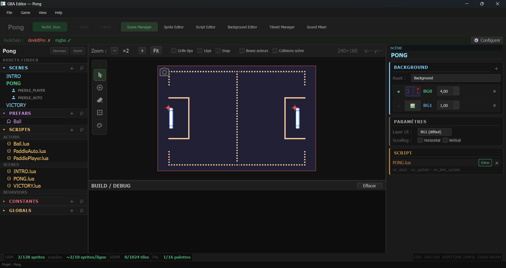
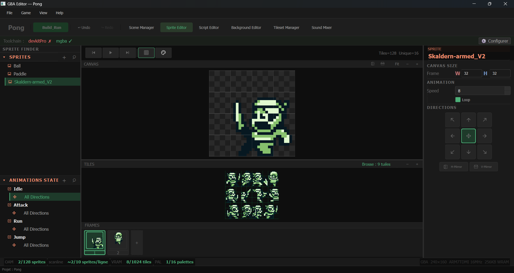
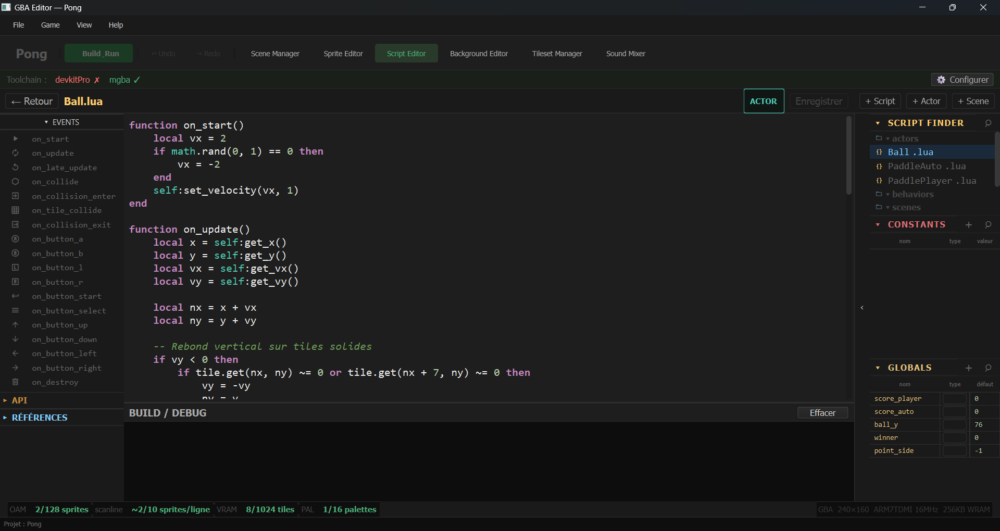

# GBA Editor

Un éditeur visuel pour créer des jeux Game Boy Advance en Lua : scènes, sprites, collisions, son, depuis une seule interface.
Développé en Python/PyQt6, le projet s'appuie sur la toolchain devkitPro pour compiler de véritables ROMs .gba, jouables aussi bien sur émulateur que sur console.
Le choix de Lua s'est imposé pour sa simplicité et sa légèreté. Les scripts sont transpilés en C lors de la compilation, garantissant des ROMs optimisées, sans machine virtuelle ni coût d'exécution supplémentaire.

---

## Comment ça marche

Chaque projet est entièrement contenu dans son propre dossier. 
Vous y retrouvez vos ressources (sprites, backgrounds, scripts, sons...), ainsi que les scènes et les éléments qui composent votre jeu.
Importez vos backgrounds, ajoutez un acteur, construisez la logique de votre jeu.
Il suffit de cliquer sur Build & Run. 

L'éditeur s'occupe automatiquement de préparer les ressources & de générer le code C nécessaire afin de tester votre jeu.

---

## Installation

1. Télécharger le dernier `.exe` depuis l'onglet [Releases](https://github.com/victor3x0/GBA-EDITOR/releases).

Pour compiler et lancer des ROMs, deux outils externes sont nécessaires (l'éditeur les détecte automatiquement leur installation) :

| Outil | Rôle | Lien |
|-------|------|----------------|
| **devkitPro** (devkitARM + grit + make) | Compile le C généré en ROM `.gba` | [devkitpro.org](https://devkitpro.org/wiki/Getting_Started) |
| **mGBA** | Émulateur pour tester la ROM (Build & Run) | [mgba.io](https://mgba.io/downloads.html) |

## Fonctionnalités

- **Éditeur de scènes** : composez vos niveaux en plaçant acteurs, collisions et caméra directement sur un canvas GBA.

 

- **Éditeur de sprites** : créez les animations de vos personnages à partir d'une spritesheet.

- **Scripting Lua** : écrivez votre gameplay en Lua, le code est automatiquement converti en C lors de la compilation.

- **Son** : effets sonores et musique (maxmod), gérés depuis l'éditeur.

- **Prefabs** : acteurs réutilisables entre scènes.

- **Components** : Components réutilisable et empilable pour manipuler facilement vos assets en LUA.

## Projet de démo

Un jeu Pong complet (scènes, sprites, scripts, son) est disponible dans [`Project Demo/Pong`](https://github.com/victor3x0/GBA-EDITOR/tree/main/Project%20Demo/Pong)
à télécharger directement depuis GitHub (clique sur le lien, ou clone/télécharge le repo en ZIP) puis à placer dans ton dossier `GBAProjects` local pour l'ouvrir depuis l'éditeur.

---

### Objectif de la Version 1.0

Première version stable de **GBA Editor**.

- Consolidation des fonctionnalités
- Deuxième jeu de démo
- Stabilisation du runtime et de l'éditeur
- Documentation utilisateur

## Roadmap vers la v1.0

- **v0.2** : Gestion des palettes de couleurs 
- **v0.3** : Fondations runtime "background vivant" + Texte & UI in-game
- **v0.3** : Éditeur de Background & animation de tuiles
- **v0.5** : Sauvegarde (SRAM/Flash)
- **v0.6** : Polish de la boucle de jeu (caméra, transitions, pentes)
- **v0.7** : Son enrichi & écran de mixage (SFX/musique, pitch, volume par canal)
- **v0.8** : Traduction des jeux depuis l'interface avec l'éditeur
- **v0.9** : Distribution élargie (Linux)
- **v0.10**: Traduction de l'interface de l'éditeur

## Les versions suivantes exploreront des fonctionnalités plus avancées de la Game Boy Advance :

Fonctionnalités envisagées :

- Backgrounds affines ("Mode 7"), rotation et zoom des couches de fond.
- Support des modes bitmap (modes vidéo 3, 4 et 5) pour le rendu en framebuffer.
- Support du câble Link (multijoueur)
- Nouveaux outils d'édition
- Optimisations du runtime

---

## Crédits

<<<<<<< HEAD
Musiques du projet de démo par **Tiptoptom Cat** — [itch.io](https://tiptoptomcat.itch.io/).
=======
### Palettes de couleurs

Merci à leurs créateurs :

| Palette | Auteur |
| --- | --- |
| DMG (GB Default) / (BG) | Nintendo — Game Boy (DMG-01) |
| Miyazaki 16 | skeddles |
| NA16 | Nauris |
| PICO-8 | Lexaloffle Games |
| Soft 16 | Endesga |
| Mystic 16 | polyphrog |
| Colorquest 16 | polyphrog |
| Commodore 64 | palette matérielle Commodore |
| Microsoft Windows 16 | palette système Microsoft |

Beaucoup de ces palettes sont partagées par leurs auteurs sur
[Lospec](https://lospec.com/palette-list); elles restent la propriété de
leurs créateurs.

Musiques du projet de démo par **Tiptoptom Cat** — [itch.io](https://tiptoptomcat.itch.io/).
>>>>>>> 67f4205 (// Mise à jour et Modifications UI)
