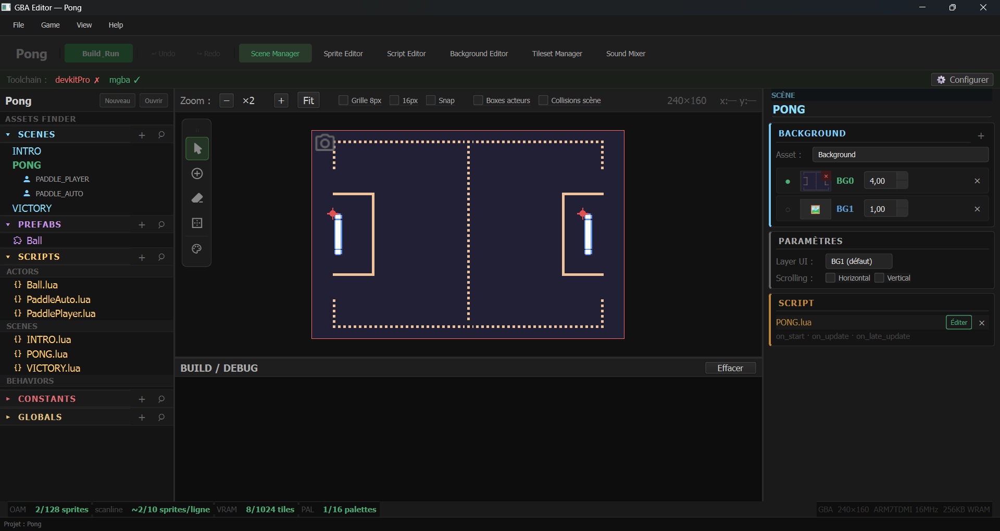
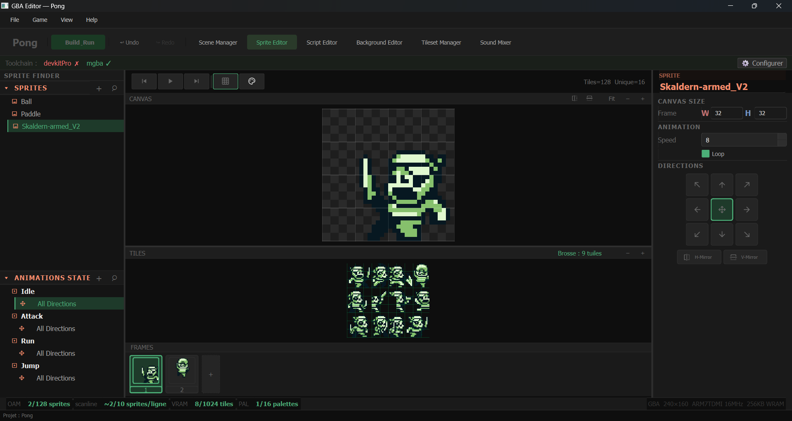
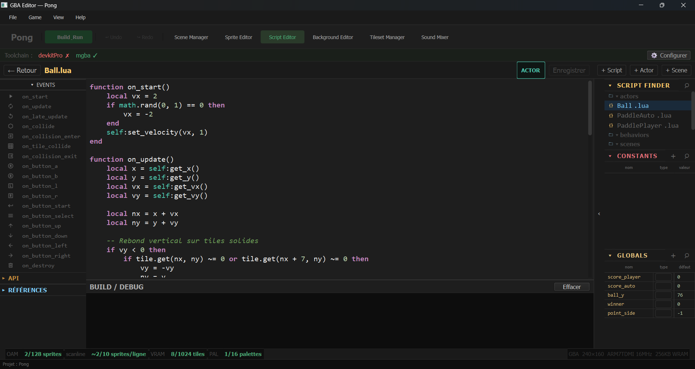

# GBA Editor

Un éditeur visuel pour créer des jeux Game Boy Advance en Lua : scènes, sprites, collisions, son, depuis une seule interface.
Développé en Python/PyQt6, le projet s'appuie sur la toolchain devkitPro pour compiler de véritables ROMs .gba, jouables aussi bien sur émulateur que sur console.
Le choix de Lua s'est imposé pour sa simplicité et sa légèreté. Les scripts sont transpilés en C lors de la compilation, garantissant des ROMs optimisées, sans machine virtuelle ni coût d'exécution supplémentaire.

---

## Comment ça marche

Chaque projet est entièrement contenu dans son propre dossier. 
Vous y retrouvez vos ressources (sprites, backgrounds, scripts, sons...), ainsi que les scènes et les éléments qui composent votre jeu.
Importez vos backgrounds, ajoutez un acteur, construisez la logique de votre jeu.
Il suffit de cliquer sur Build & Run. 

L'éditeur s'occupe automatiquement de préparer les ressources & de générer le code C nécessaire afin de tester votre jeu.

---

## Installation

1. Télécharger depuis l'onglet [Releases](https://github.com/victor3x0/GBA-EDITOR/releases), au choix :
   - **`GBAEditor-<version>-windows-setup.exe`** — installateur. S'installe pour votre compte utilisateur uniquement, sans demander de droits administrateur.
   - **`GBAEditor-<version>-windows-portable.zip`** — version portable. Décompressez où vous voulez et lancez `GBA Editor.exe`.

Pour compiler et lancer des ROMs, deux outils externes sont nécessaires (l'éditeur les détecte automatiquement leur installation) :

| Outil | Rôle | Lien |
|-------|------|----------------|
| **devkitPro** (devkitARM + grit + make) | Compile le C généré en ROM `.gba` | [devkitpro.org](https://devkitpro.org/wiki/Getting_Started) |
| **mGBA** | Émulateur pour tester la ROM (Build & Run) | [mgba.io](https://mgba.io/downloads.html) |

## Fonctionnalités

- **Éditeur de scènes** : composez vos niveaux en plaçant acteurs, collisions et caméra directement sur un canvas GBA.

 

- **Éditeur de sprites** : créez les animations de vos personnages à partir d'une spritesheet.

- **Scripting Lua** : écrivez votre gameplay en Lua, le code est automatiquement converti en C lors de la compilation.

- **Son** : effets sonores et musique (maxmod), gérés depuis l'éditeur.

- **Prefabs** : acteurs réutilisables entre scènes.

- **Components** : Components réutilisable et empilable pour manipuler facilement vos assets en LUA.

## Projet de démo

Un jeu Pong complet (scènes, sprites, scripts, son) est disponible dans [`Project Demo/Pong`](https://github.com/victor3x0/GBA-EDITOR/tree/main/Project%20Demo/Pong)
à télécharger directement depuis GitHub (clique sur le lien, ou clone/télécharge le repo en ZIP) puis à placer dans ton dossier `GBAProjects` local pour l'ouvrir depuis l'éditeur.

---

### Objectif de la Version 1.0

Première version stable de **GBA Editor** : le pipeline 2D complet, de bout en bout.

L'objectif est énoncé comme une cible, pas comme une liste de fonctionnalités — à la v1.0,
ces cinq genres doivent être réalisables avec l'éditeur :

| Genre | Ce qu'il exerce |
| --- | --- |
| Platformer | gravité, pentes, collision de tuiles, caméra en suivi |
| Metroidvania | état persistant entre scènes, déverrouillages |
| RPG | tables de données, menus, dialogues, sauvegarde longue |
| Tactique (Advance Wars) | grille, liste d'unités, recherche de chemin |
| Gestion (Zoo Tycoon) | beaucoup d'entités à état propre, économie |

Plus la stabilisation du runtime et de l'éditeur, la documentation utilisateur, et un
deuxième jeu de démo choisi parmi les genres les plus exigeants de cette liste.

Et quatre points qui ne sont pas des fonctionnalités, mais sans lesquels le mot « 1.0 » ne
tient pas : une licence, des formats de fichiers qu'un outil de version sait relire, des
modèles de projet pour démarrer, et la vérification que l'éditeur tient à l'échelle d'un vrai
projet.

## Roadmap vers la v1.0

- **v0.2** ✅ : Gestion des palettes de couleurs
- **v0.3** ✅ : Fondations runtime "background vivant" (layers, fenêtres, fondus) + Texte & UI in-game (polices custom, table de textes balisée, interface dessinée au canvas)
- **v0.4** ✅ : Animation de décor (fonds animés posés au canvas, couleurs d'une scène pilotables au script)
- **v0.5** ✅ : Sauvegarde en SRAM (variables globales marquées persistantes, plusieurs emplacements)
- **v0.6** ✅ : Polish de la boucle de jeu — caméra devenue un asset réutilisable (suivi, bornes, secousse, script), transitions de scène en fondu (réglées au projet, surchargeables par scène), pentes résolues au runtime (26°, 45°, 63°, sols et plafonds)
- **v0.7** ✅ : Structures de données — tableaux typés dans les scripts (une ou deux dimensions, indexés à partir de 1) et tables de données authorées, éditées dans le Data Editor et cuites en `const` dans la ROM — ce qui débloque RPG, tactique et gestion
- **v0.8** : Son enrichi & écran de mixage (SFX/musique, pitch, volume par canal)
- **v0.9** : Traduction des jeux depuis l'interface avec l'éditeur
- **v0.10** : Distribution élargie (Linux)
- **v0.11** : Traduction de l'interface de l'éditeur
- **v0.12** : Vue d'ensemble — graphe des scènes et de leurs transitions, pour lire la logique d'un projet d'un coup d'œil
- **v0.13** : Édition mixte code / no-code — les appels d'API s'éditent aussi comme des blocs, le script Lua restant la source unique
- **v0.14** : Diagnostic — trace de débogage vers la console de l'émulateur, et mesure du budget de frame sur la console

## Les versions suivantes exploreront des fonctionnalités plus avancées de la Game Boy Advance :

Fonctionnalités envisagées :

- Backgrounds affines ("Mode 7"), rotation et zoom des couches de fond.
- Physique et collision : gravité, milieux (air, viscosité), collision par normale, formes
  cercle et maillage, import d'une carte de collision depuis une image.
- Distorsion d'image par ligne (eau, chaleur, vitesse).
- Rendu isométrique : projection en losange et tri en profondeur des sprites.
- Un **second moteur de rendu**, en 3D logicielle sur framebuffer (modes bitmap), à côté du
  moteur 2D actuel — avec pour objectif qu'un jeu du niveau de V-Rally 3 soit constructible
  avec l'éditeur.
- Support du câble Link (multijoueur)
- Nouveaux outils d'édition
- Optimisations du runtime

---

## Licence

### Votre jeu vous appartient

**Sans réserve.** Vos images, vos sons, vos scripts, vos scènes et la ROM que
vous en tirez sont votre travail : les avoir produits avec cet éditeur ne donne
à personne le moindre droit dessus.

- **Vendez-le** où vous voulez, sans nous demander, sans rien reverser.
- **Ne publiez pas vos sources** si vous ne le souhaitez pas.
- **Ne joignez aucune notice** à votre ROM.

Le moteur recopié dans votre projet au moment du build est sous licence **zlib**
([runtime/LICENSE](runtime/LICENSE)), justement pour que rien de tout ça ne soit
à négocier.

> Une réserve qui ne vient pas de nous : votre ROM est liée à `libgba` et
> `maxmod` (devkitPro). Elles sont permissives et compatibles avec un jeu
> commercial, mais leurs termes sont à lire chez devkitPro.

### L'éditeur

GBA Editor est un **logiciel libre**, sous [GPL-3.0-only](LICENSE). Vous pouvez
l'utiliser, l'étudier, le modifier et le redistribuer. En contrepartie, toute
version modifiée que vous distribuez doit rester libre, sous la même licence, et
créditer les auteurs d'origine.

Le téléchargement depuis GitHub est et restera gratuit. Les versions vendues sur
d'autres plateformes sont les mêmes : ce qui s'y achète, c'est la commodité et
le soutien au développement, jamais un supplément de fonctionnalités.

Les composants tiers embarqués et leurs licences sont listés dans
[THIRD-PARTY-NOTICES.md](THIRD-PARTY-NOTICES.md). Pour contribuer, voir
[CONTRIBUTING.md](CONTRIBUTING.md).

---

## Crédits

Musiques du projet de démo par **Tiptoptom Cat** — [itch.io](https://tiptoptomcat.itch.io/).

### Palettes de couleurs

Merci à leurs créateurs :

| Palette | Auteur |
| --- | --- |
| Miyazaki 16 | skeddles |
| NA16 | Nauris |
| PICO-8 | Lexaloffle Games |
| Soft 16 | Endesga |
| Mystic 16 | polyphrog |
| Colorquest 16 | polyphrog |

Beaucoup de ces palettes sont partagées par leurs auteurs sur
[Lospec](https://lospec.com/palette-list); elles restent la propriété de
leurs créateurs.

Musiques du projet de démo par **Tiptoptom Cat** — [itch.io](https://tiptoptomcat.itch.io/).
